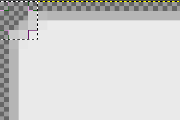

Image clipping and combining
============================

qooxdoo integrates the support for clipped and combined images in the framework where both features are heavily used, mainly in the different themes like appearance or decoration themes
\<desktop/ui\_theming\>.

Configuration
-------------

> **note**
>
> To be able to use image clipping and combining you need a locally installed ImageMagick \<introduction/third\_party\_components\> package. The latest version known to work is 6.6.1.

To use the two features you have to configure dedicated generator jobs. the generator to clip or combine images. You can add those jobs to your standard `config.json` file, or, as the configuration for these tasks is fairly self-contained, put them in an own file like `image.json`, as we do in the framework.

Here is the general layout for the image manipulating jobs configuration:

    {
      "jobs" :
      {
        "common" :
        {
          "let" :
          {
             "RESPATH" : "./source/resource"
          },

          "cache" :
          {
             "compile" : "../../cache"
          }
        },

        "image-clipping" : { ... },

        "image-combining": { ... }
      }
    }

The `common` job is used to set up the basic settings which are shared between the specific jobs `image-clipping` and `image-combine`, described in the following sections.

### Image clipping

Clipping images is needed whenever you have a base image, e.g. a complete image for your button with rounded borders, and want to cut it into several parts. A common use case in the framework is to use such images for `grid` decorators.

    "image-clipping" :
    {
       "extend" : ["common"],

       "slice-images" :
       {
          "convert-cmd" : "convert %(infile)s -crop \
              %(xoff)sx%(yoff)s+%(xorig)s+%(yorig)s +repage %(outfile)s",
          "images" :
          {
             "${RESPATH}/custom/image/groupBox.png" :
             {
                "prefix" : "../../clipped/groupBox",
                "border-width" : 4
             }
          } 
       }
    }

(Mind that you cannot split a string across lines in Json, so the `\` in the value of `convert-cmd` is only for better readability here in the manual.) Each entry in the `images` block represents one source image to clip.

-   The key has to be the path to the *source* image.
-   The `prefix` entry will set the base file path for all the result images. The resulting file paths will follow the rule `prefix + imagepart + extension` where imagepart will specify the spacial location from which the clip has been taken, e.g. `tl` for top-left or `br` for bottom-right etc. So one result image will be *"../../clipped/groupBox-tl.png"*.
-   The entry `border-width` defines how deep from the border into the image the cut will run. If you look at your source image you can determine the border-width by selecting a rectangle (which your graphic tool) which encloses the corner of the image completely. The edge of the rectangle is your border-width (see further).

See the slice-images reference
\<pages/tool/generator/generator\_config\_ref\#slice-images\> for all configuration details.

#### Visual example

Here is an example illustration for the border-width case.

The selection rectangle has the size of 4 x 4 pixels (a single pixel is indicated by the embedded square at the bottom-right corner), thus the `border-width` value is 4. Differing border width values for each of the four sides are also supported. In that case, the value for border-width must be an array containing the four values in the order: top, right, bottom, left.

### Image combining

Complementary to image clipping image combining takes multiple images as sources and generates a single image out of them. The result image is like a box that contains the input images side by side. Here is a configuration sample:

    "image-combine" :
    {
       "extend" : ["common"],

       "combine-images" :
       {
          "montage-cmd" : "montage @%(tempfile)s -geometry +0+0 -gravity \
            NorthWest -tile %(orientation)s -background None %(combinedfile)s",
          "images" :
          {
             "${RESPATH}/custom/image-combined.png":
             {
                "prefix" : [ "${RESPATH}" ],
                "layout" : "vertical",
                "input"  :
                [
                  {
                    "prefix" : [ "${RESPATH}" ],
                    "files" : [ "${RESPATH}/custom/image/clipped/groupBox*.png" ]
                  }
                ]
             }
          }
       }
    }

(Mind that you cannot split a string across lines in Json, so the `\` in the value of `montage-cmd` is only for better readability here in the manual.) Basically the structure is the same as for the `image-clipping` job. Let's take a look at the details.

-   The key has to be the path of the *result* image.
-   The `layout` key takes the two possible values "horizontal" or "vertical" and determines the alignment of the source images inside the combined image.
-   `files` is an array which takes several input images that share the same path prefix. (This is relevant as the `prefix` will be stripped from the index which is also generated together with the output image. The individual files in the index are only identified by their paths *after* the prefix.)

The layout depends on the sizes of the source images and their intended purpose. Combining images of same sizes saves white space "noise" in the result image, thus decreasing transfer size. If the combined image contains images that need to be stretched *horizontally* by the browser, the images need to be aligned *vertically*, and vice versa. If you are free in this respect the horizontal layout is usually the better choice

For more information see the combine-images \<pages/tool/generator/generator\_config\_ref\#combine-images\> reference section.

Running Image Jobs
------------------

If you are finished with the definition of your images to clip and/or to combine you can use the `generator` to actually let them created for you.

    ./generate.py -c image.json image-clipping

    ./generate.py -c image.json image-combine

If you include the following job in your `image.json` jobs list

    "images" :
    {
       "run" : [ "image-clipping", "image-combine" ]
    },

the execution of

    ./generate.py -c image.json images

will run both jobs at once.

Benefits
--------

There are several benefits for setting up the image clipping and combining.

-   Fewer HTTP requests mean better performance when using combined images.
-   Widgets using the `grid` decorator are easier to use. If you do not use the tool-based clipping you have to slice the source image and name the parts manually.
-   State changes are faster with combined images as the browser does not have to change the source of the displayed image. Instead it only changes the value of the CSS property `background-position` to display the desired part of the combined image.

