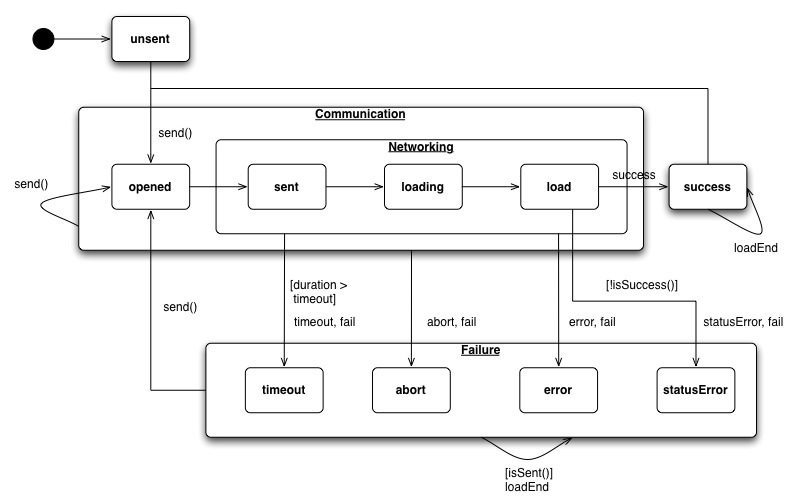

Higher-level requests
=====================

Choosing an appropriate transport
---------------------------------

qooxdoo ships with two transport methods, interfaced by `qx.io.request.Xhr` and `qx.io.request.Jsonp`.

-   Choose `Xhr` whenever you can. `Xhr` offers true HTTP client functionality and exposes metadata associated with HTTP requests. It is agnostic of the data interchange format and does not make any specific demands on the backend.
-   If you are making cross-origin requests and need to support all popular browsers and/or the target server is not configured to accept cross-origin request (`Access-Control-Allow-Origin` header), you will need to use `Jsonp`. Only JSON is supported as data interchange format and the server needs to wrap responses in a JavaScript function call.

`Xhr` and `Jsonp` share a common interface. `AbstractRequest` defines the lowest common denominator of both transport methods.

Basic Setup
-----------

Before a request can be send, it must be configured. Configuration is accomplished by setting properties. The most commonly used properties include:

-   **url**: The HTTP resource to request
-   **method**: The HTTP method, sometimes also referred to as HTTP verb. `Script` only accepts the `GET` method.
-   **requestData**: Data to be send as part of the request.
-   **requestHeaders**: Headers to send with the request

For a complete list of properties, please refer to the API Documentation of [qx.io.request](http://demo.qooxdoo.org/%{version}/apiviewer/#qx.io.request):

    // Instantiate request
    var req = new qx.io.request.Xhr();

    // Set URL (mandatory)
    req.setUrl("/books");

    // Set method (defaults to GET)
    req.setMethod("POST");

    // Alternative notation
    // var req = new qx.io.request.Xhr("/books", "POST");

    // Set request data. Accepts String, Map
    // or qooxdoo Object.
    req.setRequestData({"title": "The title"});

    // Send request
    req.send();

Events and states
-----------------

Once a request is sent using the `send()` method, it traverses various states. There are two ways to query the current state of the request.

-   **getReadyState()**: An integer (0-4) representing UNSENT, OPENED, HEADERS\_RECEIVED, LOADING and DONE.
-   **getPhase()**: Symbolic state mapping to deterministic events (success, abort, timeout, statusError) and intermediate readyStates.

Events are fired when the request is progressing from one state to the other. The most important events in the lifecycle of a request include:

-   **load**: Request completed successfully.
-   **success**: Request completed successfully (like `load`) *and* the response can be expected to contain the kind of data requested. For `Xhr` this means the HTTP status of the response indicates success (e.g. `200`). For `Jsonp`, the script received executed the expected callback.
-   **statusError**: Request completed successfully (like `load`) *but* the additional requirements for `success` are not met. For `Xhr` this event is typically fired when the server reports that an erroneous or unknown resource was requested (e.g. `500` or `404`). For `Jsonp`, this event is associated with an invalid response for whatever reasons.
-   **fail**: Any kind of error occurred. Catches distinct events `error`, `statusError` and `timeout`.

For a complete list of events, please refer to the API Documentation of [qx.io.request](http://demo.qooxdoo.org/%{version}/apiviewer/#qx.io.request):

    req.addListener("success", function(e) {
      var req = e.getTarget();
      var response = req.getResponse();
      this.doSomething(response);
    }, this);

    // Send request
    req.send();

Response
--------

Once the request completed, a range of getters return details about the response.

-   **getResponse()**: Response processed according to parser settings or content type (`Xhr`). Always JSON for (`Jsonp`).
-   **getStatus()**: The numerical status of the response. For `Xhr` the status is the HTTP status. `Jsonp` only knows `200` (when callback was executed) and `500` (when it was not).

Authentication
--------------

There are two ways to handle authentication. The lower-level approach is to manually set the adequate request headers. The high-level, recommended way is to assign the `authentication` property an instance of a class that implements the `IAuthentication` interface. This class defines the necessary request headers and can handle the authentication logic. `Basic` implements the most basic kind of authentication (HTTP Basic) and serves as an example for more advanced authentication methods.

Data binding
------------

The request's response can be bound to a widget, model or any other object using data binding. This feature is provided by the `changeResponse` event, fired on change of the (parsed) response.

    // Bind response to value of a label
    //
    // req is an instance of qx.io.request.*,
    // label an instance of qx.ui.basic.Label
    req.bind("response", label, "value");

Debugging
---------

If you encounter odd behavior, it might help to enable debugging of the IO classes. Debugging is controlled with the `qx.debug.io` setting. Provided you have allowed URL settings (`allowUrlSetting`), you can simply append `?qxenv:qx.debug.io:true` to the URL of your application.

Specific to XHR
---------------

Features specific to `Xhr`.

### Parsing

By default, `response` is populated with the response parsed according to the response content type. For the built-in parsers, parsing always results in a JavaScript object.

The content type is read from `Content-Type` response header. If the response content type is unrecognized, no parsing is done and `response` equals `responseText`. Parsers associated to a content type are:

-   **JSON**: application/json
-   **XML**: application/xml

The parser can be explicitly set with `setParser()`. This can be useful if the content type returned from the server is wrong or the response needs special parsing. The setter accepts either a symbolic string (`"json"` or `"xml"`) or a function. If a function is given, this function is called once the request completes. It receives the raw response as first argument. The return value determines the `response`.

### Response

-   **getResponseText()**: Raw, unprocessed response
-   **getResponseHeader(header)**
-   **getAllResponseHeaders()**

### Accepting

Some servers send distinct *representations* of the same resource depending on the content type accepted. For instance, a server may respond with either a JSON, XML or a HTML representation while requesting the *same* URL. By default, requests accept every content type. In effect, the server will respond with it's default representation. If the server has no default representation, it may respond with the status code `406` (Not Acceptable).

In order to choose a representation, set the accepted response content type with `setAccept()`. It is a good practice to always set the preferred representation to guard against possible changes of the server's default behavior.

For more details, see [Accept header](http://www.w3.org/Protocols/rfc2616/rfc2616-sec14.html#sec14.1) in the HTTP 1.1 specification.

### Caching

Usually, one or more caches sit between the browser sending the request and the server answering the request. The most important cache is arguably the browser cache, which is enabled by default in all modern browsers. Other caches include various kinds of proxy servers. Understanding caches is vital to reduce latency and save bandwidth. However, a detailed introduction of HTTP caching is beyond the scope of this section. For more information, refer to the [Caching tutorial](http://www.mnot.net/cache_docs/).

To control the behavior of caches on the client-side, a number of HTTP Cache-Control directives can be sent as part of the request by setting the `cache` property. To circumvent caching, a common trick is to add a random string to the URL's query part. This is accomplished by setting `cache` to `false`.

Specific to JSON
----------------

Features specific to `Jsonp`.

### Callback

Callback handling is done behind the scenes but can be customized. If the service only accepts a special callback parameter to read the desired callback function name from, this parameter can be set with `setCallbackParam()`. Some services do not allow custom callback names at all. In this case, `setCallbackName()` wires the request to the fixed callback name.

### Caching

No Cache-Control directives can be set, but caching can be disabled by setting `cache` to `false`. Works by adding a random string to the URL's query part.
