Form Handling
=============

The `qx.ui.form` package contains several classes for the construction of forms.
Some widgets -- like `Button`, `List` or `TextField` -- may look familiar if you
have worked with HTML before, but this package also contains more complex
widgets that you may know from your operating system and/or native desktop
applications (e.g. `Spinner`, `Slider` or `DateField`).

Idea
----

The idea of the form API is to make handling of form widgets as simple as
possible, but also as generic as possible within the entire framework.

Demos
-----

If you like to see some of qooxdoo's form management in action, take a look at
the following samples in the demo browser:

### Widgets

-   [All form widgets](apps://demobrowser/#showcase~Form.html)
-   [All form widgets with invalid states](apps://demobrowser/#ui~FormInvalids.html)

### Validation and Resetting

-   [Synchronous and asynchronous form validation](apps://demobrowser/#ui~FormValidator.html)
-   [Validation on different pages](apps://demobrowser/#ui~MultiPageForm.html)

### Rendering

-   [Single column form](apps://demobrowser/#ui~FormRenderer.html)
-   [Double column form](apps://demobrowser/#ui~FormRendererDouble.html)
-   [Single column form using placeholders](apps://demobrowser/#ui~FormRendererPlaceholder.html)
-   [Custom form layout](apps://demobrowser/#ui~FormRendererCustom.html)

### Data Binding

-   [Manual form binding](apps://demobrowser/#data~Form.html)
-   [Form Controller](apps://demobrowser/#data~FormController.html)

Interfaces
----------

The entire form API is defined by a couple of interfaces. These interfaces
contain the most important methods and events for the form widgets. The
following listing shows the interfaces, their purpose and how you can benefit
from them.

### Form

The interface `qx.ui.form.IForm` defines a set of methods and events for every
visible form widget. It contains the listed events and methods.

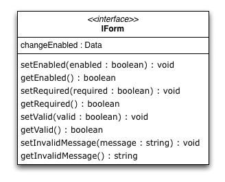

As you can see, the interface defines accessors for four different properties.

-   The enabled property is usually inherited from the widget class and is used to deactivate a form element.
-   The required property is just a boolean flag signaling that the form widget is required. This can be used by some kind of form manager or parent widget to display the status of the widget.
-   The valid property is a boolean flag containing `true` if the content of the widget is valid, but the form widgets do not have any kind of code to set this property. It needs to be set from outside. If it is set to `false`, the appearance will change automatically to properly signal the invalid state.
-   The invalidMessage property should contain a message which will be shown in a tooltip if the valid flag is set to `false`. If no message is given, no tooltip will appear.

### Executable

The `qx.ui.form.IExecutable` interface defines the essential components for all executable widgets. The best example for an executable widget is a button. It defines the following events and methods.

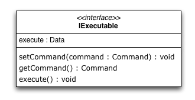

As you can see, the interface defines accessors for only one property.

-   The command property can take a `qx.event.Command`. The execute method executes the given command.

### Range

The `qx.ui.form.IRange` interface defines the essential components for all widgets dealing with ranges. It defines the following methods.

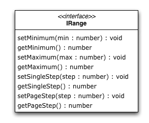

As you can see, the interface defines accessors for four properties.

-   The minimum value of the range is defined by the Minimum property.
-   The maximum value of the range is defined by the Maximum property.
-   Each range has a single step value which is defined by the SingleStep property.
-   Like the single step, there is a page step for every range which is defined by the PageStep property.

### Number / String / Color / Date / Boolean

Each of the listed interfaces define the same methods and events. The only difference in the interfaces is - as the name says - the type of the data processed by the implementing widget. With that solution, we have the same API for every form widget but can still determinate which type of value the widget expects by checking for the different interfaces.

#### Interfaces

-   Number : `qx.ui.form.INumberForm`
-   String : `qx.ui.form.IStringForm`
-   Color : `qx.ui.form.IColorForm`
-   Date : `qx.ui.form.IDateForm`
-   Boolean : `qx.ui.form.IBooleanForm`

The color interface takes a string which has to be formatted like the [common colors](apps://apiviewer/#qx.util.ColorUtil) in qooxdoo.

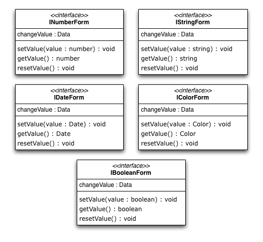

As you can see, the interface can be implemented with only one property.

-   The value property takes the value of the widget. This is for example a boolean in a checkbox widget or a string in a text field widget.

### Model / ModelSelection

Most of the form items handling a selection had a value property in the old API. We replaced that with a model property since the value property is used for user input values. The methods for accessing the model data are defined in an interface called `qx.ui.form.IModel`.

The model property can be used to store additional data which is represented by the widget. The data does not need to be a string like in the old value property. You can store references to objects, numbers, strings and so on. Accessing the model is very easy. Every widget containing a widget implementing the `qx.ui.form.IModel` interface has its own interface to access the current selected model.

As you can see in the diagram, you can get the currently selected model and also set the selection using the models.

Widgets
-------

The following listing shows the form widgets and their corresponding interfaces. To see more details about a widget, take a look at the widgets (/pages/desktop/widget/widget_ref) documentation.

<html>

<table>
<tbody>
  <tr>
    <td>&nbsp;</td>
    <td><strong>IForm</strong></td>
    <td><strong>IExecutable</strong></td>
    <td><strong>IRange</strong></td>
    <td><strong>INumber Form</strong></td>
    <td><strong>IString Form</strong></td>
    <td><strong>IColor Form</strong></td>
    <td><strong>IDate Form</strong></td>
    <td><strong>IBoolean Form</strong></td>
    <td><strong>IModel</strong></td>
    <td><strong>IModel Selection</strong></td>
  </tr>

  <tr>
    <td>Label</td>
    <td>&nbsp;</td>
    <td>&nbsp;</td>
    <td>&nbsp;</td>
    <td>&nbsp;</td>
    <td>X</td>
    <td>&nbsp;</td>
    <td>&nbsp;</td>
    <td>&nbsp;</td>
    <td>&nbsp;</td>
    <td>&nbsp;</td>
  </tr>

  <tr>
    <td colspan="11"><strong>Text Input</strong></td>
  </tr>

  <tr>
    <td>TextField</td>
    <td>X</td>
    <td>&nbsp;</td>
    <td>&nbsp;</td>
    <td>&nbsp;</td>
    <td>X</td>
    <td>&nbsp;</td>
    <td>&nbsp;</td>
    <td>&nbsp;</td>
    <td>&nbsp;</td>
    <td>&nbsp;</td>
  </tr>

  <tr>
    <td>TextArea</td>
    <td>X</td>
    <td>&nbsp;</td>
    <td>&nbsp;</td>
    <td>&nbsp;</td>
    <td>X</td>
    <td>&nbsp;</td>
    <td>&nbsp;</td>
    <td>&nbsp;</td>
    <td>&nbsp;</td>
    <td>&nbsp;</td>
  </tr>

  <tr>
    <td>PasswordField</td>
    <td>X</td>
    <td>&nbsp;</td>
    <td>&nbsp;</td>
    <td>&nbsp;</td>
    <td>X</td>
    <td>&nbsp;</td>
    <td>&nbsp;</td>
    <td>&nbsp;</td>
    <td>&nbsp;</td>
    <td>&nbsp;</td>
  </tr>

  <tr>
    <td colspan="11"><strong>Supported Text Input</strong></td>
  </tr>

  <tr>
    <td>ComboBox</td>
    <td>X</td>
    <td>&nbsp;</td>
    <td>&nbsp;</td>
    <td>&nbsp;</td>
    <td>X</td>
    <td>&nbsp;</td>
    <td>&nbsp;</td>
    <td>&nbsp;</td>
    <td>&nbsp;</td>
    <td>&nbsp;</td>
  </tr>

  <tr>
    <td>DateField</td>
    <td>X</td>
    <td>&nbsp;</td>
    <td>&nbsp;</td>
    <td>&nbsp;</td>
    <td>&nbsp;</td>
    <td>&nbsp;</td>
    <td>X</td>
    <td>&nbsp;</td>
    <td>&nbsp;</td>
    <td>&nbsp;</td>
  </tr>

  <tr>
    <td colspan="11"><strong>Number Input</strong></td>
  </tr>

  <tr>
    <td>Slider</td>
    <td>X</td>
    <td>&nbsp;</td>
    <td>X</td>
    <td>X</td>
    <td>&nbsp;</td>
    <td>&nbsp;</td>
    <td>&nbsp;</td>
    <td>&nbsp;</td>
    <td>&nbsp;</td>
    <td>&nbsp;</td>
  </tr>

  <tr>
    <td>Spinner</td>
    <td>X</td>
    <td>&nbsp;</td>
    <td>X</td>
    <td>X</td>
    <td>&nbsp;</td>
    <td>&nbsp;</td>
    <td>&nbsp;</td>
    <td>&nbsp;</td>
    <td>&nbsp;</td>
    <td>&nbsp;</td>
  </tr>

  <tr>
    <td colspan="11"><strong>Boolean Input</strong></td>
  </tr>

  <tr>
    <td>CheckBox</td>
    <td>X</td>
    <td>X</td>
    <td>&nbsp;</td>
    <td>&nbsp;</td>
    <td>&nbsp;</td>
    <td>&nbsp;</td>
    <td>&nbsp;</td>
    <td>X</td>
    <td>X</td>
    <td>&nbsp;</td>
  </tr>

  <tr>
    <td>RadioButton</td>
    <td>X</td>
    <td>X</td>
    <td>&nbsp;</td>
    <td>&nbsp;</td>
    <td>&nbsp;</td>
    <td>&nbsp;</td>
    <td>&nbsp;</td>
    <td>X</td>
    <td>X</td>
    <td>&nbsp;</td>
  </tr>

  <tr>
    <td colspan="11"><strong>Color Input</strong></td>
  </tr>

  <tr>
    <td>ColorPopup</td>
    <td>&nbsp;</td>
    <td>&nbsp;</td>
    <td>&nbsp;</td>
    <td>&nbsp;</td>
    <td>&nbsp;</td>
    <td>X</td>
    <td>&nbsp;</td>
    <td>&nbsp;</td>
    <td>&nbsp;</td>
    <td>&nbsp;</td>
  </tr>

  <tr>
    <td>ColorSelector</td>
    <td>&nbsp;</td>
    <td>&nbsp;</td>
    <td>&nbsp;</td>
    <td>&nbsp;</td>
    <td>&nbsp;</td>
    <td>X</td>
    <td>&nbsp;</td>
    <td>&nbsp;</td>
    <td>&nbsp;</td>
    <td>&nbsp;</td>
  </tr>

  <tr>
    <td colspan="11"><strong>Date Input</strong></td>
  </tr>

  <tr>
    <td>DateChooser</td>
    <td>X</td>
    <td>X</td>
    <td>&nbsp;</td>
    <td>&nbsp;</td>
    <td>&nbsp;</td>
    <td>&nbsp;</td>
    <td>X</td>
    <td>&nbsp;</td>
    <td>&nbsp;</td>
    <td>&nbsp;</td>
  </tr>

  <tr>
    <td colspan="11"><strong>Selections</strong></td>
  </tr>

  <tr>
    <td>SelectBox</td>
    <td>X</td>
    <td>&nbsp;</td>
    <td>&nbsp;</td>
    <td>&nbsp;</td>
    <td>&nbsp;</td>
    <td>&nbsp;</td>
    <td>&nbsp;</td>
    <td>&nbsp;</td>
    <td>&nbsp;</td>
    <td>X</td>
  </tr>

  <tr>
    <td>List</td>
    <td>X</td>
    <td>&nbsp;</td>
    <td>&nbsp;</td>
    <td>&nbsp;</td>
    <td>&nbsp;</td>
    <td>&nbsp;</td>
    <td>&nbsp;</td>
    <td>&nbsp;</td>
    <td>&nbsp;</td>
    <td>X</td>
  </tr>

  <tr>
    <td>ListItem</td>
    <td>&nbsp;</td>
    <td>&nbsp;</td>
    <td>&nbsp;</td>
    <td>&nbsp;</td>
    <td>&nbsp;</td>
    <td>&nbsp;</td>
    <td>&nbsp;</td>
    <td>&nbsp;</td>
    <td>X</td>
    <td>&nbsp;</td>
  </tr>

  <tr>
    <td>tree.Tree</td>
    <td>&nbsp;</td>
    <td>&nbsp;</td>
    <td>&nbsp;</td>
    <td>&nbsp;</td>
    <td>&nbsp;</td>
    <td>&nbsp;</td>
    <td>&nbsp;</td>
    <td>&nbsp;</td>
    <td>&nbsp;</td>
    <td>X</td>
  </tr>

  <tr>
    <td>tree.TreeFolder</td>
    <td>&nbsp;</td>
    <td>&nbsp;</td>
    <td>&nbsp;</td>
    <td>&nbsp;</td>
    <td>&nbsp;</td>
    <td>&nbsp;</td>
    <td>&nbsp;</td>
    <td>&nbsp;</td>
    <td>X</td>
    <td>&nbsp;</td>
  </tr>

  <tr>
    <td>tree.TreeFile</td>
    <td>&nbsp;</td>
    <td>&nbsp;</td>
    <td>&nbsp;</td>
    <td>&nbsp;</td>
    <td>&nbsp;</td>
    <td>&nbsp;</td>
    <td>&nbsp;</td>
    <td>&nbsp;</td>
    <td>X</td>
    <td>&nbsp;</td>
  </tr>

  <tr>
    <td colspan="11"><strong>Grouping</strong></td>
  </tr>

  <tr>
    <td>GroupBox</td>
    <td>X</td>
    <td>&nbsp;</td>
    <td>&nbsp;</td>
    <td>&nbsp;</td>
    <td>&nbsp;</td>
    <td>&nbsp;</td>
    <td>&nbsp;</td>
    <td>&nbsp;</td>
    <td>&nbsp;</td>
    <td>&nbsp;</td>
  </tr>

  <tr>
    <td>CheckGroupBox</td>
    <td>X</td>
    <td>X</td>
    <td>&nbsp;</td>
    <td>&nbsp;</td>
    <td>&nbsp;</td>
    <td>&nbsp;</td>
    <td>&nbsp;</td>
    <td>X</td>
    <td>&nbsp;</td>
    <td>&nbsp;</td>
  </tr>

  <tr>
    <td>RadioGroupBox</td>
    <td>X</td>
    <td>X</td>
    <td>&nbsp;</td>
    <td>&nbsp;</td>
    <td>&nbsp;</td>
    <td>&nbsp;</td>
    <td>&nbsp;</td>
    <td>X</td>
    <td>&nbsp;</td>
    <td>&nbsp;</td>
  </tr>

  <tr>
    <td>RadioGroup</td>
    <td>X</td>
    <td>&nbsp;</td>
    <td>&nbsp;</td>
    <td>&nbsp;</td>
    <td>&nbsp;</td>
    <td>&nbsp;</td>
    <td>&nbsp;</td>
    <td>&nbsp;</td>
    <td>&nbsp;</td>
    <td>X</td>
  </tr>

  <tr>
    <td>RadioButtonGroup</td>
    <td>X</td>
    <td>&nbsp;</td>
    <td>&nbsp;</td>
    <td>&nbsp;</td>
    <td>&nbsp;</td>
    <td>&nbsp;</td>
    <td>&nbsp;</td>
    <td>&nbsp;</td>
    <td>&nbsp;</td>
    <td>X</td>
  </tr>

  <tr>
    <td colspan="11"><strong>Buttons</strong></td>
  </tr>

  <tr>
    <td>Button</td>
    <td>&nbsp;</td>
    <td>X</td>
    <td>&nbsp;</td>
    <td>&nbsp;</td>
    <td>&nbsp;</td>
    <td>&nbsp;</td>
    <td>&nbsp;</td>
    <td>&nbsp;</td>
    <td>&nbsp;</td>
    <td>&nbsp;</td>
  </tr>

  <tr>
    <td>MenuButton</td>
    <td>&nbsp;</td>
    <td>X</td>
    <td>&nbsp;</td>
    <td>&nbsp;</td>
    <td>&nbsp;</td>
    <td>&nbsp;</td>
    <td>&nbsp;</td>
    <td>&nbsp;</td>
    <td>&nbsp;</td>
    <td>&nbsp;</td>
  </tr>

  <tr>
    <td>RepeatButton</td>
    <td>&nbsp;</td>
    <td>X</td>
    <td>&nbsp;</td>
    <td>&nbsp;</td>
    <td>&nbsp;</td>
    <td>&nbsp;</td>
    <td>&nbsp;</td>
    <td>&nbsp;</td>
    <td>&nbsp;</td>
    <td>&nbsp;</td>
  </tr>

  <tr>
    <td>SplitButton</td>
    <td>&nbsp;</td>
    <td>X</td>
    <td>&nbsp;</td>
    <td>&nbsp;</td>
    <td>&nbsp;</td>
    <td>&nbsp;</td>
    <td>&nbsp;</td>
    <td>&nbsp;</td>
    <td>&nbsp;</td>
    <td>&nbsp;</td>
  </tr>

  <tr>
    <td>ToggleButton</td>
    <td>&nbsp;</td>
    <td>X</td>
    <td>&nbsp;</td>
    <td>&nbsp;</td>
    <td>&nbsp;</td>
    <td>&nbsp;</td>
    <td>&nbsp;</td>
    <td>X</td>
    <td>&nbsp;</td>
    <td>&nbsp;</td>
  </tr>

  <tr>
    <td>tabView.Button</td>
    <td>&nbsp;</td>
    <td>X</td>
    <td>&nbsp;</td>
    <td>&nbsp;</td>
    <td>&nbsp;</td>
    <td>&nbsp;</td>
    <td>&nbsp;</td>
    <td>&nbsp;</td>
    <td>&nbsp;</td>
    <td>&nbsp;</td>
  </tr>

  <tr>
    <td>menu.CheckBox</td>
    <td>&nbsp;</td>
    <td>X</td>
    <td>&nbsp;</td>
    <td>&nbsp;</td>
    <td>&nbsp;</td>
    <td>&nbsp;</td>
    <td>&nbsp;</td>
    <td>X</td>
    <td>&nbsp;</td>
    <td>&nbsp;</td>
  </tr>

  <tr>
    <td>menu.RedioButton</td>
    <td>&nbsp;</td>
    <td>X</td>
    <td>&nbsp;</td>
    <td>&nbsp;</td>
    <td>&nbsp;</td>
    <td>&nbsp;</td>
    <td>&nbsp;</td>
    <td>X</td>
    <td>&nbsp;</td>
    <td>&nbsp;</td>
  </tr>

  <tr>
    <td>menu.Button</td>
    <td>&nbsp;</td>
    <td>X</td>
    <td>&nbsp;</td>
    <td>&nbsp;</td>
    <td>&nbsp;</td>
    <td>&nbsp;</td>
    <td>&nbsp;</td>
    <td>&nbsp;</td>
    <td>&nbsp;</td>
    <td>&nbsp;</td>
  </tr>

</tbody>
</table>
</html>
Sample Usage
------------

The first example is a simple one, showing how to use two widgets implementing the `IStringForm` interface:

    // create and add a textfield
    var textfield = new qx.ui.form.TextField();
    this.getRoot().add(textfield, {left: 10, top: 10});

    // create and add a label
    var label = new qx.ui.basic.Label();
    this.getRoot().add(label, {left: 10, top: 40});

    // set the text of both widgets
    textfield.setValue("Text");
    label.setValue("Text");

The second example shows how to react on a change in a widget implementing the `INumberForm` interface. The value of the slider will be shown as a label:

    // create and add a slider
    var slider = new qx.ui.form.Slider();
    slider.setWidth(200);
    this.getRoot().add(slider, {left: 10, top: 10});

    // create and add a label
    var label = new qx.ui.basic.Label();
    this.getRoot().add(label, {left: 220, top: 10});

    // add the listener
    slider.addListener("changeValue", function(e) {
      // convert the number to a string
      label.setValue(e.getData() + "");
    }, this);

The last example shows how to use the `IForm` interface and how to mark a widget as invalid:

    // create and add a slider
    var slider = new qx.ui.form.Slider();
    slider.setWidth(200);
    slider.setValue(100);
    this.getRoot().add(slider, {left: 10, top: 10});
    // set the invalid message
    slider.setInvalidMessage("Please use a number above 50.");

    // add the validation
    slider.addListener("changeValue", function(e) {
      if (e.getData() > 50) {
        slider.setValid(true);
      } else {
        slider.setValid(false);
      }
    }, this);

All examples work in the Playground application.

Validation
----------

Form validation is essential in most of the common use cases of forms. That's why qooxdoo supports the application developer with a validation component named `qx.ui.form.validation.Manager`. This manager is responsible for managing the form items which need to be validated. We tried to keep the API as minimal as possible but simultaneously as flexible as possible. The following class diagram shows the user API of the component.

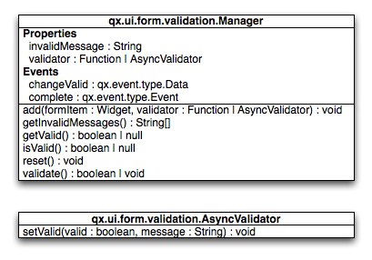

The events, properties and methods can be divided into three groups:

-   **Validation**
    -   getValid()
    -   isValid()
    -   validate()
    -   validator - property
    -   complete - event
    -   changeValid - event
-   **Form Item Management**
    -   add(formItem, validator)
    -   reset()
-   **Invalid Messages**
    -   getInvalidMessages()
    -   invalidMessage - property

The first part with which the application developer gets in contact is the add method. It takes form items and a validator. But what are form items?

### Requirements

Form items need two things. First of all, a given form item must be able to handle an invalid state and must have an invalid message. This is guaranteed by the IForm desktop/ui_form_handling.md#form interface already introduced. But that's not all: The manager needs to access the value of the form item. Therefore, the form item needs to specify a value property. This value property is defined in the data specific form interfaces desktop/ui_form_handling.md#number_string_color_date_boolean also introduced above. So all widgets implementing the `IForm` interface and one of the value defining interfaces can be used by the validation. For a list of widgets and the interfaces they implement, take a look at the widgets section desktop/ui_form_handling.md#widgets1 in this document.

Now that we know what the manager can validate, it's time to learn how to validate. In general, there are two different approaches in validation. The first approach is client side validation, which is commonly synchronous. On the other hand, server side validation is asynchronous in most cases. We will cover both possibilities in the following sections.

### Synchronous

The following subsections cover some common scenarios of synchronous validation. See this code snippet as basis for all the examples shown in the subsections.

    var manager = new qx.ui.form.validation.Manager();
    var textField = new qx.ui.form.TextField();
    var checkBox = new qx.ui.form.CheckBox();

#### Required Form Fields

One of the most obvious validations is a check for a non-empty field. This can be seen in common forms as required fields, which are easy to define in qooxdoo. Just define the specific widget as required and add it to the validation manager without any validator.

    textField.setRequired(true);
    manager.add(textField);

The validation manager will take all the necessary steps to mark the field as invalid as soon as the validate method is invoked if the text field is empty.

#### Default Validator

Another common use case of validation is to check for specific input types like email addresses, URLs or similar. For those common checks, qooxdoo offers a set of predefined validators in `qx.util.Validate`. The example here shows the usage of a predefined email validator.

    manager.add(textField, qx.util.Validate.email());

#### Custom Validator

Sometimes, the predefined validators are not enough and you need to create an application-specific validator. That's also no problem because the synchronous validator is just a JavaScript function. In this function, you can either return a boolean which signals the validation result or you can throw a `qx.core.ValidationError` containing the message to be displayed as an invalid message. The validation manager can handle both kinds of validators. The example here checks if the value of the text field has a length of at least 3.

    manager.add(textField, function(value) {
      return value.length >= 3;
    });

#### Validation in the context of the form

All shown validation rules validate each form item in its own context. But it might be necessary to include more than one form item in the validation. For such scenarios, the manager itself can have a validator too. The example here demonstrates how to ensure that the text field is not empty if the checkbox is checked.

    manager.setValidator(function(items) {
      if (checkBox.getValue()) {
        var value = textField.getValue();
        if (!value || value.length == 0) {
          textField.setValid(false);
          return false;
        }
      }
      textField.setValid(true);
      return true;
    });

### Asynchronous

Imagine a scenario where you want to check if a username is already taken during a registration process or you want to verify a credit card number. This type of validation can only be done by a server and not in the client. But you don't want the user to wait for the server to process your request and send the answer back. So you need some kind of asynchronous validation.

For all asynchronous validation cases, we need a wrapper for the validator, the `qx.ui.form.validation.AsyncValidator`. But that does not mean a lot work for the application developer. Just take a look at the following example to see the AsyncValidator in action.

    manager.add(textField, new qx.ui.form.validation.AsyncValidator(
      function(validator, value) {
        // here comes the async call
        qx.event.Timer.once(function() {
          // callback for the async validation
          validator.setValid(false);
        }, this, 1000);
      }
    ));

The only difference to the synchronous case, at least from the application developer's point of view, is the wrapping of the validator function. Take a look at the following sequence diagram to get an insight on how the asynchronous validation is handled.

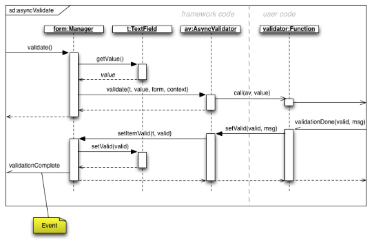

The asynchronous validation can not only be used for form items. Also, the manager itself can handle instances of the AsyncValidator as validator.

Serialization
-------------

Entering data into a form is one part of the process. But usually, that entered data needs to be sent to the server. So serialization is a major topic when it comes to forms. We decided not to integrate this in one form manager which would be responsible for both validation and serialization.

### Idea

The main idea behind this was to ensure that it cooperates nicely with features like the form widgets and the corresponding data binding components. So we decided to split the problem into two different parts. The first part is storing the data held in the view components as a model. The second part takes that model and serializes its data. Sounds like data binding (/pages/data_binding/data_binding)? It is data binding!

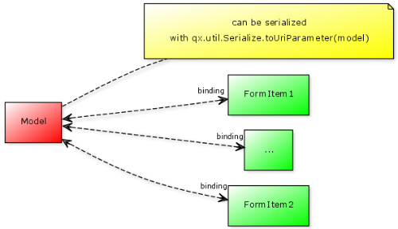

But you don't have to connect all these widgets yourself. qooxdoo offers an object controller which can take care of most of the work. But where do you get the model? Writing a specific qooxdoo class for every form sounds like a bit of overkill. But qooxdoo has a solution for that, too. The creation of classes and model instances is already a part of the data binding components and can also be used here. Sounds weird? Take a look at the following common scenarios to see how it works.

### Common Scenarios

The most common scenario is to serialize a number of form items without any special additions. Just get the values of the entire form and serialize them.

    // create the ui
    var name = new qx.ui.form.TextField();
    var password = new qx.ui.form.PasswordField();

    // create the model
    var model = qx.data.marshal.Json.createModel({name: "a", password: "b"});

    // create the controller and connect the form items
    var controller = new qx.data.controller.Object(model);
    controller.addTarget(name, "value", "name", true);
    controller.addTarget(password, "value", "password", true);

    // serialize
    qx.util.Serializer.toUriParameter(model);

The result will be `name=a&password=b` because the initial values of the model are `a` and `b`.

This way, the serialization is separated from the form itself. So hidden form fields are as easy as it could be. Just add another property to the model.

    var model = qx.data.marshal.Json.createModel(
      {name: "a", password: "b", c: "i am hidden"}
    );

Keep in mind that you're creating a model with that and you can access every property you created using the default getters and setters.

You might be asking yourself "What if i want to convert the values for serialization? My server needs some different values...". That brings us to the topic of conversion. But as we have seen before, the mapping from the view to the model is handled by the data binding layer which already includes conversion. Take a look at the data binding documentation data_binding/single_value_binding.md#options_conversion_and_validation for more information on conversion.

#### Need something special?

In some cases, you might want to have something really special like serializing one value only if another value has a special value or something similar. In that case, you can write your own serializer which handles serialization the way you need it.

Resetting
---------

A third useful feature of a form besides validation and serialization is resetting the entire form with one call. Doesn't sound complicated enough that a separate class is needed. But we decided to do it anyway for good reasons:

-   The validation manager is not the right place for resetting because it handles only the validation.
-   The form widget, responsible for layouting forms, is a good place, but we don't want to force developers to use it if they just want the reset feature.

So we decided to create a standalone implementation for resetting called `qx.ui.form.Resetter`.

Like the task of resetting itself, the API is not too complicated. We have one method for adding items, and another one for resetting all added items.

### How It Works

Technically, it's not really a challenge thanks to the new form API. You can add any items either having a value property defined by one of the data specific form interfaces desktop/ui_form_handling.md#number_string_color_date_boolean or implementing the selection API (ui_selection) of qooxdoo. On every addition, the resetter grabs the current value and stores it. On a reset all stored values are set.

### Sample Usage

The following sample shows how to use the resetter with three input fields: A textfield, a checkbox and a list.

    // create a textfield
    var textField = new qx.ui.form.TextField("acb");
    this.getRoot().add(textField, {left: 10, top: 10});

    // create a checkbox
    var checkBox = new qx.ui.form.CheckBox("box");
    this.getRoot().add(checkBox, {left: 10, top: 40});

    // create a list
    var list = new qx.ui.form.List();
    list.add(new qx.ui.form.ListItem("a"));
    list.add(new qx.ui.form.ListItem("b"));
    list.setSelection([list.getSelectables()[0]]);
    this.getRoot().add(list, {left: 10, top: 70});

    // create the resetter
    var resetter = new qx.ui.form.Resetter();
    // add the form items
    resetter.add(textField);
    resetter.add(checkBox);
    resetter.add(list);

    // add a reset button
    var resetButton = new qx.ui.form.Button("Reset");
    resetButton.addListener("execute", function() {
      resetter.reset();
    });
    this.getRoot().add(resetButton, {left: 120, top: 10});

Form Object
-----------

We've already covered most parts of form handling. But one thing we've left out completely until now is layouting the form items. That's where the `qx.ui.form.Form` widget comes into play.

### What is it?

The qooxdoo form is an object which includes three main parts.

-   Validation desktop/ui_form_handling.md#validation using the `qx.ui.form.validation.Manager` class
-   Resetting desktop/ui_form_handling.md#resetting using the `qx.ui.form.Resetter` class
-   Handling the layout of the form

As we have already talked about the first two items, I'll cover the last item in a more detailed way.

In most cases, a form's layout is specific to the application. It depends on the space available in the application and many other factors. That's why qooxdoo has this flexible form layouting tool, which includes a set of default options to layout a form. On of the main requirements of the solution was extensibility so that anyone could have the layout their application requires. To achieve this, we applied a pattern used widely across the qooxdoo framework, which moves all UI related code to renderer classes. These renderers are as lightweight as possible to make it easy for developers to write their own custom renderer, as you can see in this UML diagram: 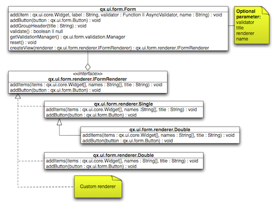

### Renderer

As the diagram shows, qooxdoo provides an interface for FormRenderer, the `IFormRenderer` interface. It defines two methods, one for adding a group of form items and one for adding buttons.

-   addItems(items : qx.ui.form.IForm[], names : String[], title : String) : void
-   addButton(button : qx.ui.form.Button) : void

Surely you've recognized the difference to the API of the form itself. Widgets are added to the form individually, but the renderer always gets a group of widgets at once. This gives the renderer additional information which it may need to render the form based on the number of groups rather then on the number of widgets.

You may ask yourself why we didn't use the layouts we usually use in such scenarios if we ant to render widgets on the screen. It may be necessary for a renderer to contain even more than one widget. Imagine a wizard or a form spread out over multiple tabs. That wouldn't be possible using layouts instead of renderer widgets.

The following sections show the renderers included in qooxdoo, which can be used out of the box.

#### Default (Single Column)

If you don't specify a renderer, the default is used, which is a single column renderer.

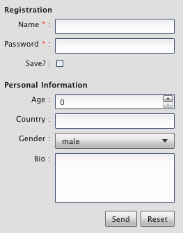

As you can see in the picture, the renderer adds an asterisk to every required field, adds a colon at the end of every label and defines the vertical layout.

#### Double Column

The double column renderer has the same features as the previously introduced single column renderer but renders the fields in two columns, as you can see in the following picture.

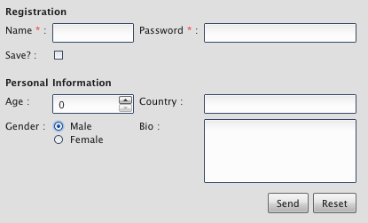

#### Single Column with Placeholer

This renderer is more a of demo showing how easy it can be to implement your own renderer. It has a limitation in that it can only render input fields which have the placeholder property. But the result is pretty nice:

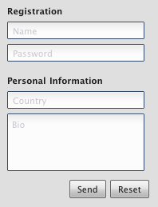

### Sample Usage

After we've seen how it should look, here come some examples showing how it works. In this example, we want to create a form for an address management tool. So we divide our input fields into two groups. The first group contains two text fields, one for the first name and one for the last name. The second group contains some contact data like email, phone number and company name. Finally, we want to add two buttons to the form, one for saving the data if it is valid and another for resetting the form. So here we go...

First, we need a form object.

    // create the form
    var form = new qx.ui.form.Form();

After that, we can create the first two input fields. As these two fields are required, we should mark them as such.

    // create the first two input fields
    var firstname = new qx.ui.form.TextField();
    firstname.setRequired(true);
    var lastname = new qx.ui.form.TextField();
    lastname.setRequired(true);

As you can see, the input fields are text fields as described above. Next, we can add those input fields to the form.

    // add the first group
    form.addGroupHeader("Name");
    form.add(firstname, "Firstname");
    form.add(lastname, "Lastname");

First, we added a group header to create a headline above the two input fields. After that, we added them with a name but without a validator. The required flag we set earlier is enough. We need to add another group of input fields for the contact data.

    // add the second group
    form.addGroupHeader("Contact");
    form.add(new qx.ui.form.TextField(), "Email", qx.util.Validate.email());
    form.add(new qx.ui.form.TextField(), "Phone");

After adding the second group header, you'll see the text field for the email address, which uses a predefined email validator from the framework. The phone number does not get any validator at all. The last missing thing are the buttons. First, add the save button.

    // add a save button
    var savebutton = new qx.ui.form.Button("Save");
    savebutton.addListener("execute", function() {
      if (form.validate()) {
        alert("You can save now...");
      }
    });
    form.addButton(savebutton);

The save button gets an execute listener which first validates the form and, if the form is valid, alerts the user. The reset button is analogous.

    // add a reset button
    var resetbutton = new qx.ui.form.Button("Reset");
    resetbutton.addListener("execute", function() {
      form.reset();
    });
    form.addButton(resetbutton);

Now the form is complete and we can use the default renderer to render the form and add it to the document.

    // create the view and add it
    this.getRoot().add(new qx.ui.form.renderer.Single(form), {left: 10, top: 10});

Running this code will create a form as described above which will look like this:

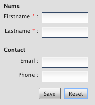

If you want to get a different look and feel, you can create a different renderer.

    // create the view and add it
    this.getRoot().add(
      new qx.ui.form.renderer.SinglePlaceholder(form),
      {left: 10, top: 10}
    );

Just give it a try in the [playground](apps://playground/#%7B%22code%22%3A%20%22%252F%252F%2520create%2520the%2520form%250Avar%2520form%2520%253D%2520new%2520qx.ui.form.Form()%253B%250A%250A%252F%252F%2520create%2520the%2520first%2520two%2520input%2520fields%250Avar%2520firstname%2520%253D%2520new%2520qx.ui.form.TextField()%253B%250Afirstname.setRequired(true)%253B%250Avar%2520lastname%2520%253D%2520new%2520qx.ui.form.TextField()%253B%250Alastname.setRequired(true)%253B%250A%250A%252F%252F%2520add%2520the%2520first%2520group%250Aform.addGroupHeader(%2522Name%2522)%253B%250Aform.add(firstname%252C%2520%2522Firstname%2522)%253B%250Aform.add(lastname%252C%2520%2522Lastname%2522)%253B%250A%250A%252F%252F%2520add%2520the%2520second%2520group%250Aform.addGroupHeader(%2522Contact%2522)%253B%250Aform.add(new%2520qx.ui.form.TextField()%252C%2520%2522Email%2522%252C%2520qx.util.Validate.email())%253B%250Aform.add(new%2520qx.ui.form.TextField()%252C%2520%2522Phone%2522)%253B%250A%250A%252F%252F%2520add%2520a%2520save%2520button%250Avar%2520savebutton%2520%253D%2520new%2520qx.ui.form.Button(%2522Save%2522)%253B%250Asavebutton.addListener(%2522execute%2522%252C%2520function()%2520%257B%250A%2520%2520if%2520(form.validate())%2520%257B%250A%2520%2520%2520%2520alert(%2522You%2520can%2520save%2520now...%2522)%253B%250A%2520%2520%257D%250A%257D)%253B%250Aform.addButton(savebutton)%253B%250A%250A%252F%252F%2520add%2520a%2520reset%2520button%250Avar%2520resetbutton%2520%253D%2520new%2520qx.ui.form.Button(%2522Reset%2522)%253B%250Aresetbutton.addListener(%2522execute%2522%252C%2520function()%2520%257B%250A%2520%2520form.reset()%253B%250A%257D)%253B%250Aform.addButton(resetbutton)%253B%250A%250A%252F%252F%2520create%2520the%2520view%2520and%2520add%2520it%250Athis.getRoot().add(new%2520qx.ui.form.renderer.Single(form)%252C%2520%257Bleft%253A%252010%252C%2520top%253A%252010%257D)%253B%22%7D).

Form Controller
---------------

Data binding for a form certainly is a handy feature. Using a model to access data in the form brings form handling to another level of abstraction. That's exactly what the form controller offers.

The form controller is fully covered in the data binding documentation data_binding/controller.md#form_controller.

### Sample Usage

The following example shows how to use the controller with a simple form, which contains three text fields: One for salutation, one for first name and one for last name.

First, we create the form:

    // create the form
    var form = new qx.ui.form.Form();

In a second step we add the three text fields. The important thing here is that if no name is given - as in the first two cases - each label will also be used as a name. For that, all spaces in the label are removed.

    // add the first TextField ("Salutation" will be the property name)
    form.add(new qx.ui.form.TextField(), "Salutation");
    // add the second TextField ("FirstName" will be the property name)
    form.add(new qx.ui.form.TextField(), "First Name");
    // add the third TextField ("last" will be the property name)
    form.add(new qx.ui.form.TextField(), "Last Name", null, "last");

After we add the text fields, we can add the view to the application root.

    // add the form to the root
    this.getRoot().add(new qx.ui.form.renderer.Single(form));

Now that the form has been created, we can take care of the data binding controller. We simply supply the form instance as an argument to the constructor. But we don't have a model yet, so we just pass `null` for the model.

    // create the controller with the form
    var controller = new qx.data.controller.Form(null, form);

The final step for data binding is to create the actual model.

    // create the model
    var model = controller.createModel();

Take a look at the following sequence diagram to see how it works internally. 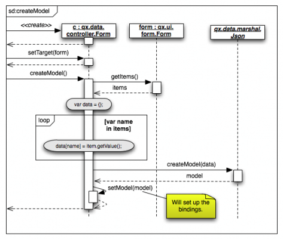

Now we have managed to set up a form and a model connected by bidirectional bindings. So we can simply use the model to set values in the form.

    // set some values in the form
    model.setSalutation("Mr.");
    model.setFirstName("Martin");
    model.setLast("Wittemann");

As you can see here, the properties (and therefore setters) are defined according to the names we gave the text fields when adding them.

[See the code in action](apps://playground/#%7B%22code%22%3A%20%22%252F%252F%2520create%2520the%2520form%250Avar%2520form%2520%253D%2520new%2520qx.ui.form.Form()%253B%250A%250A%252F%252F%2520add%2520the%2520first%2520TextField%2520(Salutation%2520will%2520be%2520the%2520property%2520name)%250Aform.add(new%2520qx.ui.form.TextField()%252C%2520%2522Salutation%2522)%253B%250A%252F%252F%2520add%2520the%2520second%2520TextField%2520(FirstName%2520will%2520be%2520the%2520property%2520name)%250Aform.add(new%2520qx.ui.form.TextField()%252C%2520%2522First%2520Name%2522)%253B%250A%252F%252F%2520add%2520the%2520third%2520TextField%2520(last%2520will%2520be%2520the%2520property%2520name)%250Aform.add(new%2520qx.ui.form.TextField()%252C%2520%2522Last%2520Name%2522%252C%2520null%252C%2520%2522last%2522)%253B%250A%250A%252F%252F%2520add%2520the%2520form%2520to%2520the%2520root%250Athis.getRoot().add(new%2520qx.ui.form.renderer.Single(form))%253B%250A%250A%252F%252F%2520create%2520the%2520controller%2520with%2520the%2520form%250Avar%2520controller%2520%253D%2520new%2520qx.data.controller.Form(null%252C%2520form)%253B%250A%252F%252F%2520create%2520the%2520model%250Avar%2520model%2520%253D%2520controller.createModel()%253B%250A%250A%252F%252F%2520set%2520some%2520values%2520in%2520the%2520form%250Amodel.setSalutation(%2522Mr.%2522)%253B%250Amodel.setFirstName(%2522Martin%2522)%253B%250Amodel.setLast(%2522Wittemann%2522)%253B%250A%22%7D) in the playground.

Still to come...
----------------

-   [A way to create a form out from a JSON definition](https://github.com/qooxdoo/qooxdoo/issues/2823)
