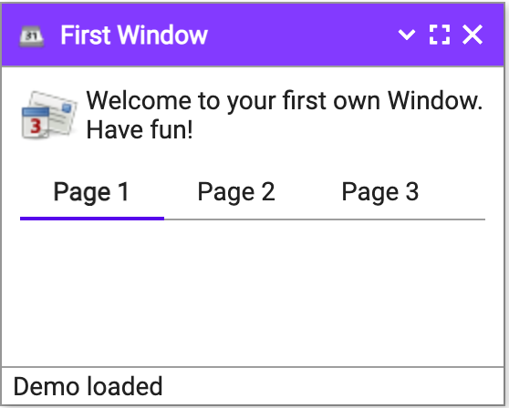
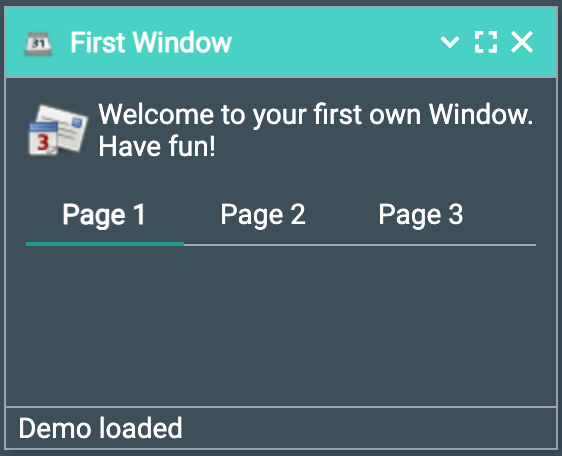
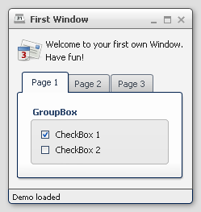
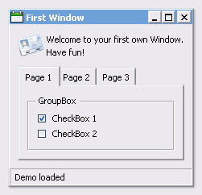
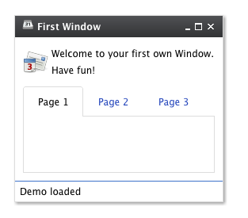

# Theming

Qooxdoo provides the following themes ready to use:

- `Simple` - a lightweight theme, which looks more like a website.

    

- `TangibleLight` and `TangibleDark` - lightweight themes based on Google Materials design philosophy and using Material Font Icons

    
    

- `Modern` - a graphically rich theme, showcasing many UI capabilities of Qooxdoo #{qooxdoo.version}

    

- `Classic` - MS Windows oriented theme

    

- `Indigo` - a theme, based on simple but offers the style of the qooxdoo.org website.

    

While those four themes run out-of-the-box, it is easy to create your own
themes. Those custom themes can either be created by 
[extending existing ones](themes#extending-themes)
or they can be [created from scratch](themes#define-custom-themes).

A complete theme (a so-called _meta theme_) consists of several special themes,
each designed to play a dedicated role and to set up the different parts of the
whole theming. These special themes are described at the subsequent sections
followed by a description of how to create own themes.

## Meta Theme

A meta theme describes the whole theme itself by defining the specific parts.
Each meta theme consists of five keys

- appearance
- color
- decoration
- font
- icon

each of them referencing to a specialized theme. So you can think of a meta
theme as of collection whose parts can easily be changed.

Sample of a meta theme:

```javascript
qx.Theme.define("qx.theme.Modern",
{
  meta :
  {
    color : qx.theme.modern.Color,
    decoration : qx.theme.modern.Decoration,
    font : qx.theme.modern.Font,
    appearance : qx.theme.modern.Appearance,
    icon : qx.theme.icon.Tango
  }
});
```

This section describes the different types of themes which are used for theming
a whole application.

## Color Theme

A color theme defines all colors used by the framework. Each color is defined by
a unique name and a value which can be written as hex, rgb or named color. This
defined name is usable throughout the whole framework and your application.

> :memo: The best way to organize your color names is to use **semantic ones** like
> `background`, `text-input` or `text-disabled`. This way it is easier to use
> one color for multiple widgets.

Part of a sample color theme:

```javascript
/**
 * sample color theme
 */
qx.Theme.define("myApplication.theme.sample.Color",
{
  colors :
  {
    /*
    ----------------------------------------------------------------------
      SAMPLE COLORS
    ----------------------------------------------------------------------
    */

    // color as hex value
    "background-application" : "#DFDFDF",

    // color as rgb array
    "background-pane" : [ 128, 128, 128 ],

    // color as named color
    "background-light" : "gray",
  }
});
```

Following names are recognized as named colors: `black`, `white`, `silver`,
`gray`, `maroon`, `red`, `purple`, `fuchsia`, `green`, `lime` , `olive`,
`yellow`, `navy`, `blue`, `teal`, `aqua`, `orange`, `brown` .

The color values are set in the class
[qx.util.ColorUtil](apps://apiviewer/#qx.util.ColorUtil)

## Decoration Theme

Each widget can be equipped with an independent decoration which can be used to
set a background-color or -image, define a border, add a shadow and much more.
In a decoration theme you can use several different decorators depending on the
results you wish to achieve. Please take a look at the [theme article](themes.md#custom-decorators) 
to get more information.

> :memo: It is recommended to define the decorations inside the theme instead of
> creating manually decorator instances inside your application code. This way
> the created decorators can be used by multiple widgets.

What a decoration theme can look like:

```javascript
/**
 * Sample decoration theme.
 *
 * @asset(sample/decoration/myDecorationTheme/*)
 */
qx.Theme.define("myApplication.theme.sample.Decoration",
{
  aliases : {
    decoration : "myApplication/decoration/sample"
  },

  decorations :
  {
    "single" :
    {
      decorator: qx.ui.decoration.Single,

      style :
      {
        width : 1,

        color : "red",
        colorLeft : "black",
        colorRight : "white",

        style : "solid"
      }
    },

    "grid" :
    {
      decorator : qx.ui.decoration.Grid,

      style :
      {
        baseImage : "decoration/pane/grid.png"
      }
    },


    "combined" :
    {
      decorator : [
        qx.ui.decoration.MBackgroundColor,
        qx.ui.decoration.MBorderRadius
      ],

      style :
      {
        backgroundColor : "button",
        radius : 3
      }
    }
  }
});
```

Noted the `@asset` at the top and the `aliases` key inside the theme
declaration? This is needed to for the images used within the theme. A
description of how to work with resources is available [here](resources.md#declaring-resources-in-the-code).

> :memo: The `aliases` key is especially important when defining an own decorator
> theme. This entry does add a new alias at the `AliasManager` class and
> verifies that your images for the decoration theme are found by the
> `ResourceManager` which is working with the resolve URLs of the `AliasManager`
> class.

## Font Theme

This theme is all about the information of the fonts used throughout your
application. As the number of types/variants of fonts used with application
isn't that big the font theme is normally a compact one. Web fonts are also
defined here. See the article on [web fonts](theming.md#web-fonts) for details.

> :memo: It is always a good idea to limit the number of types or variants of fonts to
> create a homogenous look.

To demonstrate how compact and powerful a font theme can look like, take a look
at the example font theme:

```javascript
/**
 * The modern font theme.
 */
qx.Theme.define("qx.theme.modern.Font",
{
  fonts :
  {
    "default" :
    {
      size : 11,
      lineHeight : 1.4,
      family : [ "Tahoma", "Liberation Sans", "Arial" ]
    },

    "bold" :
    {
      size : 12,
      lineHeight : 1.4,
      family : [ "Lucida Grande" ],
      bold : true
    }
  }
});
```

It is important to note that you can only specify values available as property
on [qx.bom.Font](apps://apiviewer/#qx.bom.Font) or
[qx.bom.webfonts.WebFont](apps://apiviewer/#qx.bom.webfonts.WebFont).


### Specifying Fonts

These days there are a lot of fonts available, and it's not unusual to want to download and use a font specifically chosen for your theme. These webfonts are available from a variety of sources (whether open source licensed or proprietary / paid for); you can use an online service such as [FontSquirrel's Webfont Generator](https://www.fontsquirrel.com/tools/webfont-generator) or other tools to convert your fonts into webfonts (provided of course that your license for the font permits it) and add them to your application.

**Note**
>This section describes using the `provides.fonts` part of `Manifest.json` to describe the fonts that your application or library will use; there was a previous mechanism which used `provides.webfonts` but that is deprecated and should no longer be used.

>The main difference between the two is that `provides.webfonts` only support font files which are compiled into the application (URLs, including CDNs, were not supported), every font file is loaded all of the time, and the filenames are embedded in code.  The `provides.fonts` is smarter and will only load those fonts which are needed, and can choose at compile time which files (or URLs) to use - this can greatly reduce the size of applications

The Manifest.json's `provides.fonts` lists fonts, giving each on a unique name (you can choose your own identifier or use something well known), specify the 
download URLs and/or resource paths, and then only refer to the unique identifier in code.

If you are using built-in fonts (ie you do not have any URLs or resource paths to use) then it is still useful to define fonts here so that you can avoid repetition
later on, and if you're writing a theme in a library, you are also allowing applications to override your font definitions.

Here's three examples from Qooxdoo's Manifest.json:

```json5
    "fonts": {
      "qx.theme.monospace": {
        "family": ["DejaVu Sans Mono", "Courier New", "monospace"]
      },
      "Roboto": {
        "css": ["https://fonts.cdnfonts.com/css/roboto"],
        "fontFaces": [
          {
            "fontFamily": "Roboto",
            "fontStyle": "normal",
            "fontWeight": "normal",
            "paths": [
              "qx/font/Roboto/roboto-v18-latin_latin-ext-regular.eot",
              "qx/font/Roboto/roboto-v18-latin_latin-ext-regular.woff2",
              "qx/font/Roboto/roboto-v18-latin_latin-ext-regular.woff",
              "qx/font/Roboto/roboto-v18-latin_latin-ext-regular.ttf"
            ]
          }
        ]
      },
      "MaterialIcons": {
        "family": ["Material Icons"],
        "defaultSize": 32,
        "comparisonString": "e1feef39",
        "css": ["https://fonts.googleapis.com/icon?family=Material+Icons"],
        "fontFaces": [
          {
            "fontFamily": "Material Icons",
            "paths": [
              "qx/iconfont/MaterialIcons/materialicons-v126.eot",
              "qx/iconfont/MaterialIcons/materialicons-v126.woff2",
              "qx/iconfont/MaterialIcons/materialicons-v126.woff",
              "qx/iconfont/MaterialIcons/materialicons-v126.ttf"
            ]
          }
        ],
        "glyphs": "qx/iconfont/MaterialIcons/materialicons.json"
      },
```

In the first example ("qx.theme.monospace") we're defining a shortcut that says that anywhere that the font name "qx.theme.monospace" is used, Qooxdoo
should switch to using the font family in the array.  In this case, the various Qooxdoo themes often use this one name, and it makes it a touch easier to
update it in the future.

In the second example ("Roboto"), we're describing a Google font that is stored inside the Qooxdoo repo - it's a copy of the Google font, and will be compiled
into every application that has a theme which uses that font - for example, if you use the `TangibleDark` or `TangibleLight` themes, Qooxdoo will automatically
include the Roboto font in your application.

In the third example ("MaterialIcons"), we're describing a Google font where we have a URL to use for the CDNs, or we can have it compiled in.  The compiler
can decide whether to use the CDN or embeded fonts.

Note that in the Roboto and MaterialIcons example, there is a `fontFaces` key - this is an array of CSS `@font-face` declarations that need to be made by
Qooxdoo when it uses that font - for each element in the `fontFaces` array, you specify the filenames (or URLs) of the font files.  By default, the family
name of the font is the font ID (eg "MaterialIcons") but in the examples above that's not correct - the font file will provide a font called "Material Icons" 
(ie with a space), so you can override that for your `fontFaces` declaration.  Similarly, you have to specify the `fontWeight` and `fontStyle`, which default to
just `"normal"`.  All of this matches exactly as a browser would consider `@font-face`.

However, a better example is often to use the actual fonts from a CDN - to do this, use the "css" key and provide an array of URLs.  These CSS files can 
include multiple `@font-face` declarations, and while there would normally be only one font family in the CSS that's not actually a requirement.  When you use 
"css", you must provide the "family" array to tell Qooxdoo which families are provided.


#### Using fonts
Once you've added a font to your library or application, the final step is that you need to tell the compiler which classes need that font - use the `@usefont` jsdoc, which is similar to `@asset` - for example:

```javascript
/**
 * The simple qooxdoo font theme.
 *
 * @usefont(Roboto)
 * @usefont(Roboto Mono)
 */
qx.Theme.define("qx.theme.tangible.Font", {
```


#### Icon Fonts
That third example is also an Icon Font, which means that it has a set of glyphs/ligatures which can be referenced by name - for example, if you use an
image with "@MaterialIcons/warning/16" the "warning" is the name of a glyph, and has to be translated to `\u57346`.  

Note that the third example above has a `"glyphs"` setting, which is the name of a .json file that has those mappings from names to characters.

The compiler can typically read the font and generate that mapping for you - eg:

```bash
$ cd source/resource/qx/iconfont/MaterialIcons
$ qx export-glyphs materialicons-v126.ttf materialicons.json

```

(BTW there is a file called `source/resource/qx/iconfont/export-glyphs.sh` which does this already for all MaterialIcon fonts)

#### Choosing whether to use CDN URLs or embed

Embedding a font in your application guarantees that it can't change, and if your app is running off a local intranet (or your developing over a slow
internet link) you may prefer to *not* use CDNs.  This means that you app will be larger because the compiler has to include the font files in the generated
application.

By default, the compiler will use CDN URLs if they are given in Manifest.json, but you can override this in two ways: firstly, the `--local-fonts` compiler
option, or adding a `fonts` object block in `compile.json`:

```json5
  "targets": [
    {
      "type": "source",
      "fonts": {
        "local": true,
        "fontTypes" ["ttf"]
      }
```

If you set the `targets[].fonts.local` to true, it will have the same effect as `--local-fonts`, ie embed rather than use URLs.  The `compile.json` also
has a `fontTypes` array, which is the list of font extensions to include - by default this is just "ttf", but you can also specify any of "eot", "otf", 
"woff", and "woff2".


## Icon Theme

This theme is to define which icon set is used and normally consists only of 2
main keys (title and aliases).

The important one is the `aliases` key which points the compiler to the
location of the icon set. The `icon` alias, which is used to reference icons
in Qooxdoo applications, is set to the value of this key. As Qooxdoo uses the
freely available [Tango](https://commons.wikimedia.org/wiki/Tango_icons) and
[Oxygen](http://www.iconarchive.com/show/oxygen-icons-by-oxygen-icons.org.html)
icon sets it is not necessary to extend these.

Complete code for the `tango` icon theme:

```javascript
/**
 * Tango icons
 */
qx.Theme.define("qx.theme.icon.Tango",
{
  aliases : {
    "icon" : "qx/icon/Tango"
  }
});
```

## Appearance Theme

The appearance theme is by far the biggest theme. Its task is to describe every
themeable widget and their child controls. Since the widgets are styled using
decorators, colors, fonts and icons the appearance theme uses the definitions of
all the other themes namely the decoration, color, font and icon theme. You can
think of the appearance theme as the central meeting point where the other
themes (decorator, color, font and icon) get together.

To discover the power of the appearance theme please take a look at the
[corresponding article](appearance.md) which should let you get an idea of the
whole picture.

## Applying Themes

Typically, your application will have a certain, pre-defined theme known _at
build-time_. The default theme can be defined in `compile.json`.

```json5
  "applications": [
    {
      "class": "myApp.Application",
      "theme": "myApp.theme.Theme",
      "name": "myApp",
      "bootPath": "source/boot"
    }
  ]
```

The above example defines as default theme, the meta theme of the application.


## Switching Themes During Runtime

It is also possible to set a theme _at runtime_:

```javascript
qx.theme.manager.Meta.getInstance().setTheme(qx.theme.Classic);
```

Having e.g. the Qooxdoo modern theme defined in your `compile.json` file, this line
of code switches the whole UI to the classic theme. Of course, this can also be
a [custom theme](themes.md).

> :memo: Referencing a second theme in the code also adds a dependency to the theme and
> all the classes and resources necessary. This is only necessary if the theme
> switch is actively triggered. [Parts](../../development/howto/parts.md#parts-and-source-code-packages-overview)
>  offer a convenient way of on demand loading of code, like a second theme.

## Multi-theme Applications

Building up on the previous section, here is how to create an application that
provides multiple themes that can be switched at runtime.

- **Configure themes**: Add all meta theme classes of the themes you want to use
  to the `include` key for the application; for example:

```json5
   "applications": [
      {
         "class": "qxl.widgetbrowser.Application",
         "theme": "qx.theme.Indigo",
         "name": "widgetbrowser",
         "title": "WidgetBrowser",
         "include": [
            "qx.theme.Modern",
            "qx.theme.Simple",
            "qx.theme.Classic",
            "qx.theme.TangibleLight",
            "qx.theme.TangibleDark"
            ]
        }
      ],
```

  If you use third-party themes (like the Aristo or RetroTheme contributions)
  make sure you also add their libraries via `qx package` or the `libraries` property in the `compile.json`, so their classes are actually available.

- **Implement theme switch**: Switch the theme in your application code. E.g.
  you can use [qx.Theme.getAll()](apps://apiviewer/#qx.Theme~getAll) to retrieve
  all known theme classes, filter out the "meta" classes, decide which to use,
  and set it as the current theme, exemplified here through two methods:

  ```javascript
  _getThemeNames() {
    let theme, theme_names = [];
    const themes = qx.Theme.getAll();
    for (let key in themes) {
      theme = themes[key];
      if (theme.type === "meta") {
        theme_names.push(theme.name); }
    }
    return theme_names;
  },

  _setTheme(theme_name) {
    const theme = qx.Theme.getByName(theme_name);
    if (theme) {
      qx.theme.manager.Meta.getInstance().setTheme(theme); 
    }
  }
  ```

  Of course, you can use these APIs in different ways, depending on your
  application needs.

- **Use theme-dependent icons (opt)**: So far switching the theme will result in
  widgets changing their appearance. Usually, themes also use a specific icon
  theme. If you use icons in your custom classes (widgets or themes), and you
  want them to adapt to the main theme you need to make sure that

  1.  the relevant icons of all icon themes are registered with your application
  2.  your code doesn't "hard-wire" icons but uses aliases. Here are code
      snippets to illustrate that.

  For 1. add the icon theme in your application's environment variable `qx.icontheme`  which can later be used in
  the [@asset](resources.md#declaring-resources-in-the-code) hints of class code. E.g.:


  ```json5
  "environment": {
    "qx.icontheme": ["Tango", "Oxygen"]
  },
  ```

  In application code register icons for both icon themes with the class using
  them, by exploiting an asset macro instead of entering the icon theme
  literally. This also allows you to later add further icon themes just by
  adapting the configuration, without touching code:

  ```javascript
  // Application class:

  // Use the asset macro "qx.icontheme" to register icons from both themes.
  /**
   * @asset(qx/icon/${qx.icontheme}/16/apps/utilities-terminal.png)
   */
  ```

  For 2. use an alias in application code to reference icons transparently:

  ```javascript
  // Use an aliased resource id for the icon
  const b = qx.ui.form.Button("My button", "icon/16/apps/utilities-terminal.png");
  ```

