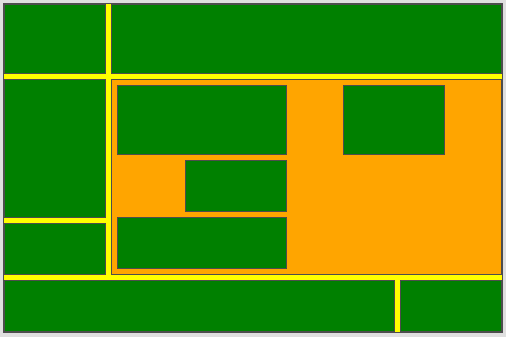

# Grid

The grid layout manager arranges the items in a two dimensional grid. Widgets
can be placed into the grid's cells and may span multiple rows and columns.

## Preview Image

This image show two nested grids with column and row spans.

## Features

- Flex values for rows and columns
- Minimal and maximal column and row sizes
- Manually setting of column and row sizes
- Horizontal and vertical alignment
- Horizontal and vertical spacing
- Column and row spans
- Auto-sizing

## Description

The grid arranges the child widgets in a two dimensional grid. Each child is
associated with a grid `column` and `row`. Widgets can span multiple cells by
setting the `colSpan` and `rowSpan` layout properties. However each grid cell
can only contain one widget. Thus child widgets can never overlap.

The grid computes the preferred with/height of each column/row based on the
preferred size of the child widgets. The computed column widths and row heights
can be overridden by explicitly setting them using  
[setColumnWidth](apps://apiviewer/#qx.ui.layout.Grid~setColumnWidth) and
[setRowHeight](apps://apiviewer/#qx.ui.layout.Grid~setRowHeight) . Minimum and
maximum sizes for columns/rows can be set as well.

By default no column or row is stretched if the available space is
larger/smaller than the needed space. To allow certain rows/columns to be
stretched each row/column can have a flex ui_layouting.md#flex value.

## Layout properties

- **row** _(Integer)_: The row of the cell the widget should occupy. Each cell
  can only contain one widget. This layout property is mandatory.
- **column** _(Integer)_: The column of the cell the widget should occupy. Each
  cell can only contain one widget. This layout property is mandatory.
- **rowSpan** _(Integer)_: The number of rows, the widget should span, starting
  from the row specified in the `row` property. The cells in the spanned rows
  must be empty as well. (defaults to `1`)
- **colSpan** _(Integer)_: The number of columns, the widget should span,
  starting from the column specified in the `column` property. The cells in the
  spanned columns must be empty as well. (defaults to `1`)

## Alternative Names

- [QGridLayout](http://qt-project.org/doc/qt-5.0/qtwidgets/qgridlayout.html)
  (Qt)
- Grid (XAML)
- TableLayout (ExtJS)

## Demos

Here are some links that demonstrate the usage of the layout:

- [Simple grids](apps://demobrowser/#layout~Grid_Simple.html)
- [Complex grids](apps://demobrowser/#layout~Grid_Complex.html)
- [A grid with different cell alignments](apps://demobrowser/#layout~Grid_Alignment.html)
- [An animated grid](apps://demobrowser/#layout~Grid_Animated.html)

## API

Here is a link to the API of the layout manager:
[qx.ui.layout.Grid](apps://apiviewer/#qx.ui.layout.Grid)
