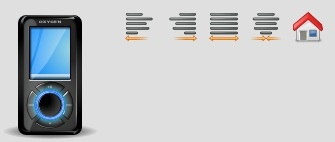

Image
=====

As the name suggest, the Image widget is used to display image files.

Preview Image
-------------

Features
--------

-   Scaling the image
-   Image clipping (combine multiple images into one single image)
-   Auto sizing
-   Configurable second image for the disabled state
-   Support for PNG files with alpha transparency in all browsers (including IE6)
-   Support for a loading event (only available for images loaded externally)

Demos
-----

Here are some links that demonstrate the usage of the widget:

-   [Image demo](apps://demobrowser/#widget~Image.html)

API
---

Here is a link to the API of the Widget:
[qx.ui.basic.Image](apps://apiviewer/#qx.ui.basic.Image)
