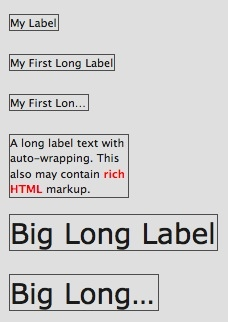

# Label

The Label widget is used to display either plain text or rich text with HTML
markup.

## Preview Image

## Features

- Auto sizing
- Ellipsis: If the label does not fit into the widget bounds an ellipsis ("...")
  is rendered at the end of the label. (Only in text mode)
- "height for width": If the widget's width is too small to display the text in
  one line the text is wrapped and a new size hint is calculated. (Only in HTML
  mode)
- Configurable fonts, text colors and text alignment

## Description

The Label supports two different modes. The text and the HTML mode. The mode can
be set by using the `rich` property. Which mode to use depends on the required
features. If possible the text mode should be preferred because in this mode the
text size calculation is faster.

## Demos

Here are some links that demonstrate the usage of the widget:

- [A label demo with differently configured labels](apps://demobrowser/#widget~Label.html)
- [Height for width demo](apps://demobrowser/#ui~HeightForWidth.html)
- [Label reflow](apps://demobrowser/#ui~Label_Reflow.html)

## API

Here is a link to the API of the Widget:
[qx.ui.basic.Label](apps://apiviewer/#qx.ui.basic.Label)
