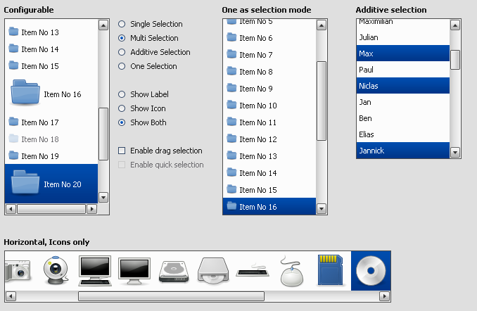

List
====

A List widget has items with plain text and/or icon.

Preview Image
-------------

Features
--------

-   Horizontal and vertical orientation.
-   Single selection.
-   Multi selection.
-   Additive selection.
-   One selection.
-   Drag selection.
-   Quick selection.
-   Items with plain text and/or icon.
-   Context menu support.

Description
-----------

A List widget can be used to show a list of items. These items could selected in different modes:

-   `single`: Only one or none could be selected.
-   `multi`: One, more or none could be selected.
-   `additive`: The same selection like `multi`, but each item, which the user taped on it is added or removed to the selection.
-   `one`: The same selection like `single`, but one must selected.

The item which are added to the list are `ListItem`. For more details see: [ListItem](apps://apiviewer/#qx.ui.form.ListItem).

Demos
-----

Here are some links that demonstrate the usage of the widget:

-   [List Demo](apps://demobrowser/#widget~List.html)
-   [Lists with Drag and Drop](apps://demobrowser/#ui~DragDrop.html)
-   [List with re-size support](apps://demobrowser/#widget~Resizer.html)

API
---

Here is a link to the API of the Widget:
[qx.ui.form.List](apps://apiviewer/#qx.ui.form.List)
