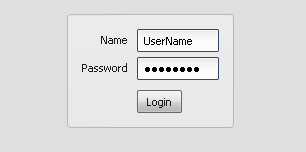

# PasswordField

The PasswordField widget is a special TextField witch show the input hidden.

## Preview Image

## Features

- Hide password
- Pointer and keyboard control.
- Set maximum input length.
- Read only support.

## Description

The PasswordField is a special TextField for password input. The PasswordField
hide the text input.

The act is the same like the TextField, for more details see: textfield

## Demos

Here are some links that demonstrate the usage of the widget:

- [Login dialog](apps://demobrowser/#animation~Login.html)
- [Show a form demo](apps://demobrowser/#showcase~Form.html)

## API

Here is a link to the API of the Widget:
[qx.ui.form.PasswordField](apps://apiviewer/#qx.ui.form.PasswordField)
