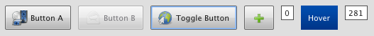

# RepeatButton

The RepeatButton is a special button, which fires an event, while the pointer is
pressed on the button.

## Preview Image

## Features

- Contain text and/or icon.
- Pointer support.
- Ellipsis: If the label does not fit into the widget bounds an ellipsis (”...”)
  is rendered at the end of the label.
- Event interval is adjustable.

## Description

The RepeatButton is a special button, which fires an event, while the pointer is
pressed on the button. The interval time for the RepeatButton event can be
configured by the developer.

## Demos

Here are some links that demonstrate the usage of the widget:

- [Button demo with all supported buttons](apps://demobrowser/#widget~Button.html)
- [Form showcase demo](apps://demobrowser/#showcase~Form.html)

## API

Here is a link to the API of the Widget:
[qx.ui.form.RepeatButton](apps://apiviewer/#qx.ui.form.RepeatButton)
