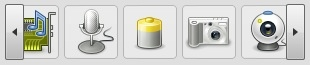

# SlideBar

The SlideBar is a container widget, which provides scrolling in one dimension
(vertical or horizontal).

## Preview Image

## Features

- Supports `vertical` and `horizontal` orientation
- Hides the scroll buttons if the content fits into the scroll container

## Description

The SlideBar widget can be used as a replacement for a scroll container if
scrolling is only needed in one direction. In contrast to the Scroll container
the SlideBar uses RepeatButtons (repeatbutton) instead of scroll bars to do the
scrolling. It is used e.g. in tab views (tabview).

## Demos

Here are some links that demonstrate the usage of the widget:

- [SlideBar demo](apps://demobrowser/#widget-SlideBar.html)

## API

Here is a link to the API of the Widget:
[qx.ui.container.SlideBar](apps://apiviewer/#qx.ui.container.SlideBar)
