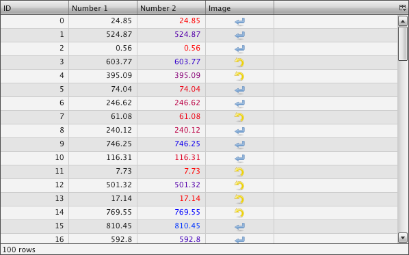
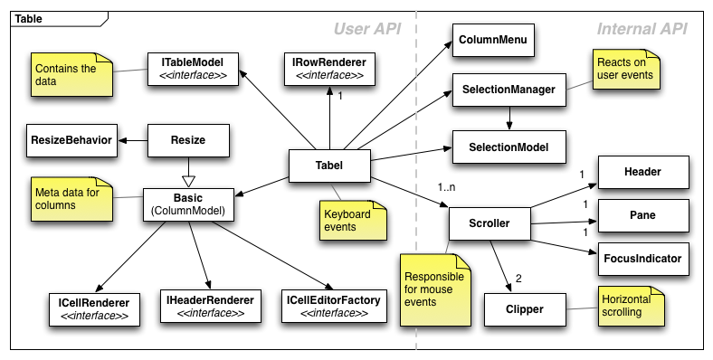

# Table

The table package contains classes that allow you to build up virtual tables for
showing data in a grid like view.

## Preview Image



## Description

A `Table` is a widget to show a set of data in a column based view. It is based
on the idea of virtual rendering. This means that only the visible rows will be
rendered, which increases the performance of the widget and makes the table
capable of displaying thousands of rows. But it is important to know that the
table has only virtual rows, not columns. Having a huge number of columns can
still decrease performance.

## Features

| Column Feature                   | Description                                                                                                                                                                |
| -------------------------------- | -------------------------------------------------------------------------------------------------------------------------------------------------------------------------- |
| Display grid data                | Takes an array containing an array for each row. The data in the row can be of almost any type.                                                                            |
| Set custom header                | Pre-built header renderer for icons and labels. Can be easily extended to supply a custom header cell renderer.                                                            |
| Column sorting                   | Built-in sorting accessible to the user by a tap on the table header.                                                                                                      |
| Reorganizing of columns          | Columns can be reorganized by the user via Drag&Drop.                                                                                                                      |
| Change the visibility of columns | A special column visibility menu is included. It offers the user a way to show / hide single columns.                                                                      |
| Content menu support             | The table supports content menus for each cell.                                                                                                                            |
| Meta Columns                     | You can define one or more column which have a separate scrolling if any. E.g. you could have the first column always visible, while the other columns scroll out of view. |
| Resizable columns                | The user can resize each column individually.                                                                                                                              |

| Row Feature                                      |                                                                                                                                                                |
| ------------------------------------------------ | -------------------------------------------------------------------------------------------------------------------------------------------------------------- |
| Render for different kinds of data types         | Special renderer for boolean, dates, HTML content, numbers, passwords and strings.                                                                             |
| Conditional rendering for individual table cells | A conditional renderer is available which can render the data in different ways dependent on the content, like applying a red text colors to negative numbers. |
| Row filtering                                    | Filtering for specific data can be done with a filter method.                                                                                                  |
| Virtual rendering for rows                       | Only the rows visible will be rendered which increases the speed of the table.                                                                                 |
| Highlight color for hovered row                  | The currently hovered row can be highlighted.                                                                                                                  |

| General Feature                  |                                                                                                                                                                               |
| -------------------------------- |-------------------------------------------------------------------------------------------------------------------------------------------------------------------------------|
| Capable of remote data gathering | A remote data model can fetch data from the server. It fetches only the current visible data which means not the whole data needs to be transferred to the client on startup. |
| Different selection modes        | The table offers single and multi selection in different variants.                                                                                                            |
| Editable cells                   | The cells can be set to editable. Build in editors are CheckBox, ComboBox, PasswordField, SelectBox and TextField.                                                            |
| Focus indicator                  | The currently selected cell can have a focus indicator.                                                                                                                       |
| Statusbar                        | The table has a status bar to show the number of rows and/or custom text.                                                                                                     |

## Examples

### Simple

The most simple table can be build in five lines of code, as you can see in this
example:

```javascript
// table model
const tableModel = new qx.ui.table.model.Simple();
tableModel.setColumns(["ID", "A number"]);
tableModel.setData([[1, 12.23],[3, 849759438750],[2, -2]]);

// table
const table = new qx.ui.table.Table(tableModel);
this.getRoot().add(table);
```

One of the important parts of the table is the table model. The first line
creates a simple table model. In the second and third line, we configure the
table model with some column names and data. With that model, we can create a
table and add it to our application, as the example shows in the last two lines.

### Editable Column

Making for example the second column of our simple example editable can be done
in one line:

```javascript
// make second column editable
tableModel.setColumnEditable(1, true);
```

The first parameter here is the column (column numbering starts with 0), and the
second one is to change the editable state.

### Sorting

Also adding a default sort order for the table is easy in one single line:

```javascript
// sort the table on startup
tableModel.sortByColumn(0, true);
```

Again, the first argument is the column. The second argument is responsible for
the sort order, `true` for ascending.

### Conditional Cell Rendering

As a last addition to our example we build something more complex. We want to
render all negative numbers in red and all positive numbers in green:

```javascript
// conditional rendering
const newRenderer = new qx.ui.table.cellrenderer.Conditional();
newRenderer.addNumericCondition(">", 0, null, "green");
newRenderer.addNumericCondition("<", 0, null, "red");
table.getTableColumnModel().setDataCellRenderer(1, newRenderer);
```

For that purpose, Qooxdoo has a built-in conditional renderer. In the first
line, we create such a renderer. The second and third line set up our
conditional rules. The last line tells the table column model to use that
renderer for the column with the index 1.

## UML Diagram



This diagram shows how the table uses the different kinds of classes you can
find in the table namespace. The diagram is divided in two sides. The left side
is interesting for the user if he wants to extend the table or wants to use its
custom cell renderer for example. The right side is usually a set of internal
classes the tables uses to get its general tasks done.

## Further resources

- [Table demos](apps://demobrowser/#table) in the online Demobrowser.
- [API documentation for qx.ui.table](apps://apiviewer/#qx.ui.table) in the
  online APIViewer.
