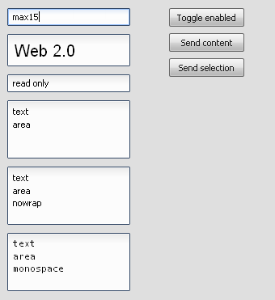

# TextArea

A TextArea some long text. The TextArea is classic GUI element.

## Preview Image

## Features

- Pointer and keyboard control.
- Configurable fonts and text alignment.
- Read only support.
- Automatic wrap around.

## Description

The TextArea is like a TextField, but for longer text input. So the TextArea
supports a automatic wrap around which can be deactivated, when it is undesired.

## Demos

Here are some links that demonstrate the usage of the widget:

- [Shows different TextArea demos](apps://demobrowser/#widget~TextField.html)
- [Shows a dialog demo with an TextArea](apps://demobrowser/#showcase~Dialog.html)
- [Show a form demo](apps://demobrowser/#showcase~Form.html)

## API

Here is a link to the API of the Widget:
[qx.ui.form.TextArea](apps://apiviewer/#qx.ui.form.TextArea)
