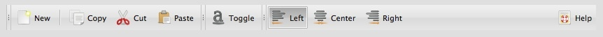
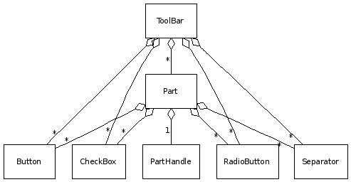

# Toolbar

The ToolBar widget is responsible for displaying a toolbar in the application.
Therefore it is a container for Buttons, RadioButtons, CheckBoxes and
Separators.

## Preview Image

## Features

- Buttons
  - Regular
  - Radio
  - Toggle
  - Menu
- Icons and / or labels for all buttons
- Separation into parts
- Separator handles

## Description

The qx.ui.toolbar package, which contains all stuff needed for the toolbar
widget, has the main class called ToolBar. The ToolBar class is the main
container for the rest of the classes. If you want to group your buttons in the
toolbar, you can do this with parts. The parts class acts as a subelement of the
toolbar with almost the same functionality. To a part you can add buttons. There
are some kinds of buttons in the toolbar package:

- Buttons
- Radio buttons
- CheckBox buttons
- MenuButtons
- SplitButtons

These buttons can also be added directly to the toolbar if no parts are needed.
For further structuring in the toolbar, a Separator is available in the package
which can be added.

## Diagram

## Demos

Here are some links that demonstrate the usage of the widget:

- [Toolbar with all features](apps://demobrowser/#widget~ToolBar.html)
- [Toolbar in a browser demo](apps://demobrowser/#showcase~Browser.html)
- [Toolbar with other menus](apps://demobrowser/#widget~Menu.html)

## API

Here is a link to the API of the Widget:
[qx.ui.toolbar](apps://apiviewer/#qx.ui.toolbar)
