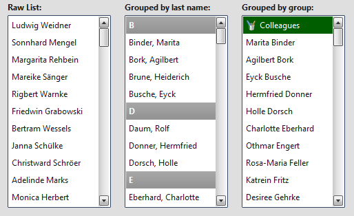

# Virtual List

The virtual List is a widget based on the framework's virtual infrastructure.

## Preview Image



## Description

The `qx.ui.list.List` is based on the virtual infrastructure and supports
filtering, sorting, grouping, single selection, multi selection, data binding
and custom rendering.

Using the virtual infrastructure has considerable advantages when there is a
huge amount of model items to render: Widgets are created only for visible items
and reused. This saves both creation time and memory.

With the
[qx.ui.list.core.IListDelegate](apps://apiviewer/#qx.ui.list.core.IListDelegate)
interface, it is possible to configure the list's behavior (item and group
renderer configuration, filtering, sorting, grouping, etc.).

> :memo: Only widget based rendering for list and group items is supported.

## Code Example

Here's an example. We create a simple list example with 2500 items, sort the
items (ascending), select the 20th item and log each selection change.

```javascript
//create the model data
let rawData = [];
for (let i = 0; i < 2500; i++) {
  rawData[i] = "Item No " + i;
}
const model = qx.data.marshal.Json.createModel(rawData);

//create the list
const list = new qx.ui.list.List(model);

//configure the lists's behavior
const delegate = {
  sorter : function(a, b) {
    return a > b ? 1 : a < b ? -1 : 0;
  }
};
list.setDelegate(delegate);

//Pre-Select "Item No 20"
list.getSelection().push(model.getItem(20));

//log selection changes
list.getSelection().addListener("change", function(e) {
  this.debug("Selection: " + list.getSelection().getItem(0));
}, this);
```

## Demos

Here are some links that demonstrate the usage of the widget:

- [Example for the virtual List widget](apps://demobrowser/#virtual~List.html)
- [Example showing the filtering feature](apps://demobrowser/#virtual~ListWithFilter.html)
- [Example showing the custom rendering](apps://demobrowser/#virtual~ExtendedList.html)
- [Example showing the grouping feature](apps://demobrowser/#virtual~GroupedList.html)

## API

Here is a link to the API of the widget:
[qx.ui.list.List](apps://apiviewer/#qx.ui.list.List)
