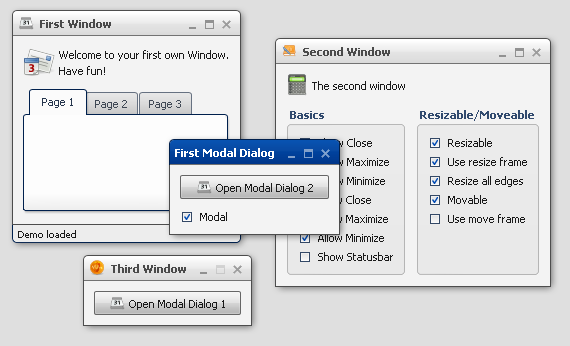

# Window

The window widget is similar to Windows' MDI child windows.

## Preview Image

## Features

- Title support text and/or icon
- Support modal window
- Status bar support
- Minimize and maximize a window
- Open and close a window
- Resize a window

## Description

The window widget can be used to show dialogs or to realize an MDI (Multiple
Document Interface) Application.

The widgets implement all known metaphors from a window:

- minimize
- maximize
- open
- close
- and so on

The package `qx.ui.window` contains two other classes that can be used to create
an MDI Application:

- The [Desktop](apps://apiviewer/#qx.ui.window.Desktop) can act as container for
  windows. It can be used to define a clipping region for internal windows.
- The [Manager](apps://apiviewer/#qx.ui.window.Manager) handle the z-order and
  modality blocking of windows managed the connected desktop.

## Demos

Here are some links that demonstrate the usage of the widget:

- [Demonstrate different window types](apps://demobrowser/#widget~Window.html)
- [Windows with using a Desktop](apps://demobrowser/#widget~Desktop.html)
- [A window containing a table demo](apps://demobrowser/#table~Table.html)
- [A calculator demo](apps://demobrowser/#showcase~Calculator.html)

## API

Here is a link to the API of the Widget:
[qx.ui.window.Window](apps://apiviewer/#qx.ui.window.Window)
