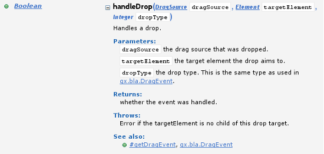

# Writing API Documentation

For documenting the Qooxdoo API special comments in the source code (so-called
"doc comments") are used. The doc comments in Qooxdoo are similar to
[JSDoc comments](https://jsdoc.app/) or
[Javadoc](http://docs.oracle.com/javase/7/docs/technotes/tools/solaris/javadoc.html)
comments. To account for some Qooxdoo specific needs there are certain
differences to the two systems mentioned above.

For a complete treatment of the syntax see the
[JSDoc reference](api_jsdoc_ref.md) and see the special
[information on the \``@ignore` tag](api_jsdoc_at_ignore.md).

## An introductory example

Doc comments are specially formatted comment blocks enclosed by `/**` and `*/`.
A typical use case is to put them in front of a method definition. You start
with a general description of the method, and then add sections that start with
`@` followed by a special key that describes e.g. a parameter or the return type
of the method. Here is an example:

```javascript
/**
 * Shows a message to the user.
 *
 * @param {string} text The message to show.
 */
showMessage(text) {
  //...
}
```

The `@param` attribute entry describes the parameter `text`. Description texts
may also include markup for highlighting and structure.

Here is a longer example that covers an entire class file:

```javascript
/**
 * General class description.
 */
qx.Class.define("mypackage.MyClass", {
  extend: blubb.MySuperClass,

  /**
   * Constructor description.
   *
   * @param param1 {Integer} description of first parameter\
   */
  construct(param1) {
    //...
  },

  properties: {
    /** Property definitions. */
    myProperty: {
      check: "Number",
      init: 0
    }
  },

  members: {
    /**
     * @param {Number} a
     * @param {Number} b
     * @return {Number}
     */
    add(a, b) {
      return a + b;
    }
  },

  statics: {
    /**
     * @param {Object} foo
     * @param {Number} bar
     */
    setBaz(foo, bar) {
      foo.baz = bar;
    },

    /**
     * @var {Number}
     */
    MY_CONSTANT: 100
  }
});
```

The class description is taken as the first comment in the file which starts
with `/**`. Therefore, if you have a comment at the start of the file which has a
first line of `/**********`, that will be taken as the class description,
overriding any comment above the class itself. Therefore, use `/* *********` or
`/* ==========` etc.

## Advanced Doc Comments

Here is a more advanced example of a method documentation block that uses more
`@` keys to provide structured information about the method.

```javascript
    /**
    * Handles a drop.
    *
    * @param {qx.bla.DragSource} dragSource The drag source that was dropped.
    * @param {Element} targetElement The target element the drop aims to.
    * @param {Integer|null} dropType  the drop type. This is the same type
    *        as used in {@link qx.bla.DragEvent}.
    * @return {Boolean} whether the event was handled.
    * @throws {Error} if the targetElement is no child of this drop target.
    *
    * @see #getDragEvent
    * @see qx.bla.DragEvent
    */
    handleDrop(dragSource, targetElement, dropType) {
      //...
    }
```

This will render in the API Viewer similarly to this:



As mentioned above the [JSDoc reference](api_jsdoc_ref.md) has the complete list
of possible section keys and markup possibilities.

## Generate the API Viewer

If you haven't already, install the apiviewer package without making it a
dependency of your application:

```bash
npx qx pkg install --save=0 qooxdoo/qxl.apiviewer
```

Then start the Qooxdoo application server...

```bash
npx qx serve -S
```

... and click on the API Viewer application to see your applications API in its
full beauty alongside the Qooxdoo API

## Advanced usage

### `__init__.js`

While documenting a class files where JSDoc comments are interleaved with the
class code seems straight forward, this is not so obvious if you want to provide
documentation for a collection of classes under a common namespace (like
_qx.ui.core_, _qx.util_, etc.).

In order to fill this gap you can add a `__init__.js` file to the topmost
directory of that particular collection. This file should contain only a single
JSDoc comment that describes the collection as a whole. These files are then
scanned by the apiviewer application and the documentation is inserted at the
nodes, together with a list of classes of the corresponding collection, in the
documentation tree. See the API documentation for the
[qx.core namespace](apps://apiviewer/#qx.core) as examples.
