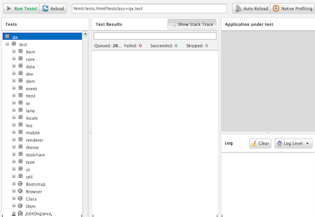
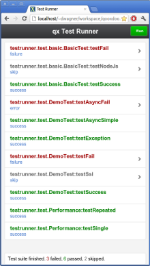

Test Runner
===========

"Test Runner" is a [unit testing](http://en.wikipedia.org/wiki/Unit_test) framework that fully supports testing qooxdoo classes. It is similar to but does not require JSUnit or any other JavaScript unit testing framework. If you look at the component section of a qooxdoo distribution under `component/testrunner/`, you will find the Test Runner sources, together with a mockup test class. In the `framework/` section you can create a Test Runner instance with all test classes from the qooxdoo framework by running:

    ./generate.py test

Test Runner provides a convenient interface to test classes that have been written to that end. You can run single tests, or run a whole suite of them at once.



> **note**
>
> See the Test Runner in action in the [online demo](http://demo.qooxdoo.org/%{version}/testrunner/).

The Test Runner framework can also be deployed for *your own* application. It provides a GUI, a layer of infrastructure and a certain interface for arbitrary test classes. So now you can write your own test classes and take advantage of the Test Runner environment.

How to deploy Test Runner for your own development
--------------------------------------------------

This section assumes that your qooxdoo application bears on the structure of the qooxdoo skeleton \<pages/getting\_started/helloworld\#create\_your\_application\> application. Then this is what you have to do:

### Writing Test Classes

-   You have to code test classes that perform the individual tests. These test classes have to comply to the following constraints:
    -   They have to be within the name space of your application.
    -   They have to be derived from `qx.dev.unit.TestCase`.
    -   They have to define member functions with names starting with `test*`. These methods will be available as individual tests.
    -   Apart from that you are free to add other member functions, properties etc., and to instantiate other classes to your own content. But you will usually want to instantiate classes of your current application and invoke their methods in the test functions.
    -   In order to communicate the test results back to the Test Runner framework exceptions are used. No exception means the test went fine, throwing an exception from the test method signals a failure. Return values from the test methods are not evaluated.
    -   To model your test method behaviour, you can use the methods inherited from `qx.dev.unit.TestCase` which encapsulate exceptions in the form of assertions:
        -   `assert`, `assertFalse`, `assertEquals`, `assertNumber`, ... - These functions take values which are compared (either among each other or to some predefined value) and a message string, and raise an exception if the comparison fails.
        -   A similar list of methods of the form `assert*DebugOn` is available, which are only evaluated if the debug environment setting `qx.debug` is on (see Environment \<core/environment\>).
        -   See the documentation for the [qx.dev.unit.TestCase](http://demo.qooxdoo.org/%{version}/apiviewer/#qx.dev.unit.TestCase) class for more information on the available assertions.

#### Generic setUp and tearDown

Test classes can optionally define a `setUp` method. This is used to initialize common objects needed by some or all of the tests in the class. Since `setUp` is executed before each test, it helps to ensure that each test function runs in a "clean" environment. Similarly, a method named `tearDown` will be executed after each test, e.g. to dispose any objects created by `setUp` or the test itself.

#### Specific tearDown

For cases where the generic class-wide `tearDown` isn't enough, methods using the naming convention `tearDown<TestFunctionName>` can be defined. A method named e.g. `tearDownTestFoo` would be called after `testFoo` and the generic `tearDown` of the class were executed.

#### Asynchronous Tests

Asynchronous tests enable testing for methods that aren't called directly, such as event handlers:

-   Test classes inheriting from `qx.dev.unit.TestCase` have a `wait()` method that stops the test's execution and sets a timeout. `wait()` should always be the last function to be called in a test since any code following it is ignored. `wait()` has two optional arguments: The **amount of time to wait** in milliseconds (defaults to 5000) and a **function to be executed** when the timeout is reached. If no function is specified, reaching the timeout will cause an exception to be thrown and the test to fail.
-   The `resume()` method is used to (surprise!) resume a waiting test. It takes two arguments, a **function to be executed** when the test is resumed, typically containing assertions, and the object context it should be executed in.

Here's an example: In our test, we want to send an AJAX request to the local web server, then assert if the response is what we expect it to be.

    testAjaxRequest : function()
    {
      var request = new qx.io.request.Xhr("/index.html");
      request.addListener("success", function (e) {
        this.resume(function() {
          this.assertEquals(200, request.getStatus());
        }, this);
      }, this);
      request.send();

      this.wait(10000);
    }

#### Defining Test Requirements

Requirements are conditions that must be met before a test can be run. For example, a test might rely on the application having been loaded over HTTPS and would give false results otherwise. Requirements are defined for individual tests; if one or more aren't satisfied, the test code won't be executed and the test will be marked as "skipped" in the Test Runner's results list.

#### Using Requirements

To make use of the requirements feature, test classes must include either the [MRequirementsBasic](http://demo.qooxdoo.org/%{version}/apiviewer/#qx.dev.unit.MRequirementsBasic) mixin (for tests running in non-browser environments such as node.js or Rhino) or the [MRequirements](http://demo.qooxdoo.org/%{version}/apiviewer/#qx.dev.unit.MRequirements) mixin which provides additional requirement checks for browser environments. The mixins provide a `require` method that takes an array of strings: The requirement IDs. This method is either called from the `setUp` method or from a test function **before** the actual logic of the test, e.g.:

    testBackendRequest : function()
    {
      this.require(["backend"]);
      // test code goes here
    }

`require` then searches the current test instance for a method that verifies the listed requirements: The naming convention is "has" + the requirement ID with the first letter capitalized, e.g. `hasBackend`. This method is the called with the requirement ID as the only parameter. If it returns `true`, the test code will be executed. Otherwise a [RequirementError](http://demo.qooxdoo.org/%{version}/apiviewer/#qx.dev.unit.RequirementError) is thrown. The Test Runner will catch these and mark the test as "skipped" in the results list. Any test code after the `require` call will not be executed.

If no "has" method for a given feature is found, [qx.core.Environment](http://demo.qooxdoo.org/%{version}/apiviewer/#qx.core.Environment) will be checked for a key that matches the feature name. This way, any Environment key that has a boolean value can be used as a test requirement, e.g.:

    this.require(["event.touch", "css.textoverflow"]);

Note that only Environment keys with **synchronous** checks are supported.

#### Spies, stubs and mocks

Spies are test functions that records details for all its calls. Stubs are spies with pre-programmed behavior. Mocks are fake methods are like spies and stubs, but also come with pre-programmed expectations. Generally speaking, spies, stubs and mocks are fakes that allow fine-grained unit testing. They constitute important tools for test driven development.

In order to use fakes in your tests, test classes must include the [MMock](http://demo.qooxdoo.org/%{version}/apiviewer/#qx.dev.unit.MMock) mixin. Here are some example tests that demonstrate the usage of spies and stubs.

    "test: spy": function() {
      var spy = this.spy();
      spy();
      this.assertCalled(spy);
    },

    "test: stub": function() {
      var whoami = this.stub();
      whoami.returns("Affe");
      this.assertEquals("Affe", whoami());
    }

[MMock](http://demo.qooxdoo.org/%{version}/apiviewer/#qx.dev.unit.MMock) also provides custom assertions tailored to work with fakes. Whenever possible, custom assertions should be used instead of lower level assertions because they provide more detailed error messages.

    "test: assert called": function() {
      var spy = this.sinon.spy();

      // Fail test deliberately
      // spy();

      // Recommended
      this.assertCalledOnce(spy);
      // --> expected spy to have been called once but was called 0 times

      // Lower level assertion
      this.assertTrue(spy.called);
      this.assertEquals(1, spy.callCount);
      // --> Called assertTrue with 'false'
      // --> Expected '1' but found '0'!
    }

Mocks are different from spies and stubs. They have pre-programmed *expectations*, meaning that unexpected calls fail your tests. Mocks allow to enforce implementation details without explicit assertions.

    "test: mock": function() {
      var obj = {method: function() {}};
      var mock = this.sinon.mock(obj);
      mock.expects("method").once();

      obj.method();
      // Would fail test (Unexpected second call)
      // obj.method();
      mock.verify();
    },

For more details, please refer to the API documentation of [MMock](http://demo.qooxdoo.org/%{version}/apiviewer/#qx.dev.unit.MMock). Additional examples can be found in `qx.test.dev.unit.Sinon`.

MMock is based on [Sinon.JS](http://sinonjs.org/). The original `sinon` object can be retrieved by calling `qx.dev.unit.Sinon.getSinon()`.

##### Sandboxing

Stubs can override original behavior. To prevent tests from leaking, it is recommended to restore fakes on tear down. Every fake (including stubs) created by [MMock](http://demo.qooxdoo.org/%{version}/apiviewer/#qx.dev.unit.MMock) is contained within a sandbox. Here is how to restore all fakes recorded in the sandbox.

    tearDown: function() {
      this.getSandbox().restore();
    }

##### Faking XMLHttpRequest

To replace the native implementation of `XMLHttpRequest` (XHR), call `useFakeXMLHttpRequest()`. The fake implementation behaves just like the original implementation only that no HTTP backend is required. Additional methods allow to simulate HTTP interaction. For example, the following test demonstrates the basic functionality of XHR.

    "test: GET with XMLHttpRequest": function() {
      // Replace XMLHttpRequest host object with fake implementation
      this.useFakeXMLHttpRequest();

      var readyStates = [];
      var req = new XMLHttpRequest();

      req.open("GET", "/");
      req.onreadystatechange = this.spy(function() {
        readyStates.push(req.readyState);
      });

      req.send();

      // Fake server response
      // - Fires "readystatechange" event
      // - Updates status, responseText properties
      req.respond(200, {}, "Response");

      this.assertCalled(req.onreadystatechange);
      this.assertArrayEquals([1,2,3,4], readyStates);
      this.assertEquals(200, req.status);
      this.assertEquals("Response", req.responseText);
    }

Usually, the unit under test does not directly expose requests. Rather, some other part of the program calls the XMLHttpRequest constructor. Whenever the request is not directly available within the test (or complicated to access), each request created by the fake implementation can be retrieved with `getRequests()`.

    "test: GET with qx.io.request.Xhr": function() {
      this.useFakeXMLHttpRequest();
      var req = new qx.io.request.Xhr("GET", "/");
      var fakeReq = this.getRequests()[0];

      // qx.io.request.Xhr indirectly uses an instance of XMLHttpRequest.
      // The test should not be concerned with the implementation detail
      // about how to retrieve the instance. Instead, getRequests()
      // above provides an implementation indepent way to retrieve the
      // used object.
      //
      // this.assertEquals(fakeReq, req.getTransport().getRequest());

      req.send();

      this.assertEventFired(req, "statusError", function() {
        fakeReq.respond(500, {}, "Error");
      });
      this.assertEquals(500, req.getStatus());
    }

### Create the Test Application

-   Run `generate.py test` from the top-level directory of your application. This will generate the appropriate test application for you, which will be available in the subfolder `test` as `test/index.html`. Open this file in your browser and run your tests.
-   Equally, you can invoke `generate.py test-source`. This will generate the test application, but allows you to use the *source* version of your application to run the tests on. In doing so the test application links directly into the source tree of your application. This allows for [test-driven development](http://en.wikipedia.org/wiki/Test-driven_development) where you simultaneously develop your source classes, the test classes and run the tests. All you need to do is to change the URL of the "test backend application" (the textfield in the upper middle of the Test Runner frame) from `tests.html` (which is the default) to `tests-source.html`. (Caveat: If `generate.py test-source` is the first thing you do, you might get an error when Test Runner starts, since the default tests.html has not been built; just change the URL and continue). For example, the resulting URL will look something like this:

        html/tests-source.html?testclass=<your_app_name>

    After that, you just reload the backend application by hitting the reload button to the right to see and test your changes in the Test Runner.
-   If you're working on an application based on qx.application.Native or qx.application.Inline (e.g. by starting with an Inline skeleton), you can run `generate.py test-native` or `generate.py test-inline` to create a test application of the same type as your actual application. The Test Runner's index file will be called `index-native.html` or `index-inline.html`, respectively.

Test Runner Views
-----------------

The Test Runner architecture is split between the logic that executes tests and the view that displays the results and allows the user to select which tests to run. Views are selected by overriding the `TESTRUNNER_VIEW` configuration macro, specifying the desired view class. For example, to build the Test Runner using the HTML view, use the following shell command:

    ./generate.py test -m TESTRUNNER_VIEW:testrunner.view.Console

Several views are included with the Test Runner:

### Widget

This is the default view used for the GUI, Native and Inline skeletons' test and test-source jobs. It is the most fully-featured and convenient to use, making heavy use of data binding to list available tests in a Virtual Tree and to visualize the results. The downside is that can it feel sluggish in environments with poor JavaScript performance.

### HTML


As the name indicates, this view uses plain (D)HTML instead of qooxdoo's UI layer. It is intended for usage scenarios where speed is more important than good looks.

### Mobile



A view based on qx.Mobile's widget set. In an an application based on the Mobile Skeleton \<pages/development/skeletons\#mobile\>, run generate.py test-mobile or generate.py test-mobile-source to build a Test Runner with the Mobile view. For other application types, you'll need to add test-mobile and/or test-mobile-source to the top-level exports list in config.json first.

### Console


Even more bare-bones than the HTML view, the Console view features no visual elements other than the Iframe containing the test application. Tests are started using the browser's JavaScript console. This is mostly intended as a base for specialized views.

### Reporter

The Reporter is a specialized view used for automated unit test runs. Based on the Console view, it features (almost) no GUI. The test suite is automatically started as soon as it's ready. A method that returns a map of failed tests is its only means of interaction:

    qx.core.Init.getApplication().runner.view.getFailedResults()

URI parameters
--------------

The following URI parameters can be used to modify the Test Runner's behavior:

-   **testclass** Restrict the tests to be loaded. Takes a fully qualified class name or namespace that is a subset of the classes included in the test application, e.g. *custom.test.gui* or *custom.test.gui.PreferencesDialog*
-   **autorun** Automatically execute all selected tests as soon as the suite is loaded. Takes any parameter, e.g. *1*.

Portable Test Runner
--------------------

A stand-alone version of the qooxdoo's unit testing sub-system, requiring **no compile step** and with **no external dependencies**. It comes in the form of a single .js file that can simply be added to an HTML page along with the code to be tested and unit test definitions (as inline JavaScript).

Its main purpose is to provide a comprehensive unit testing framework including [Assertions](http://demo.qooxdoo.org/%{version}/apiviewer/#qx.core.Assert), [Sinon](http://demo.qooxdoo.org/%{version}/apiviewer/#qx.dev.unit.MMock), Requirements \<pages/frame\_apps\_testrunner\#requirements\> and a Test Runner GUI to developers working on non-qooxdoo JavaScript applications.

### Example

The fictional non-qooxdoo JavaScript library `foo.js` provides a `Bar` class, with a constructor that takes a string parameter. This test checks if the `getName` method returns that string:

``` {.sourceCode .html}
<!DOCTYPE html>
<head>
  <meta http-equiv="Content-Type" content="text/html; charset=utf-8" />
  <title>Test Runner</title>
  <script type="text/javascript" src="http://localhost/testrunner-portable.js"></script>
  <script type="text/javascript" src="http://localhost/foo.js"></script>
  <script type="text/javascript">
  testrunner.define({
    classname : "foo.Bar",

    __bar : null,

    setUp : function() {
      this.__bar = new foo.Bar("baz");
    },

    testName : function() {
      this.assertEquals("baz", this.__bar.getName());
    }
  });
  </script>
</head>
<body>
</body>
</html>
```

The important thing to note here is the map argument for `testrunner.define`: It's equivalent to the `members` section of a class extending [qx.dev.unit.TestCase](http://demo.qooxdoo.org/%{version}/apiviewer/#qx.dev.unit.TestCase) and including [qx.dev.unit.MMock](http://demo.qooxdoo.org/%{version}/apiviewer/#qx.dev.unit.MMock) and [qx.dev.unit.MRequirements](http://demo.qooxdoo.org/%{version}/apiviewer/#qx.dev.unit.MRequirements), allowing full access to these APIs. Multiple test classes can be defined by additional calls to `testrunner.define`.

The `classname` key is optional. If present, its value will be used as the name of the test class, making it easier to create logical groups of tests. Otherwise, the generated classes will be named `TestN` where N is the running count of `testrunner.define` calls. All test classes will be grouped under the top-level name space `test`.

The Portable Test Runner can be downloaded from the Demo section of the qooxdoo website, or generated from within the SDK:

``` {.sourceCode .bash}
cd component/testrunner
generate.py portable-build
```

"Headless" Automated Unit Testing
---------------------------------

In a Continuous Integration (CI) scenario, it can be very helpful to run unit tests automatically, perhaps as one step in an automated build process that is triggered either manually, in set intervals, or by changes to the project's sources. If any tests fail, the build could be marked as failed by the CI server and notifications sent to the developers.

It's possible to achieve this using a tool like WebDriver to remotely control a browser which runs the tests, but this would be a fairly complex task. Fortunately, there is a much simple solution: [PhantomJS](http://phantomjs.org/) is a "headless" WebKit browser that can be controlled through a JavaScript API. The [qx-phantom](https://github.com/qooxdoo/qx-phantom) Git repository provides a small script that loads the Test Runner in PhantomJS, gathers the results of the test suite, and logs them to the console.

The status code returned by the PhantomJS process on exit is the number of tests that failed. This is especially interesting if you are planning to integrate unit testing into a CI setup using [Jenkins](http://jenkins-ci.org/), or some other kind of automated workflow, such as commit hooks or reports.

### Setup

1.  Download or compile PhantomJS and add the binary to your path.
2.  Get the script that drives PhantomJS by cloning the Git repository:

``` {.sourceCode .bash}
$ git clone https://github.com/qooxdoo/qx-phantom
```

1.  Build the Test Runner for your project (named `myproject` in this example):

``` {.sourceCode .bash}
$ cd myproject
$ ./generate.py test -m TESTRUNNER_VIEW:testrunner.view.Console
```

### Running the tests

Call the PhantomJS binary with the following arguments:

-   The script from the Git repository (qx-phantom.js)
-   The namespace of the tests you want to run
-   The URL of the Test Runner. This can be an absolute URL if you're running a web server, or a file system path

``` {.sourceCode .bash}
$ phantomjs ../qx-phantom/qx-phantom.js myproject.test test/index.html
```

### Debugging

To adjust the verbosity of the script, change the settings found at the top of the qx-phantom.js script. If you encounter any problems, set CONSOLE=true.
