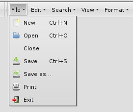
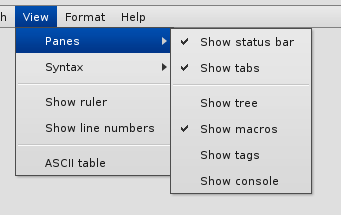
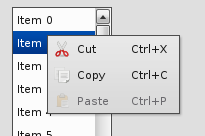

Menu Handling
=============

Menus are well-established user interface elements in GUIs. They are popup-like controls that provide simple or cascading lists of buttons. Typical uses show menus opening off from buttons in tool bars, or popping up as context menus on right-clicks e.g. on a tree element.

Here are a few examples:

The [Demobrowser](http://demo.qooxdoo.org/%{version}/demobrowser/#widget~Menu.html) provides further examples.

Menus can be constructed in a qooxdoo application using widgets from the [qx.ui.menu](http://demo.qooxdoo.org/%{version}/apiviewer/#qx.ui.menu) name space. The main class from this package is `Menu`. Other classes allow you to tailor the appearance and the behaviour of the menu you create. You can even use checkboxes and radiobuttons inside your menus.

Simple Example
--------------

Here is a simple menu example:

    // Create the menu
    var menu = new qx.ui.menu.Menu();

    // Creates the command
    var command = new qx.event.Command("Control+O");
    command.addListener("execute", function() {
      this.debug("Open action");
    },this);

    // Add some content
    var openButton = new qx.ui.menu.Button("Open", "icon/16/actions/document-open.png", command);
    var closeButton = new qx.ui.menu.Button("Close");

    menu.add(openButton);
    menu.add(closeButton);

    // Add behaviour
    closeButton.addListener("execute", function() {
      this.debug("Close action");
    }, this);

    // Create a button that will hold the menu
    var button = new qx.ui.form.MenuButton("Menu", null, menu);

There are a couple of things to note here:

-   The main widget is the `menu` of type `qx.ui.menu.Menu`.
-   Menu buttons are of type `qx.ui.menu.Button` and are created individually.
-   They are then added to the menu. The buttons will appear in the menu in the order they are added.
-   The `closeButton` is created with the minimal set of parameters, namely just the string for the button label. For a more advanced solution, see the `openButton`: you can optionally specify a button icon, and a command `qx.event.Command` that is invoked if the button or the shortcut is pressed/selected.
-   You can supply missing or updated features after the widget's creation; e.g. the callback function for the `closeButton` is provided in a separate method call to `addListener()`.
-   The canonical event for the selection of a menu button is the `execute` event. (This is in line with other button flavors throughout the qooxdoo framework, e.g. the regular `qx.ui.form.Button`).

Complex Menu Sample
-------------------

This example should show how to create a menu structure with submenu and how to handle with groups.

Qooxdoo has some widgets that need a menu to handle user interaction. For this sample we will chose the `qx.ui.toolbar.ToolBar` to create the menu structure. To see a overview, witch widgets uses a menu, take a look in the /pages/widget/menu.

This code snippet show how to create a "ToolBar" with to menu items "File" and "View":

    // Create the toolbar and add to the DOM
    var toolBar = new qx.ui.toolbar.ToolBar();
    this.getRoot().add(toolBar, {
      left: 20,
      top: 20,
      right: 20
    });

    // Create "File" menu
    var fileButton = new qx.ui.toolbar.MenuButton("File");
    toolBar.add(fileButton);

    var fileMenu = new qx.ui.menu.Menu();
    fileMenu.add(new qx.ui.menu.Button("New", null, null, this.__getNewMenu()));
    fileMenu.add(new qx.ui.menu.Button("Open...", "icon/16/actions/document-open.png"));
    fileMenu.add(new qx.ui.menu.Separator());
    fileMenu.add(new qx.ui.menu.Button("Save", "icon/16/actions/document-save.png"));
    fileMenu.add(new qx.ui.menu.Button("Save As...", "icon/16/actions/document-save-as.png"));
    fileMenu.add(new qx.ui.menu.Separator());
    fileMenu.add(new qx.ui.menu.Button("Exit", "icon/16/actions/application-exit.png"));
    fileButton.setMenu(fileMenu);

    // Create "View" menu
    var viewButton = new qx.ui.toolbar.MenuButton("View");
    toolBar.add(viewButton);
    var viewMenu = new qx.ui.menu.Menu();
    viewMenu.add(new qx.ui.menu.Button("Panes", null, null, this.__getPanesMenu()));
    viewMenu.add(new qx.ui.menu.Button("Syntax", null, null, this.__getSyntaxMenu()));
    viewMenu.add(new qx.ui.menu.Separator()); // First kind to add a separator
    viewMenu.add(new qx.ui.menu.CheckBox("Show ruler"));
    viewMenu.add(new qx.ui.menu.CheckBox("Show line numbers"));
    viewMenu.addSeparator(); // A other kind to add a separator
    viewMenu.add(new qx.ui.menu.Button("ASCII table..."));
    viewButton.setMenu(viewMenu);

There are a couple of things to note here:
-   The `qx.ui.menu.Menu` could get some different children (Button, Separator, CheckBox, ...)
-   The fourth parameter in `qx.ui.menu.Button` is also a menu. So it is possible to create submenus.
-   There are tow kinds to add a separator to a menu. The first kind is to create a `Separator` instance and add this to the menu. Or the other kind is to call the `addSeparator` method from the `Menu` instance.

The next code snipped should explain how to create a menu, which contain RadioButtons, but only one could be selected:

    __getSyntaxMenu : function()
    {
      var syntaxMenu = new qx.ui.menu.Menu();

      var cDialectMenu = new qx.ui.menu.Menu();
      cDialectMenu.add(new qx.ui.menu.RadioButton("C"));
      cDialectMenu.add(new qx.ui.menu.RadioButton("C Sharp"));
      cDialectMenu.add(new qx.ui.menu.RadioButton("C Plus Plus"));

      var htmlButton = new qx.ui.menu.RadioButton("HTML");
      var jsButton = new qx.ui.menu.RadioButton("JavaScript");
      var cdialectButton = new qx.ui.menu.Button("C Dialect", null, null, cDialectMenu);
      var pythonButton = new qx.ui.menu.RadioButton("Python");

      syntaxMenu.add(htmlButton);
      syntaxMenu.add(jsButton);
      syntaxMenu.add(cdialectButton);
      syntaxMenu.add(pythonButton);

      // Configure and fill radio group
      var langGroup = new qx.ui.form.RadioGroup();
      langGroup.add(htmlButton, jsButton, pythonButton);
      langGroup.add.apply(langGroup, cdialectButton.getMenu().getChildren());

      return syntaxMenu;
    }

You can see, that the menu contains `RadioButton` and all `RadioButton` should grouped in one `RadioGroup`, but the `RadioButton` in the submenu "C Dialect" should also be considered in the `RadioGroup`.

To add a `RadioButton` to the `RadioGroup` call the `add()` method from the `RadioGroup`. The parameter from `add()` is a variable number of items which should be added. You can see that the code calls a `langGroup.add.apply()` method to add the `RadioButton` from the "C Dialect" submenu. This is no qooxdoo construction, the `apply()` method is a construction from JavaScript and it is not important to know how thus the method works.

Additional Menu Topics
----------------------

### Menu positioning

Qooxdoo will go a long way to position a menu sensibly and with regard to the enclosing container, so that menu buttons are always fully visible if the menu is opened.

The [Placement](http://demo.qooxdoo.org/%{version}/demobrowser/#ui~Placement.html) demo shows how the menus are positioned.
