Table Styling
=============

Ever wanted to style the table widget and missed an overview what can by styled exactly? If so, then read on and learn how to style the different parts of the table widget and which steps *can* be applied to customize the appearance of this widget.

By default (talking about the *Modern* theme) the table looks like this:

This tutorial takes a look at the several *visible* parts of the table such as

-   Table widget itself
-   Header

> -   Header cells
> -   Column visibility button

-   Pane

> -   Row and column styling
> -   Cell styling
> -   Selection
> -   Focus Indicator

-   Statusbar
-   Scrollbar
-   Editable Cells (controls like Textfield, SelectBox and ComboBox)

This tutorial assumes you're implementing all styling changes of the table widget in your own application theme classes. If you're new to the theming layer of qooxdoo it's a good idea to recap the manual section for the theming layer \<ui\_theming\>.

If you're familiar with the theming layer we can dive right into the first topic.

> **note**
>
> Some of the examples are using CSS3 features, so they're not applicable to all browsers. If you need to achieve a styling which is almost completely identical (a pixel-perfect result is impossible) you have to use graphic files whenever CSS3 features are not present.

Table Widget
------------

Since this widget is the container of all sub-components the styling possibilities are naturally limited. However, limited possibilities does not result in low importance. You can e.g. change the border of the widget which can have a great visual impact. Since the border is a decorator \<ui\_decorators\> you can use all possibilities like different kind of borders, shadows and the like.

Sample of a table widget using a decorator with shadow:

To achieve this you can re-define the `table` decorator in your application theme as following:

    "table" :
    {
      // the decorator 'MBoxShadow' is only supported by modern browsers
      // Firefox 3.5+, IE9+, Safari 3.0+, Opera 10.5+ and Chrome 4.0+
      decorator: [
        qx.ui.decoration.MSingleBorder,
        qx.ui.decoration.MBoxShadow
      ],

      style :
      {
        width : 1,
        color : "table-border-main",

        shadowBlurRadius : 5,
        shadowLength : 4,
        // color is '#999999'
        shadowColor : "table-shadow"
      }
    },

> **note**
>
> To get this example working you additionally have to define the colors `table-border-main` and `table-shadow` in your color theme. It's considered as best practice to define all colors as named color in your color theme. This way you can use these named colors all over your application.

Header
------

### Header styling

The header widget is a simple widget containing the header cells and the column visibility button. However, if you want to change the e.g. the background of the whole header you're here in the right place, since the container does the styling of the background and not the header cells themselves.

    // change the whole background of the header by changing the decorator
    "table-scroller-header-css" :
    {
      decorator : [
        qx.ui.decoration.MSingleBorder,
        qx.ui.decoration.MBackgroundColor
      ],

      style :
      {
        // color is '#00AA00'
        backgroundColor: "table-header-background",

        widthBottom : 1,
        colorBottom : "border-main"
      }
    }

> **note**
>
> Make sure the color `table-header-background` is part of your color theme.

This code snippet will result in the following:

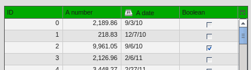

Additionally you can change the height of the whole header by using the `headerCellHeight` property. Changing this property might make sense if you also want to customize the appearance of the header cells (e.g. using a larger font).

### Removing the header

You want to get rid off the whole header? That's also possible by setting two additional themeable properties. So you only have to drop those two line in your appearance theme and you're done:

    "table" :
    {
      alias : "widget",

      style : function(states)
      {
        return {
          decorator : "table",
          headerCellsVisible : false,
          columnVisibilityButtonVisible : false
        };
      }
    },

to get the following result

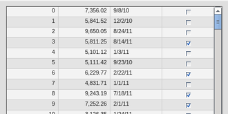

### Header Cells

Customizing the appearance of the header cells can be divided into the following parts:

> -   Decorator for hover effects
> -   Padding
> -   Alignment
> -   Using a different sort icon
> -   Using a custom font

Beside the settings for alignment and paddings all other appearance customizations are directly applied to the header cell appearance. If you want to e.g. change the hover effect for the header cell you can easily change the decorator (and the padding if necessary) to get an custom styling. Exchanging the sort icon is also supported. The sort icons are shown whenever the user does tap at one header cell the very first time.

The default appearance for each header cell looks like this:

    "table-header-cell" :
     {
       alias : "atom",
       style : function(states)
       {
         return {
           minWidth  : 13,
           minHeight : 20,
           padding   : states.hovered ? [ 3, 4, 2, 4 ] : [ 3, 4 ],
           decorator : states.hovered ? "table-header-cell-hovered" : "table-header-cell",
           sortIcon  : states.sorted ?
               (states.sortedAscending ? "decoration/table/ascending.png" : "decoration/table/descending.png")
               : undefined
         };
       }
     },

The default decorator for the hover effect does show a 1 pixel border at the bottom of the hovered header cell. If you only want to change this color you can go ahead and add the `table-header-hovered` color in the color theme of your application

    "table-header-hovered" : "orange",

to get a result like this

A bigger change of the header cells might be to change the background color at hovering. To do so you can simply modify the existing `table-header-cell-hovered` decorator like

    "table-header-cell-hovered" :
    {
      style :
      {
        backgroundColor : "orange"
      }
    },

and you're done!

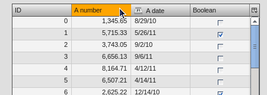

Additionally, you can change the styling of the different child controls (label, icon and sort icon) of the header cells. So if you want to change the font you can simply customize the label child control of the header cell to change the alignment, existing padding and the like.

The default appearance of the child controls are defined as

    "table-header-cell/label" :
    {
      style : function(states)
      {
        return {
          minWidth : 0,
          alignY : "middle",
          paddingRight : 5,
          paddingLeft: 5,

          // change of the default font setting
          font : "bold"
        };
      }
    },

    "table-header-cell/sort-icon" :
    {
      style : function(states)
      {
        return {
          alignY : "middle",
          alignX : "right"
        };
      }
    },

    "table-header-cell/icon" :
    {
      style : function(states)
      {
        return {
          minWidth : 0,
          alignY : "middle",
          paddingRight : 5
        };
      }
    },

With the minor change above to the decorator and a font setting of the label you can achieve the following:

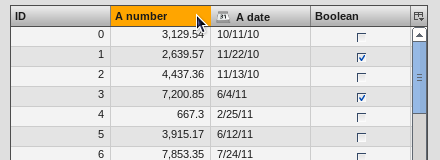

Pane
----

### Pane Background

The pane itself is only styled using a background color and it is recommended to only change the background color in order to harmonize the color with the used row colors. The pane widget gets only visible if there is more open space left than occupied by the rows to show or at the very end of the table pane whenever scrollbars are necessary.

One picture says more than thousand words :) The pane with red background color to demonstrate:

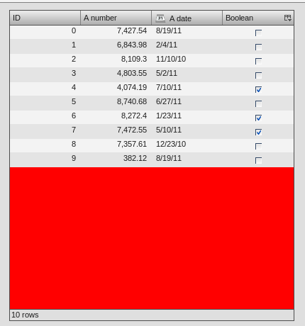

The corresponding code in the color theme of your application is a simple one-liner:

    "table-pane" : "red",

### Row And Column Styling

#### Removing The Grid Lines

If you take a second look at the picture above you can already recognize a customization of the row and column styling: the removal of the row and column lines.

Basically you can choose between two solutions:

> -   Setting the colors for the row and column line
> -   Writing your own cellrenderer **and** rowrenderer

The first solution path is the quick one which is done by customize color of the color theme and **no** additional coding. However, you have also limited possibilities to customize. The second solution is the coding one. Start right away and extend the classes `qx.ui.table.rowrenderer.Default` and `qx.ui.table.cellrenderer.Abstract`, implement the necessary interfaces and create your very own appearance by putting together the necessary CSS styles.

Since the latter solution is a more complex one, I'll only explain the first solution which helps you in styling the table rows and columns in a quick way.

    // these two lines have to inserted in your application color theme
    // to remove the grid lines
    "table-row-line" : "transparent",
    "table-column-line" : "transparent",

Okay, we're cheating here a bit by hiding and not removing them, but anyway the goal is achieved and this in a very quick manner, right?

> **note**
>
> The use of `transparent` as a named color is **not** working for the IE6. If you want to support this browser you have to write your own cellrenderer.

#### Text And Background Colors

What about changing more than the grid lines of the cells? Like changing the colors of the row background and so. I'm glad you ask this :)

Customizing these colors is as easy as hiding the grid lines. You can adapt the styling of the rows and columns by just setting different colors. These colors are available and can be overwritten in your application color theme:

> -   `table-pane` - background color of the pane when less entries are used than available space
> -   `table-row` - text color of the cells
> -   `table-row-background-even` - background color of even rows
> -   `table-row-background-odd` - background color of odd rows

By changing one or more of these colors you can e.g. achieve this:

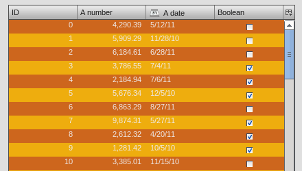

by defining these colors:

    "table-row-background-even" : "#CD661D",
    "table-row-background-odd" : "#EEAD0E",
    "table-row" : "#EEE9E9",

    "table-row-line" : "transparent",
    "table-column-line" : "transparent",

#### Selection

If you customized the colors like above this is only the first part of it. Now the colors for the selection join the game. If you don't adapt these colors the result will for sure not satisfy you. So let's dive into this topic.

> -   `table-row-selected` - text color for cells are selected but **not** focused
> -   `table-row-background-selected` - cells are selected but **not** focused
> -   `table-row-background-focused-selected` - cells are selected **and** focused
> -   `table-row-background-focused` - cells are focused but **not** selected

To better visualize this the following example does use colors which are easy to distinguish:

    "table-row-selected" : "blue",
    "table-row-background-selected" : "orange",
    "table-row-background-focused-selected" : "green",
    "table-row-background-focused" : "red",

This shows an active selection:

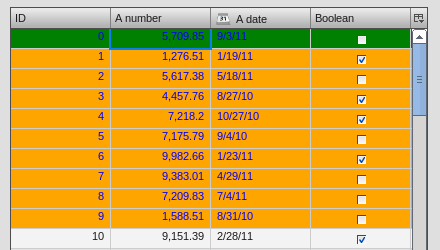

The same with an inactive selection:

#### Cell Styling

This section is rather for the sake of completeness. If you want to have full control over the cell styling you can create your own cellrenderer classes and apply them for each column of your table. This topic is more a programmatic one and it does not fit in this scope of this article. However, a short introduction and a beginners guide will fit in here :)

A list of existing cell renderer is available at the [API Viewer](http://demo.qooxdoo.org/%{version}/apiviewer/#qx.ui.table.cellrenderer). If one of these is suitable for you all you have to do to use it is

    var tcm = table.getTableColumnModel();

    // Display a checkbox in column 3
    tcm.setDataCellRenderer(3, new qx.ui.table.cellrenderer.Boolean());

to e.g. display a checkbox for the fourth column. This assumes the cell renderer fits with the provided data.

If that's still no a solution for you, because you really need some extras for the cell rendering the solution has to be an own cell renderer. To get into it it's recommended to take a look at the existing cell renderers and the base class. So basically you should study the implementation of the `qx.ui.table.cellrenderer.Abstract` class and as first start the implementation of `qx.ui.table.cellrenderer.Default` to give a good overview of this topic. Depending on your needs you can start right away by copying the `default` renderer and play around a bit to get a impression of how to customize it.

### Focus Indicator

This widget in default visible whenever a selection is present. There are two ways of customzing this widget:

> -   change the decorator and the colors of this widget
> -   hide this indicator completely

The first possibility is the fast way for customization if you decided to keep the focus indicator visible. The available decorator is a simple 2 pixel border one and the color `table-focus-indicator` is defining this border color of the decorator. So either replacing the decorator by an own one or just changing the color has a direct effect. So let's look at an example where the decorator is changed:

    "table-scroller-focus-indicator" :
    {
      decorator : qx.ui.decoration.Double,

      style :
      {
        style : "dashed",

        // color value is 'orange'
        color : "table-focus-indicator",
        width: 2,

        innerColor : "yellow",
        innerWidth : 2
      }
    },

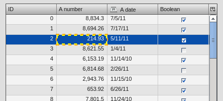

Look's really weird, but for demonstration purpose is quite good enough :)

> **note**
>
> It's better to stick with decorators which are only affecting the border for the focus indicator. A background-related decorator won't have any impact because of the background color styling of the cells.

If you want to hide the focus indicator itself this is a one-liner

    table.setShowCellFocusIndicator(false);

### Resize Line

This is a minor topic, since it only can be customized by its color. You may ask: what is the resize line all about? Point your input device to a column border and start the resizing of the column by tapping at the border. The vertical line which gets visible is the resize line. So a table with a green resize line would like this:

    "table-scroller/resize-line" :
     {
       style : function(states)
       {
         return {
           backgroundColor : "green",
           width : 2
         };
       }
     },

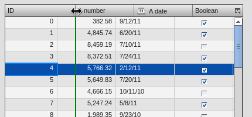

Statusbar
---------

You might guessed it already: yes, the statusbar can also be hidden *or* customized by changing a decorator in your decorator theme of your application. This kind of repetition is quite nice, because if you do understand those basic things you can take a look at the `Modern` appearance or decorator theme and you quickly know what to include in your own theme in order to change the styling of a component.

Hiding the statusbar is again an one-liner:

    table.setStatusBarVisible(false);

And the default implementation of the corresponding decorator looks like

    "table-statusbar" :
    {
      decorator : qx.ui.decoration.Single,

      style :
      {
        widthTop : 1,
        colorTop : "border-main",
        style    : "solid"
      }
    },

As you can see there is no additional background and no other fancy stuff. If you like to change this e.g. setting an own background gradient you can use the following

    "table-statusbar" :
     {
       decorator :  [
         qx.ui.decoration.MLinearBackgroundGradient,
         qx.ui.decoration.MSingleBorder
       ],

       style :
       {
         widthTop : 1,
         colorTop : "orange",
         style    : "solid",

         gradientStart : [ "orange", 10 ],
         gradientEnd : [ "red", 80 ]
       }
     },

The result of this little demo looks like:

Editable Cells
--------------

The table widget (respectively the cell renderer) do support inline editing of values. These widgets which are displayed for the inline editing can also be customized using the theming layer of qooxdoo. The following appearances are pre-defined:

> -   table-editor-textfield
> -   table-editor-selectbox
> -   table-editor-combobox

Basically those appearances do include the corresponding widget appearance and only modify single properties. In the `Modern` appearance theme this looks like this:

    "table-editor-textfield" :

> {
> include : "textfield",
>
> style : function(states) { return { decorator : undefined, padding : [ 2, 2 ], backgroundColor : "background-light" }; }
>
> },
>
> "table-editor-selectbox" : { include : "selectbox", alias : "selectbox",
>
> > style : function(states) { return { padding : [ 0, 2 ], backgroundColor : "background-light" }; }
>
> },
>
> "table-editor-combobox" : { include : "combobox", alias : "combobox",
>
> > style : function(states) { return { decorator : undefined, backgroundColor : "background-light" }; }

As you can see: only minor changes to the existing appearances. And that's also the hint for your customizations: start with the existing appearances and only modify single properties by overwriting or adding them.

Here's a little example with an editable textfield with `orange` background color:

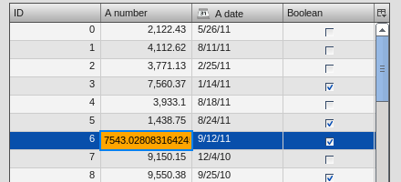

Scrollbars
----------

Each widget which uses the scrolling capabilities (as the table pane scroller does) can use themed scrollbars. By using them you can also style them, since they are rendered by decorators which are now quite common to you, right? So this section won't dive too deep into styling scrollbars and just gives hints at which appearance you have to get your hands on. The default appearance of the scrollbars for the table is

    "table-scroller/scrollbar-x": "scrollbar",
    "table-scroller/scrollbar-y": "scrollbar",

so the scrollbars of the `table-scroller` widget integrates the scrollbars as child controls and does use the same decorators as the default scrollbars. If you want to theme those scrollbars you should take a look at the `scrollbar` appearance and all other child controls of this widget. As first step you can copy this definitions and modify it to suit your needs. Instead of using the default scrollbars for the table you have to point the `table-scroller/scrollbar-x` and `table-scroller/scrollbar-y` to your own appearance entries and you're done.

Here's a quick reminder how the table does look like with themed scrollbars:

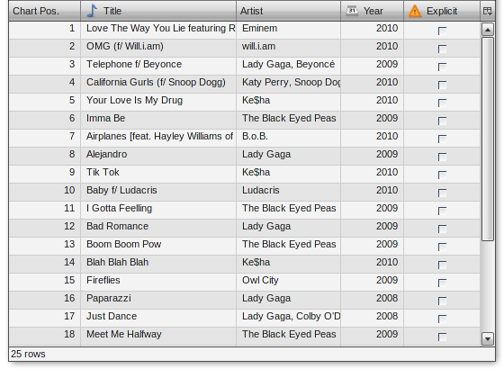
