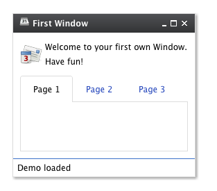

Theming
=======

qooxdoo includes four themes:

-   `Modern` - a graphically rich theme, showcasing many UI capabilities of qooxdoo %{version}
-   `Classic` - MS Windows oriented theme
-   `Simple` - a lightweight theme, which looks more like a website.
-   `Indigo` - a theme, based on simple but offers the style of the qooxdoo.org website.

Here some screenshots:

While those four themes run out-of-the-box, it is easy to create your own themes. Those custom themes can either be created by extending existing ones \<pages/desktop/ui\_custom\_themes\#extending\_themes\> or they can be created from scratch \<pages/desktop/ui\_custom\_themes\#custom\_themes\>.

A complete theme (a so-called *meta theme*) consists of several special themes, each designed to play a dedicated role and to setup the different parts of the whole theming. These special themes are described at the subsequent sections followed by a description of how to create own themes.

Meta Theme
----------

A meta theme describes the whole theme itself by defining the specific parts. Each meta theme consists of five keys

-   appearance
-   color
-   decoration
-   font
-   icon

each of them referencing to a specialized theme. So you can think of a meta theme as of collection whose parts can easily be changed.

Sample of a meta theme:

    qx.Theme.define("qx.theme.Modern",
    {
      meta :
      {
        color : qx.theme.modern.Color,
        decoration : qx.theme.modern.Decoration,
        font : qx.theme.modern.Font,
        appearance : qx.theme.modern.Appearance,
        icon : qx.theme.icon.Tango
      }
    }

This section describes the different types of themes which are used for theming a whole application.

Color Theme
-----------

A color theme defines all colors used by the framework. Each color is defined by an unique name and a value which can be written as hex, rgb or named color. This defined name is usable throughout the whole framework and your application.

> **note**
>
> The best way to organize your color names is to use **semantic ones** like `background`, `text-input` or `text-disabled`. This way it is easier to use one color for multiple widgets.

Part of a sample color theme:

    /**
     * sample color theme
     */
    qx.Theme.define("myApplication.theme.sample.Color",
    {
      colors :
      {
        /*
        ----------------------------------------------------------------------
          SAMPLE COLORS
        ----------------------------------------------------------------------
        */

        // color as hex value
        "background-application" : "#DFDFDF",

        // color as rgb array
        "background-pane" : [ 128, 128, 128 ],

        // color as named color
        "background-light" : "gray",
      }
    });

Following names are recognized as named colors: `black`, `white`, `silver`, `gray`, `maroon`, `red`, `purple`, `fuchsia`, `green`, `lime`, `olive`, `yellow`, `navy`, `blue`, `teal`, `aqua`, `orange`, `brown`.

The color values are set in the class [qx.util.ColorUtil](http://demo.qooxdoo.org/%{version}/apiviewer/#qx.util.ColorUtil)

Decoration Theme
----------------

Each widget can be equipped with an independent decoration which can be used to set a background-color or -image, define a border, add a shadow and much more. In a decoration theme you can use several different decorators depending on the results you wish to achieve. Please take a look at the decorator article \<ui\_decorators\> to get more information.

> **note**
>
> It is recommended to define the decorations inside the theme instead of creating manually decorator instances inside your application code. This way the created decorators can be used by multiple widgets.

What a decoration theme can look like:

    /**
     * Sample decoration theme.
     *
     * @asset(sample/decoration/myDecorationTheme/*)
     */
    qx.Theme.define("myApplication.theme.sample.Decoration",
    {
      aliases : {
        decoration : "myApplication/decoration/sample"
      },

      decorations :
      {
        "single" :
        {
          decorator: qx.ui.decoration.Single,

          style :
          {
            width : 1,

            color : "red",
            colorLeft : "black",
            colorRight : "white",

            style : "solid"
          }
        },

        "grid" :
        {
          decorator : qx.ui.decoration.Grid,

          style :
          {
            baseImage : "decoration/pane/grid.png"
          }
        },

        "combined" : 
        {
          decorator : [
            qx.ui.decoration.MBackgroundColor,
            qx.ui.decoration.MBorderRadius
          ],

          style : 
          {
            backgroundColor : "button",
            radius : 3
          }
        }
    });

Noted the `@asset` at the top and the `aliases` key inside the theme declaration? This is needed to for the images used within the theme. A description of how to work with resources is available here \<pages/ui\_resources\#declaring\_resources\_in\_the\_code\>.

> **note**
>
> The `aliases` key is especially important when defining an own decorator theme. This entry does add a new alias at the `AliasManager` class and verifies that your images for the decoration theme are found by the `ResourceManager` which is working with the resolve URLs of the `AliasManager` class.

Font Theme
----------

This theme is all about the information of the fonts used throughout your application. As the number of types/variants of fonts used with application isn't that big the font theme is normally a compact one. Web fonts are also defined here. See the article on web fonts\<pages/ui\_webfonts\#webfonts\> for details.

> **note**
>
> It is always a good idea to limit the number of types or variants of fonts to create a homogenous look.

To demonstrate how compact and powerful a font theme can look like, take a look at the example font theme:

    /**
     * The modern font theme.
     */
    qx.Theme.define("qx.theme.modern.Font",
    {
      fonts :
      {
        "default" :
        {
          size : 11,
          lineHeight : 1.4,
          family : [ "Tahoma", "Liberation Sans", "Arial" ]
        },

        "bold" :
        {
          size : 12,
          lineHeight : 1.4,
          family : [ "Lucida Grande" ],
          bold : true
        }
      }
    });

It is important to note that you can only specify values available as property on [qx.bom.Font](http://demo.qooxdoo.org/current/apiviewer/#qx.bom.Font) or [qx.bom.webfonts.WebFont](http://demo.qooxdoo.org/current/apiviewer/#qx.bom.webfonts.WebFont).

Icon Theme
----------

This theme is to define which icon set is used and normally consists only of 2 main keys (title and aliases).

The important one is the `aliases` key which points the generator to the location of the icon set. The `icon` alias, which is used to reference icons in qooxdoo applications, is set to the value of this key. As qooxdoo uses the free available [Tango](http://tango.freedesktop.org/Tango_Desktop_Project) and [Oxygen](http://www.oxygen-icons.org) icon sets it is not necessary to extend these.

Complete code for the `tango` icon theme:

    /**
     * Tango icons
     */
    qx.Theme.define("qx.theme.icon.Tango",
    {
      aliases : {
        "icon" : "qx/icon/Tango"
      }
    });

Appearance Theme
----------------

The appearance theme is by far the biggest theme. Its task is to describe every themable widget and their child controls. Since the widgets are styled using decorators, colors, fonts and icons the appearance theme uses the definitions of all the other themes namely the decoration, color, font and icon theme. You can think of the appearance theme as the central meeting point where the other themes (decorator, color, font and icon) get together.

To discover the power of the appearance theme please take a look at the corresponding article \<ui\_appearance\> which should let you get an idea of the whole picture.

Applying Themes
---------------

Typically, your application will have a certain, pre-defined theme known *at build-time*. The best way to associate such a default outlook with your application is to use the config.json variable `QXTHEME` inside the "let" section. Setting this variable to a fully-qualified meta theme class lets the build process handle the proper inclusion and linkage of the theme classes automatically. E.g.:

    ...
    QXTHEME : qx.theme.Modern,
    ...

Switching Themes During Runtime
-------------------------------

It is also possible to set a theme *at runtime*:

    qx.theme.manager.Meta.getInstance().setTheme(qx.theme.Classic); 

Having e.g. the qooxdoo modern theme defined in your config.json file, this line of code switches the whole UI to the classic theme. Of course, this can also be a custom theme \<pages/desktop/ui\_custom\_themes\#custom\_themes\>.

> **note**
>
> Referencing a second theme in the code also adds a dependency to the theme and all the classes and resources necessary. This is only necessary if the theme switch is actively triggered. Parts \<pages/parts\_overview\#parts\_and\_packages\_overview\> offer a convenient way of on demand loading of code, like a second theme.

Multi-theme Applications
------------------------

Building up on the previous section, here is how to create an application that provides multiple themes that can be switched at runtime.

-   **Configure themes**: Add all meta theme classes of the themes you want to use to the pages/tool/generator/generator\_config\_ref\#include configuration key of the compile jobs. A good way to achieve this is to override the pages/tool/generator/generator\_default\_jobs\#includes job in your config.json:

        "includes" : {
          "include" : [
            "qx.theme.Classic",
            "qx.theme.Indigo",
            "..."
          ]
        }

    If you use third-party themes (like the Aristo or RetroTheme contributions) make sure you also add their libraries to the pages/tool/generator/generator\_default\_jobs\#libraries job, so their classes are actually available.
-   **Implement theme switch**: Switch the theme in your application code. E.g. you can use [qx.Theme.getAll()](http://demo.qooxdoo.org/%{version}/apiviewer/#qx.Theme~getAll) to retrieve all known theme classes, filter out the "meta" classes, decide which to use, and set it as the current theme, exemplified here through two methods:

        _getThemeNames : function() {
          var theme, theme_names = [];
          var themes = qx.Theme.getAll();
          for (var key in themes) {
            theme = themes[key];
            if (theme.type === "meta") {
              theme_names.push(theme.name); }
          }
          return theme_names;
        }

        _setTheme : function(theme_name) {
          var theme = qx.Theme.getByName(theme_name);
          if (theme) {
            qx.theme.manager.Meta.getInstance().setTheme(theme); }
        }

    Of course you can use these APIs in different ways, depending on your application needs.
-   **Use theme-dependent icons (opt)**: So far switching the theme will result in widgets changing their appearance. Usually, themes also use a specific icon theme. If you use icons in your custom classes (widgets or themes), and you want them to adapt to the main theme you need to make sure that

    1.  the relevant icons of all icon themes are registered with your application
    2.  your code doesn't "hard-wire" icons but uses aliases. Here are code snippets to illustrate that.

    For 1. add macro definitions to your config.json which can later be used in the @asset
    \<pages/development/api\_jsdoc\_ref\#asset\> hints of class code. E.g.:

        // config.json :

        "let" : {
          "QXICONTHEME" : ["Tango", "Oxygen"]
        }

    In application code register icons for both icon themes with the class using them, by exploiting an asset macro instead of entering the icon theme literally. This also allows you to later add further icon themes just by adapting the configuration, without touching code:

        // Application class:

        // Use the asset macro "qx.icontheme" to register icons from both themes.
        /**
         * @asset(myapp/icontheme/${qx.icontheme}/16/apps/utilities-terminal.png)
         */

    For 2. use an alias in application code to reference icons transparently:

        // Use an aliased resource id for the icon
        var b = qx.ui.form.Button("My button", "icon/16/apps/utilities-terminal.png");

    This is basically the same when you define your own icon themes (like with `qx.Theme.define("myapp.theme.icon.Foo)`) and define your own asset macros (like `"myapp.iconthemes" : ["Foo", "Bar"]`). For the latter you would just use an explicit pages/tool/generator/generator\_config\_ref\#asset-let in your config.json, rather than using the default QXICONTHEME
    \<pages/tool/generator/generator\_config\_macros\#qxicontheme\> macro. A suitable alias like *icon* -\> *myapp/icontheme/Foo* can be defined in the theme
    \<pages/ui\_theming\#icon\_theme\> directly.

