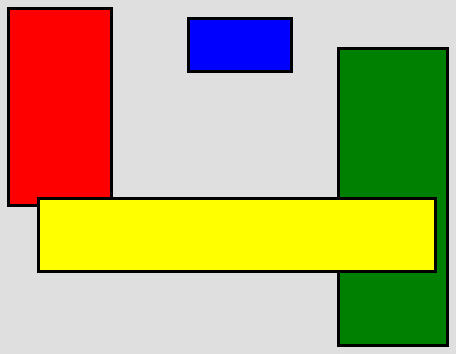

Basic
=====

The Basic is used to position the children at absolute top/left coordinates.

Preview Image
-------------

Features
--------

-   Basic positioning using `left` and `top` layout properties
-   Respects minimum and maximum dimensions without shrinking/growing
-   Margins for top and left side (including negative margins)
-   Respects right and bottom margins in the size hint
-   Auto-sizing

Description
-----------

The basic layout positions each child at the coordinate given by the `left` and `top` layout properties.

The size hint of a widget configured with a Basic layout is determined such that each child can be positioned at the specified location and can have its preferred size and margin.

Margins for left and top will shift the widget position by this amount (negative values are possible). Margins for right and bottom are only respected while computing the size hint.

Layout properties
-----------------

-   **left**: The left coordinate in pixel (defaults to `0`)
-   **top**: The top coordinate in pixel (defaults to `0`)

Alternative Names
-----------------

-   [AbsoluteLayout](http://extjs.com/deploy/dev/docs/?class=Ext.layout.AbsoluteLayout) (ExtJS)

Demos
-----

Here are some links that demonstrate the usage of the layout:

-   [A demo of the Basic layout](http://demo.qooxdoo.org/%{version}/demobrowser/#layout~Basic.html)

API
---

Here is a link to the API of the layout manager:
[qx.ui.layout.Basic](http://demo.qooxdoo.org/%{version}/apiviewer/index.html#qx.ui.layout.Basic)
