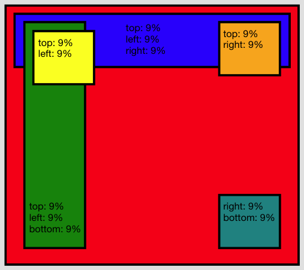

Canvas
======

The Canvas is an extended basic layout. It is possible to position a widget relative to the right or bottom edge of the available space. The Canvas layout further has support for percent dimensions and locations.

Preview Image
-------------

Features
--------

-   Pixel dimensions and locations
-   Percent dimensions and locations
-   Stretching between left+right and top+bottom
-   Minimum and maximum dimensions
-   Children are automatically shrunk to their minimum dimensions if not enough space is available
-   Auto sizing (ignoring percent values)
-   Margins (also negative ones)

Description
-----------

In addition to the Basic layout the Canvas layout adds support for `right` and `bottom` layout properties. These allows to position a child in distance from the right or bottom edge of the available space. The canvas also adds support for percent \<pages/ui\_layouting\#percent\> locations and dimensions (layout properties `width` and `height`). Percents are defined as a string value (otherwise using the same layout property) with a "%" postfix.

It is possible to stretch a between the left and right edge by specifying layout properties for both `left` and `right`. The same is of cause true for `top` and `bottom`. To define a distance which is identically to each edge e.g. stretch a child to between all sides there is the `edge` property. This property accepts the same values are supported by the other location properties (including percents). Please keep in mind that often a Grow Layout might be the better choice when `edge` was planned to use in conjunction with a Canvas Layout.

The size hint of a widget configured with a Canvas layout is determined such that each child can be positioned at the specified location and can have its preferred size and margin. For this computation the layout ignores all widgets, which have a percent size or position, because These sizes depend on the actual rendered size and are not known upfront.

Layout properties
-----------------

-   **left** *(Integer|String)*: The left coordinate in pixels or as a percent string, e.g. `20` or `30%`.
-   **top** *(Integer|String)*: The top coordinate in pixels or as a percent string, e.g. `20` or `30%`.
-   **right** *(Integer|String)*: The right coordinate in pixels or as a percent string, e.g. `20` or `30%`.
-   **bottom** *(Integer|String)*: The bottom coordinate in pixels or as a percent string, e.g. `20` or `30%`.
-   **edge** *(Integer|String)*: The coordinate in pixels or as a percent string to be used for all four edges.
-   **width** *(String)*: A percent width, e.g. `40%`.
-   **height** *(String)*: A percent height, e.g. `60%`.

Demos
-----

Here are some links that demonstrate the usage of the layout:

-   [Canvas with pixel positions](http://demo.qooxdoo.org/%{version}/demobrowser/#layout~Canvas_Fixed.html)
-   [Canvas with percent positions and dimensions](http://demo.qooxdoo.org/%{version}/demobrowser/#layout~Canvas_Percent.html)
-   [Canvas showing left and right attachment of children](http://demo.qooxdoo.org/%{version}/demobrowser/#layout~Canvas_LeftRight.html)
-   [Canvas with children having minimum and maximum dimensions](http://demo.qooxdoo.org/%{version}/demobrowser/#layout~Canvas_MinMaxSizes.html)

API
---

Here is a link to the API of the layout manager:
[qx.ui.layout.Canvas](http://demo.qooxdoo.org/%{version}/apiviewer/index.html#qx.ui.layout.Canvas)
