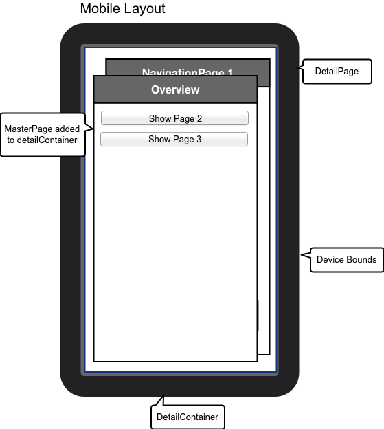
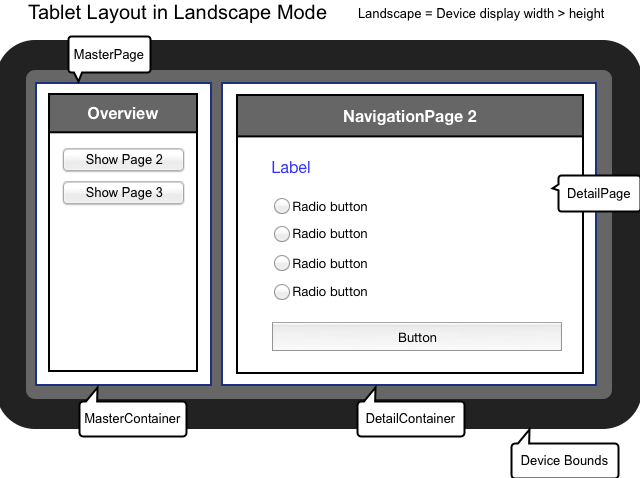
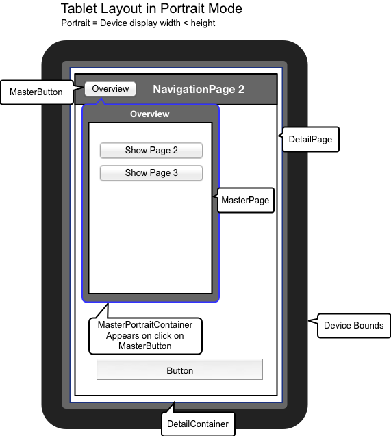

# Mobile and tablet switch

## Tablet support out of the box

On tablet devices you have a bigger screen size and more layout space than on
mobile devices. An application in a tablet device context may even provide
additional/other functions than on mobile device context.

Mobile provides mobile and tablet distinction out of the box. It provides a
detection of device type the application runs on.

Based upon this distinction, you can tell our page manager whether it should
layout its navigation pages optimized for device class mobile (intended for
mobile, 7'' tablets), class tablet or device class desktop.

## How to get the device type

The device type is accessible by the environment variable `device.type` . It is
able to detect 3 classes: `mobile`, `tablet` and `desktop`.

```
var deviceType = qx.core.Environment.get("device.type");
```

### Device type mapping table :

The device type is detected by resolving user agent strings. Device class
mapping is done by searching a specific hardware class, an operation system or a
browser type.

**Tablets** (returns `tablet`)

- Android Tablet
- iPad
- Blackberry Playbook
- Amazon Kindle
- Silk
- Sony PSP

**Mobile** (returns `mobile`)

- Android mobile phones
- iPhone
- iPod
- Bada
- Maemo
- Symbian
- Windows Phone
- Opera Mobile
- Fennec

**Desktop** (returns `desktop`)

- All other devices

## How to enable device-based layouting

The device-based layouting is handled by `qx.ui.mobile.page.Manager`. In our
examples at mobile playground and the tutorial, we always make usage of this
manager to create a Mobile application.

```
var isTablet = false;
var manager = new qx.ui.mobile.page.Manager(isTablet);
var page = new qx.ui.mobile.page.NavigationPage();
manager.addDetail(page);
page.show();
```

The manager has an optional constructor parameter `isTablet`. It indicates
whether the page manager uses the mobile or the tablet layouting mode. In this
examples, we deactivated tablet layout mode with `isTablet=false`.

If parameter `isTablet` is not defined in the constructor, the page manager
always calls environment variable `device.type` to determine the layout mode.
Tablet layout mode is active by default, if environment variable is `desktop` or
`tablet`.

## How the page manager arranges pages

The class `qx.ui.mobile.page.Manager` works with instances of
`qx.ui.mobile.page.NavigationPage`. The manager arranges the pages on screen,
based on flag `isTablet` and device orientation.

An device/window orientation change is detected by %{Mobile} and fires an
`orientationchange` event, which is handled by page manager.

### MasterPages and DetailPages

When page manager is on tablet mode, it arranges the NavigationPages in a
different order than on mobile mode. For this arrangement it needs to know,
whether a NavigationPage is important for the application flow, or not.

For this arrangement logic the instances of `qx.ui.mobile.page.NavigationPage`
needs to be added as a MasterPage or a DetailPage.

MasterPages are usually used as navigation. They control the appearance of
several DetailPages. A MasterPage should always be visible for controlling the
application flow.

DetailPages do contain the content, or more precise: they show the detailed
information. It is not necessary for the application flow, that a DetailPage is
always visible.

When tablet support is not necessary, every page can be added as a detailPage.

## Page manager layout modes

There are 3 different layouting modes, used by `qx.ui.mobile.page.Manager`.

### Mobile Layout

Used when `isTablet` of page manager is `false`.

All MasterPages and DetailsPages are added to DetailContainer.



### Tablet Landscape Layout

Used when `isTablet` of page manager is `true` and orientation is landscape.

MasterPages are added to `masterContainer`. DetailPages are added to
`detailContainer`.



### Tablet Portrait Layout

Used when `isTablet` of page manager is `true` and orientation is portrait.

MasterPages are added to a `PortraitMasterContainer`. This container is hidden
after orientation change. Visibility of this container can be controlled by
MasterButton. The caption of the MasterButton and the title of
`PortraitMasterContainer` are bound to show MasterPage's title.



## Example for a Mobile application with tablet support

Now, that you gained this knowledge about Mobile tablet support, you surely want
to create an application using this feature.

```
var manager = new qx.ui.mobile.page.Manager();

var masterPage = new qx.ui.mobile.page.NavigationPage();
var detailPage1 = new qx.ui.mobile.page.NavigationPage();
var detailPage2 = new qx.ui.mobile.page.NavigationPage();

manager.addMaster(masterPage);
manager.addDetail([detailPage1,detailPage2]);

masterPage.show();
detailPage1.show();
```

In the example above, we first create a page manager. To this manager we add
`masterPage`. You could even add multiple MasterPages.

This MasterPage could be used as a menu or overview page to control visibility
of DetailPages. The DetailPages can be added as an array, for convenience.

Finally you have to define which pages are visible at startup.

Page manager does not manage startup visibility, because this gives you full
control about the application flow.
