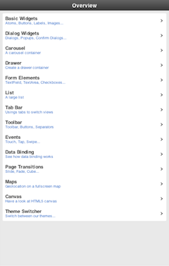
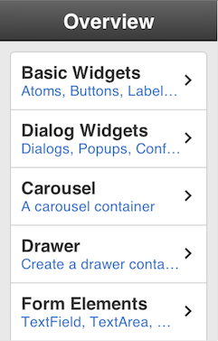

# Resolution and Pixel Density

Typical mobile devices like smartphones and tablets come in all kinds of
resolutions and pixel densities. Mobile applications are able to adapt to all
those different environments as described in the following sections.

Fortunately, you don't have to care much, as the framework handles most of it
automatically. But it also enables you to further optimize for a great user
experience on such devices as explained below.

## High Pixel Density

Many modern devices ship with high pixel density displays. The measurement of
pixel density is in units of `ppi` ("pixels per inch"), sometimes called `dpi`
("dots per inch"). Starting at about 300ppi a display's individual pixels become
indistinguishable to the human eye at regular viewing distance. Therefore such
devices are commonly said to have "Retina" displays.

In order to let applications continue with their pixel values used internally
(e.g. CSS sizes like `width: 100px;`) high-density devices introduced another
parameter: a ratio that maps CSS pixels to hardware pixels. This ratio is called
the "device pixel ratio". The device takes care of scaling the CSS pixels (also
called "device-independent pixels (dips)") to the physical pixels of the device.

The following device pixel ratios are common on mobile devices:

- iOS

  - 1
  - 2 ("Retina")

- Android
  - 1 (mdpi)
  - 1.5 (hdpi)
  - 2 (xhdpi)
  - 3 (xxhdpi)

The device pixel ratio is chosen by the manufacturer to properly match the
pixel-density to the device's physical resolution and dimensions. But
surprisingly and despite its name, it is not just a device-specific, fixed
value. For instance, modern desktop browsers also change the value of device
pixel ratio at runtime when you change the browser's font size. Mobile handles
that for you transparently.

In summary, a Mobile app takes high-density displays into account for layout
sizes, font sizes, and high-resolution images.

### Resolution-independent Theming

Since Mobile 3.5 all themes that ship with the SDK are resolution-independent.
They no longer use pixel values internally, but derive all their individual
sizes (such as paddings or border widths) from the global application font size.
Technically this is achieved by using the relative unit `rem` throughout the
theme.

Thus, at startup (or at reload) your app will layout with respect to the font
size setting of your browser. Also at runtime, whenever you decrease or increase
the application's font size, the theme (and therefore the entire visual part of
your app) will adjust itself accordingly.

### Font Scale

You can easily change the font size of your Mobile app programmatically. For
instance, this allowed you to offer the users a settings dialog to adjust the
total scale of the app to their liking.

The change is relative to the global font size (e.g. predefined by your
browser's settings). You set the new relative value, e.g. a factor of 2 for 200%
scaling) through the method `setFontScale` on `qx.ui.mobile.core.Root`:

```javascript
qx.core.Init.getApplication().getRoot().setFontScale(2);
```

The first image shows a font scale of `0.5`, the scale on the second is `1.5`:





### App Scale

The font scale isn't the only scale parameter. Usually one would be interested
in the total app scale. This app scale expresses the effective scaling of your
app. For instance, if the app scale is `1.75` , an image with an original width
of 100px, would appear on the display as 175 pixels wide.

```
var scale = qx.core.Init.getApplication().getRoot().getAppScale();
```

The app scale calculation takes into account both the font scale as well as the
reported device pixel ratio. As mentioned above modern desktop browsers tend to
modify the pixel ratio when changing built-in font sizes. So with both
parameters the effective app scale can be determined quite reliably on many
modern browsers.

### High-Resolution Images

The total app scale is important when displaying images. Regular bitmap-based
images would get blurry for high app scales. This can largely be overcome by
supplying additional versions of the same image.

You only have to follow a simple naming convention for those additional
resources. The framework picks the best match for each image from the supplied
high-resolution versions. The code of your app doesn't have to be modified. This
is possible because your app's images are handled as "managed resources" by the
Mobile toolchain. In whatever scale or on whatever high-pixel device your app
runs, it will internally look-up the best possible fit based on the determined
app scale.

### Location and naming conventions

The high-resolution images are assumed to be located in the same folder as the
default resolution image, but are annotated with the corresponding optimal
scale:

`<filename>@<appScale>.<fileextension>`

As an example, assume the following medium resolution image is part of your
project's resources: `source/resource/<APP_NAME>/icon/image.png`

The "resolution" of an image is given by the total amount of pixels available in
each dimension. Lets say `image.png` is 200 x 100 pixels. In your image
processing tool (e.g. Photoshop) take the original, high-quality sources that
you created the regular image from. Now create a high-resolution version.
Optimized for app scale 200% its resolution would become 400 x 200 pixels. Save
that larger image as `image@2x.png`. Do so for any scales and images you like to
support. That's it.

Remember that not just the device pixel ratio determines the effective app
scale. If device pixel ratio returns `1.5` but your font scale is `2`, then the
best image resolution would be `3x`. The application would try to display the
resource `image@3x.png`.

### Fallback

Mobile by default checks for the most common image resolutions:

- `@3x`
- `@2x`
- `@1.5x`

In your app you can adjust the set of scale factors to check by modifying this
static array:

`qx.ui.mobile.basic.Image.PIXEL_RATIOS`

For the best visual result Mobile uses the following fallback logic:

1.  It searches for an image with an exact or higher resolution, which is
    nearest to the actual app scale.

2.  It searches for an image with a lower resolution, which is nearest to the
    actual app scale.

3.  If no high-resolution image is found, the medium resolution image is
    displayed.
