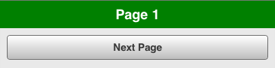
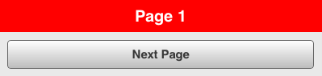
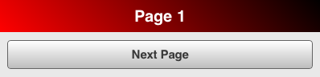
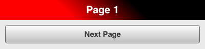

# Theming

## CSS and SCSS

Theming in Mobile is done with [SCSS](http://www.sass-lang.com/). SCSS is an
extension for CSS to enable style sheets to be more modular and maintainable. In
SCSS you can you use variables, create mixins, import other style files and
reuse CSS statements.

Despite our use of SCSS you do not have to be an SCSS expert. The main SCSS
parts are maintained by us in the framework. You will usually just need some
knowledge of CSS.

If you want to extend or change the Qooxdoo mobile themes you should always
modify the SCSS files (*.scss) in the folder
`<APP_ROOT>/source/theme/<APP_NAMESPACE>/scss`. After you modified any SCSS
files they have to be compiled into CSS, otherwise you will not see any changes.

## SCSS Compilation

The Qooxdoo compiler compiles the scss files on the fly to css!

## Coming from CSS (... and never heard of Sass and SCSS)?

Two important points for clarification:

- Valid CSS is also valid SCSS

- If you don't want to install Sass your app will still work but you can only
  edit the CSS files (*.css) to adapt the appearance of your app - editing the
  SCSS files (*.scss) will have no effect. Furthermore, you won't benefit from
  some of the features promoted here, so we strongly recommend using Sass.

## SCSS vs. Sass

Names can be confusing. Sass is both the name of the reference implementation
and the name of a syntax. Sass offers two syntax flavors:

SCSS (Sassy CSS):

```scss
#main {
  color: blue;
  font-size: 0.3em;

  a {
    font: {
      weight: bold;
      family: serif;
    }
}
```

Sass:

```sass
#main
  color: blue
  font-size: 0.3em

  a
    font:
      weight: bold
      family: serif
```

We use the SCSS syntax throughout.

## Watching SCSS files

Layout design through CSS is typically done by experimentation. You often change
a stylesheet and reload the corresponding application to see the effect. Using
SCSS you would need to compile the SCSS file after each change of your
stylesheet files.

To automatically compile the SCSS files on change/save, you can use the compiler
watch job:

```bash
qx compile --watch
```

It recognizes any changes made to the SCSS files in your `qx.Mobile` application
and triggers the compilation to CSS automatically.

## qx.Mobile Themes

`qx.Mobile` provides a custom theme which you can adjust to fit your application's
design goals. This could either follow your corporate design or the guidelines
of native platforms like iOS, Android, Windows Phone or Blackberry OS.

Instead of trying to deliver several stylesheets which mimic some native look,
we provide a powerful yet easy system to create custom themes. This way you have
all the possibilities to adapt your mobile app to any look & feel.

As a starting point use the `qx.Mobile` "Indigo" theme. This theme can be modified
by developers in many ways, like setting colors or change the appearance of
widgets, e.g. their border radius, etc. See the section below on custom theming.

## Using qx.Mobile Flat theme

If you want to use our Flat theme instead of the Indigo theme, you have to copy
the content of the following file:

`node-modules/@qooxdoo/framework/source/resource/qx/mobile/scss/theme/flat/_styles.scss`

Into your project's theme file:

`<APP_ROOT>/source/theme/<APP_NAME>/scss/_styles.scss`

After changing this, you have to run the source job in your application's root:

```bash
qx compile
```

## Adjusting the custom theme

In the qx.Mobile Showcase you can have a look at the default theme, called
"Indigo". This theme's styles will become the starting point for your custom
theme.

For customization, please follow these steps:

1.  Start the watch job by running

    ```bash
    qx compile --watch
    ```

    in your application's root.

    This job re-compiles your theme everytime you save the `_styles.scss` file.

2.  Have a look in your application's resource folder:
    `<APP_ROOT>/source/theme/<APP_NAME>/scss/_styles.scss`

    This is the key file for customizing the default theme to your needs.

    In `_styles.scss` you find various variables for the customization of your
    qx.Mobile application.

3.  Give it a try: Change the background of the NavigationBar to the color
    `green`:

    ```scss
    $navigationbar-background: green;
    ```

    Your customized theme is compiled automatically by the watch job to:
    `<APP_ROOT>/compile/resource/<APP_NAME>/css/custom.css`

4.  Reload your qx.Mobile application and check your changes. The NavigationBar
    should look like this:

    

    > scale  
    > 50%

That is all you need to know to get started customizing the theme of your
`qx.Mobile` app. Continue to adjust the other SCSS variables inside
`_styles.scss`!

## The background variables

Most theming variables accept only a single value. Background variables are
special: With only one value you set the background to a single color. With
multiple values, separated by `,` you create linear gradients. Additionally, you
can adjust the position of the color stops and adjust the direction of the
gradient, just as you know from CSS linear gradient syntax.

This feature works for all variables which end in `-background`. It accepts up
to 10 color stops.

Examples:

```scss
// This creates a red background
$navigationbar-background:  red;
```



```scss
// This creates a vertical background gradient from red to maroon
$navigationbar-background:  red, maroon;
```


```scss
// This creates a diagonal background from red to black
$navigationbar-background:  45deg, red, black;
```



```scss
// This creates a diagonal background gradient
// from red to maroon to black, with special positions
// of the color stops
$navigationbar-background:  45deg, red 33%, maroon 50%, black 66%;
```



## Extending the customized theme with CSS

In addition to the customization of variables in `_styles.scss` you can extend
the theme with your own CSS rules. In this case you can append your CSS
statements to this file:

`<APP_ROOT>/source/theme/<APP_NAME>/scss/custom.scss`

As mentioned before, you do not need to be an expert in SCSS for theming. But if
you want to know more about this exciting CSS enhancement technology, please
have a look at the Sass website:

- [Sass official website](http://www.sass-lang.com/)

## Resolution Independence

A `qx.Mobile` theme can be scaled to adjust the application to the resolution of
your target devices.

To reach this goal, `qx.Mobile` theming strictly uses `rem` units instead of `px`
inside its stylesheets.

If you are not familiar with the CSS unit `rem`, please have a look at
[MDN CSS Units](https://developer.mozilla.org/en-US/docs/Web/CSS/length) .

Thinking in `rem` units might be difficult, and that is why we added a SCSS
function named `rem()`. This function gives you the possibility to continue to
think in `px`, but converts the `px` value to a corresponding `rem` on SCSS
compilation. As you certainly want to keep the feature of resolution
independence in your custom theme, always avoid `px` and use this function
inside your `_styles.scss`.

Example:

```scss
// text size should be about 32px, this gets converted to 2rem.
$navigationbar-text-size:  rem(32);
```
