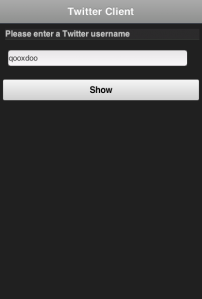
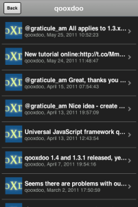

# Tutorial: Creating a Tweets Client with Qooxdoo mobile

In this tutorial you will learn how to create a simple tweets app with the
[Qooxdoo mobile](apps://apiviewer/#qx.ui.mobile) widgets.

[identica](http://identi.ca) is a twitter-like service for reading and posting
public short messages - called "tweets". It has a twitter-compatible API for
accessing data.

[Twitter](http://twitter.com) itself made its authorization scheme more complex,
as it starts requiring OAuth even to read public tweets. For this basic tutorial
it would be too complex to handle such advanced authorization. If you are
interested in OAuth, check out how you could handle that in a Qooxdoo app by
looking at the [GitHub demo](apps://demobrowser/#data~Github.html) .

We use a mock for the identica service to be sure this tutorial always works.

The app that is to be created in this tutorial should display all tweets of a
certain user. When a tweet is selected, the details of the tweet should be
shown. You can find the code of the tutorial
[here](https://github.com/qooxdoo/qooxdoo/tree/master/component/tutorials/mobiletweets/step1)
.

## Requirements and Getting Started

Please visit the getting started section [Getting Started](getting_started.md)
and follow the introduction which describes how to create a Mobile Application.

## Creating your first Page

In this section we will create two pages, one page for entering the username
whose tweets should be shown and another page for displaying the tweets.

But first of all we have to define what a page is:

A page is a widget which provides a screen with which users can interact in
order to do something. Most times a page provides a single task or a group of
related tasks. A Qooxdoo mobile application is usually composed of one or more
loosely connected pages. Typically, there is one page that presents the "main"
view.

Open the "mobiletweets" folder in your favorite IDE, so that you can edit all
the files. Navigate to the "source/class/mobiletweets" folder, where all the
application class files are located. Now you are ready to create the
application.

First we have to create a new page class. In order to do so, create a new folder
"page" under "source/class/mobiletweets", representing a new namespace
`mobiletweets.page`. In this folder create a new JavaScript file named
"Input.js". This file will contain the `mobiletweets.page.Input` class. Define
the class like this: :

```javascript
qx.Class.define("mobiletweets.page.Input",
{
  extend : qx.ui.mobile.page.NavigationPage,

  construct() {
    super();
    this.setTitle("Identica Client");
  }
});
```

The "Input" class inherits from `qx.ui.mobile.page.NavigationPage`, a
specialized page that consists of a `qx.ui.mobile.navigationbar.NavigationBar`
including a title, back and action buttons, and a scrollable content area. In
the constructor of the class we set the title of the page to "Identica Client".

To show the "Input" page, we have to create an instance of the class and a page
manager. The manager does the layouting and displays our page on the screen.
Additionally, the manager gives us the possibility to use our application in a
mobile or tablet device context. For our example, we just want to work in a
mobile device context. That is why, we construct the manager with `false`.

After creation of the new manager, we have to add the "Input" page to it. In
order to display the "Input" page on start, we then call its `show` method.

Open the "source/class/mobiletweets/Application.js" class file. You will find a
comment in the `main` method "_Below is your actual application code..._" with
example code below. As we don't need this example code, we can safely replace it
with the following lines of code: :

```javascript
const manager = new qx.ui.mobile.page.Manager(false);

const inputPage = new mobiletweets.page.Input();
manager.addDetail(inputPage);

inputPage.show();
```

Refresh the index.html in your browser. You will see a page with a navigation
bar and a title "Identica Client". That is all you have to do when you want to
display a page.

## Navigation between Pages

Qooxdoo mobile comes with different
[animations](apps://apiviewer/#qx.ui.mobile.page.manager.Animation) for page
transitions. Showing a second page is as easy as showing one page. Just call the
`show` method of the second page and Qooxdoo will do the rest. To navigate back
to the first page you have to call, you have guessed it, the `show` method of
the first page again. To play the animation of the page transition "reversed",
call the `show` method with an object literal `{reverse:true}` as an argument.
To change an animation, just add an animation key to the passed object literal,
e.g. `{animation:fade}`: :

```javascript
page.show(); // show the page; "slide" is the default animation
//or
page.show({reverse:true}); // show the page and reverse the animation of the transition
//or
page.show({animation : "cube", reverse:true}); // show the page and reverse the "cube" animation
```

### Page Lifecycle:

A page has predefined lifecycle methods that get called by the page manager when
a page gets shown. Each time another page is requested to be shown the currently
shown page is stopped. The other page, if shown for the first time, will be
initialized and started afterwards. For all called lifecycle methods an event is
fired.

Calling the "show" method triggers the following lifecycle methods:

- `initialize`: Initializes the page to show
- `start`: Starts the page that should be shown
- `stop`: Stops the current shown page

**IMPORTANT**: Define all child widgets of a page when the "initialize" _
lifecycle method is called, either by listening to the "initialize" _ event or
overriding the `_initialize` method. This is because a page can be
instantiated during application startup and would then decrease performance if
the widgets would be added during constructor call. The initialize event and
the `_initialize` lifecycle method are only called when the page is shown for
the first time.

Let's try it! Create another page class "Tweets" in the
"source/class/mobiletweets/page" folder: :

```javascript
qx.Class.define("mobiletweets.page.Tweets",
{
  extend : qx.ui.mobile.page.NavigationPage,

  construct() {
    super();
    this.set({
      title : "", // will be replaced by username
      showBackButton : true,
      backButtonText : "Back"
    });
  }
});
```

In the constructor we set up the back button and set its text to "Back".
The title will be replaced by the given username later.

Now we need a button on the "Input" page, so that we can navigate between the
two pages. Create a new instance of a `qx.ui.mobile.form.Button` in the "Input"
class and add it to the content of the page. By listening to the `tap` event of
the button, the application can handle when the user taps on the button. Add a
new `member` section to the class definition of the "Input" class and override
the protected lifecycle method `_initialize` to do that: :

```javascript
members : {

  // overridden
  _initialize() {
    super._initialize();
    // Create a new button instance and set the title of the button to "Show"
    const button = new qx.ui.mobile.form.Button("Show");
    // Add the "tap" listener to the button
    button.addListener("tap", this._onTap, this);
    // Add the button the content of the page
    this.getContent().add(button);
  }
}
```

As you can see, the `tap` listener has the `_onTap` method as a handler. This
method has to be implemented in the member section as well:

```javascript
_onTap(evt)
{
   this.fireDataEvent("requestTweet", null); // Fire a data event.
       // Later we will send the entered "username" as a data.
}
```

In the `_onTap` method we fire a data event "requestTweet". The empty data will
be replaced later with the username. The only thing which is missing now is to
define the event itself. Add a new `events` section to the "Input" class:

```javascript
events : {
  "requestTweet" : "qx.event.type.Data" // Define the event
}
```

In the "Application" class add the following code below the code we have just
added:

```javascript
// New instance of the Tweets page
const tweetsPage = new mobiletweets.page.Tweets();

// Add page to manager
manager.addDetail(tweetsPage);

// Show the tweets page, when the button is pressed
inputPage.addListener("requestTweet", function(evt) {
  tweetsPage.show();
}, this);

// Return to the Input page when the back button is pressed
tweetsPage.addListener("back", function(evt) {
  inputPage.show({reverse:true});
}, this);
```

After creating a new instance of our new "Tweets" class we listen to the
`requestTweet` event of the "Input" page instance. In the event handler we call
the `show` method of the `tweetsPage` page object to display the page. In the
`back` event handler of the `tweetsPage`, the "Input" page will be shown with a
reversed animation.

New classes mean new dependencies which means we have to generate the source
code again. Refresh the application in the browser and navigate between the
pages by tapping on the "Show" and on the "Back" button. Nice!

## We need Data, lots of Data!

Ok, here we are. You have learned how to create two pages and to wire them by
reacting on defined events. That is pretty cool, but without data to display our
app is worthless. To display the tweets of a user we will use the public Tweet
service of identica. [Data binding](../core/data_binding/README.md) is a powerful concept
of Qooxdoo which you can leverage off in your mobile applications as well.
Extend the `members` section of the "Application" class by the following code: :

```javascript
__loadTweets() {
  // Mocked Identica Tweets API
  // Create a new JSONP store instance with the given url
  const self = this;

  const url = "http://XXXX"+ "/tweets_step4.5/resource/tweets/service.js";

  const store = new qx.data.store.Jsonp();
  store.setCallbackName("callback");
  store.setUrl(url);

  // Use data binding to bind the "model" property of the store to the "tweets" property
  store.bind("model", this, "tweets");
}
```

In the `__loadTweets` method we create a new
[JSONP](apps://apiviewer/#qx.data.store.Jsonp) store which will automatically
retrieve the data from the given URL. By binding the `model` property to the
`tweets` property, the `tweets` property will be automatically updated whenever
the `model` property of the store is updated.

As you might have noticed the `__loadTweets` method uses two properties,
`username` and `tweets`, that are not defined yet. We will define those
properties now. Define a new section `properties` in the "Application" class and
add the following two properties: :

```javascript
properties :
{
    tweets :
    {
      check : "qx.data.Array",
      nullable : true,
      init : null,
      event : "changeTweets",
      apply : "_applyTweets" // just for logging the data
    },

    username :
    {
      check : "String",
      nullable : false,
      init : "",
      event : "changeUsername",
      apply : "_applyUsername"  // this method is called when the username property is set
    }
}
```

In the apply method `_applyUsername` of the `username` property we will call the
`__loadTweets` method. So every time the username is set the tweets for this
username are loaded. To see which data is set for the `tweets` property, we will
print the data in the debugging console. To do so, we call `this.debug` with the
stringified value in the apply method `_applyTweets`. Add the following code to
the member section of the "Application" class: :

```javascript
// property apply
_applyUsername(value, old) {
  this.__loadTweets();
},

_applyTweets(value, old) {
  // print the loaded data in the console
  this.debug("Tweets: ", qx.lang.Json.stringify(value));
}
```

Now the username has to be retrieved from the user input. To do so, we have to
create an input form. The usage of the form classes should be familiar to you if
you have used the RIA widget set before. Open the "Input" class again and place
the following code, before the button instance in the `_initialize` method:

```javascript
const title = new qx.ui.mobile.form.Title("Please enter an identi.ca username");
this.getContent().add(title);

const form = this.__form = new qx.ui.mobile.form.Form();

const input = this.__input = new qx.ui.mobile.form.TextField();
input.setPlaceholder("Username");
input.setRequired(true);
form.add(input, "Username");

// Add the form to the content of the page, using the Single to render
// the form.
this.getContent().add(new qx.ui.mobile.form.renderer.Single(form));
```

First we add an instance of `qx.ui.mobile.form.Title` to the content of the
page. To an instance of `qx.ui.mobile.form.Form`, a
`qx.ui.mobile.form.TextField` instance `input` is added. Both instances are
assigned to member variables as well, for further reuse. A text is set for the
`placeholder` property of the text field. By setting the property `required` to
true we indicate that the text field requires an input. Finally, we add the form
instance to the page content, by using a
`qx.ui.mobile.form.renderer.SinglePlaceholder` renderer. The renderer is
responsible for the look and feel of the form. In this case only the input
fields with their placeholders are displayed.

In the `_onTap` method we have to retrieve now the value of the input field.
Replace the code in the function body by the following code: :

```javascript
// validate the form
if (this.__form.validate())  {
  const username = this.__input.getValue();
  this.fireDataEvent("requestTweet", username);
}
```

After successfully validating the form, we retrieve the value of the text field
from the member variable and pass it as the data to the event.

As you surely remember we listen to the `requestTweet` event in the
"Application" class. Open the Application class and add the following line to
the event listener: :

```javascript
this.setUsername(evt.getData());
```

We've come full circle. By setting the username, the data will be loaded and we
can proceed to display the data. Rebuild the application and refresh it in the
browser. Type in a valid identica username (e.g. "Qooxdoo") and tap the "Show"
button. Press the `F7` key to display the Qooxdoo logging window or use the
console of the browser developer tools. You will see the loaded tweets of the
user.



## Displaying the tweets

Now that we have the tweets for a certain user, it's going to be pretty easy to
display them. All we need for that is a `qx.ui.mobile.list.List` and to set up
some data binding. Let's proceed with the tutorial.

First we have to add the following `_initialize` method to the members' section
of the "Tweets" page.

```javascript
members : {
  __list : null,

  _initialize() {
    super._initialize();

    // Create a new list instance
    const list = this.__list = new qx.ui.mobile.list.List();
    const dateFormat = new qx.util.format.DateFormat();
    // Use a delegate to configure each single list item
    list.setDelegate({
      configureItem : function(item, value, row) {
        // set the data of the model
        item.setTitle(value.getText());
        // we use the dataFormat instance to format the data value of the identica API
        item.setSubtitle(dateFormat.format(new Date(value.getCreated_at())));
        item.setImage(value.getUser().getProfile_image_url());
        // we have more data to display, show an arrow
        item.setShowArrow(true);
      }
    });
    // bind the "tweets" property to the "model" property of the list instance
    this.bind("tweets", list, "model");
    // add the list to the content of the page
    this.getContent().add(list);
  }
}
```

The created list instance (we store it in a member variable for further usage)
will use a delegate to configure each single list item. The delegate is set by
the `setDelegate` method as a literal object. The `configureItem` method is
responsible for configuring the list items. It has three parameters:

- `item`: The list item renderer instance. Use this parameter to set the title,
  subtitle or icon of the list item.

- `value`: The value of the row. Entry of the model for the current row index.

- `row`: The row index.

In this case the list item renderer is the `qx.ui.mobile.list.renderer.Default`.
This renderer has a `title`, `subtitle` and a `image` property, which can be set
individually per row. In addition to those properties, the `showArrow` property
shows an arrow on the right side of the row, indicating that we have more data
to display.

Finally, the model of the list instance is bound to the `tweets` property, which
we will add to the "Tweets" class right above the `member` section: :

```javascript
properties :  {
  tweets : {
     check : "qx.data.Array",
     nullable : true,
     init : null,
     event : "changeTweets"
   }
}
```

There are only two tasks left:

1.  Bind the `tweets` property from the "Application" to the `tweets` property
    of the "Tweets" page instance.

2.  Bind the `username` property form the "Application" to the `title` property
    of the "Tweets" page instance.

Open the "Application" class file and add under the instantiation of the
"Tweets" page `tweetsPage` the following code: :

```javascript
this.bind("tweets", tweetsPage, "tweets");
this.bind("username", tweetsPage, "title");
```

Generate the source code again and refresh you browser tab. Try the username
"Qooxdoo" and push the "Show" button. It is magic!



## Details of a tweet

Great, you have made it so far! In the last section we will display a tweet on a
new page when the user selects a certain tweet. Sometimes it can happen that a
tweet is too long for a list entry. Ellipses are then shown at the end of the
tweet. That is why we want to give the user a chance to display the whole tweet.
Let's create a simple "TweetDetail" page that only shows a
`qx.ui.mobile.basic.Label` with the selected tweet text. To do so, we bind the
`text` property of the tweet to the label's `value` property. Create the page,
like you have done before, in the "source/class/mobiletweets/page" folder. The
code of the page shouldn't be something new for you: :

```javascript
qx.Class.define("mobiletweets.page.TweetDetail",
{
  extend : qx.ui.mobile.page.NavigationPage,

  construct() {
    super();
    this.set({
      title : "Details",
      showBackButton : true,
      backButtonText : "Back"
    });
  },

  properties:
  {
    tweet :
    {
      check : "Object",
      nullable : true,
      init : null,
      event : "changeTweet"
    }
  },

  members :
  {
    _initialize()
    {
      super._initialize();
      // Create a new label instance
      const label = new qx.ui.mobile.basic.Label();
      this.getContent().add(label);
      // bind the "tweet.getText" property to the "value" of the label
      this.bind("tweet.text", label, "value");
    }
  }
});
```

Now create the instance of the "TweetDetail" page in the Application `main`
method and return to the "Tweets" page, when the `back` listener is called.

```javascript
const tweetPage = new mobiletweets.page.TweetDetail();

// Add page to manager
manager.addDetail(tweetPage);

// Return to the Tweets Page
tweetPage.addListener("back", function(evt) {
  tweetsPage.show({reverse:true});
}, this);
```

Until now, we will never see the "TweetDetail" page as its `show` method is never
called. First we have to react in the "Tweets" page on a selection change event
of the list, by registering the `changeSelection` event on the list in the
`_initialize` method: :

```javascript
list.addListener("changeSelection", this.__onChangeSelection, this);
```

The `__onChangeSelection` method looks like this: :

```javascript
__onChangeSelection(evt)
{
  // retrieve the index of the selected row
  const index = evt.getData();
  this.fireDataEvent("showTweet", index);
}
```

As you can see, a `showTweet` data event is fired here. This data event has to
be defined in the `events` section of the "Tweets" class: :

```javascript
events : {
  showTweet : "qx.event.type.Data"
}
```

All we need to do now is to listen to the `showTweet` event in the "Application"
class main method, retrieve the index from the data event and to get the
corresponding tweet from the data. Finally, we show our "TweetDetail" page.

```javascript
// Show the selected tweet
tweetsPage.addListener("showTweet", function(evt) {
  const index = evt.getData();
  tweetPage.setTweet(this.getTweets().getItem(index));
  tweetPage.show();
}, this);
```

Rebuild, refresh the application in your browser and enjoy your application! We
are done here.


## Now you are ready to develop your own applications

After you have finished this tutorial, you have learned the basics of Qooxdoo
mobile. You have seen how easy it is to develop Qooxdoo mobile applications when
you are familiar with Qooxdoo. There are only some new concepts (e.g. Pages) to
learn and you are good to go. All Qooxdoo mobile applications work on Android
and iOS devices.
