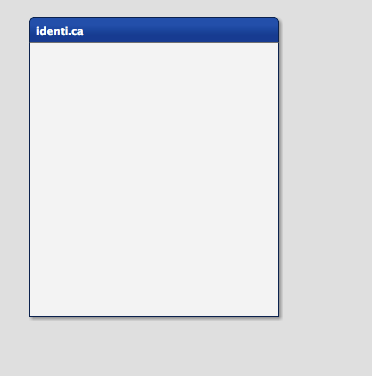

# Tutorial Part 1: Getting started


The first step is to get a working qooxdoo application where we can start our development. Us the compiler create function to setup a new application called `tweets`. If you are unsure as to what is happening here, make sure to first work through the [introduction](/)

```bash
$ mkdir tweets
$ cd tweets
$ npm init
$ npm install --save-dev @qooxdoo/compiler @qooxdoo/framework
$ npx qx create tweets --type desktop --noninteractive --out=.
```

First check that everything works as expected. run `npx qx serve` to build the application and make it available on [port 8080](http://localhost:8080).

Now, open the `Application.js` file located in `source/class/tweets/Application.js` with your favorite editor (Microsoft Visual Code is very popular for example) and you are set up for development!

The skeleton app contains all the code to setup that button, we don't need it anymore. You can just remove it, along with the configuration of the listener.

The first task is to create a Window. As the Window contains all the UI controls, it is therefore best to extend from the qooxdoo Window widget and add the controls within that news class. Adding a new class is as easy as creating a new file. Just create a file in the same folder as `Application.js` and call it `MainWindow.js`. We want to create a class so we use the qooxdoo function `qx.Class.define` for that:

```javascript
qx.Class.define("tweets.MainWindow", {
  extend : qx.ui.window.Window,
  construct : function() {
    this.base(arguments, "tweets");
  }
});
```

We have created our own class extending the qooxdoo Window. In the constructor, we already set the caption of the window, which is the [first constructor parameter of the qooxdoo window](http://demo.qooxdoo.org/%{version}/apiviewer/#qx.ui.window.Window). So you already have guessed it, `this.base(arguments)` calls the overridden method of the superclass, in this case the constructor. To test the window, we need to create an instance of it in the main application. Add these two lines of code in the `Application.js` file to create and open the window. Make sure to add it at the end of the main function in the application class.

```javascript
var main = new tweets.MainWindow();
main.open();
```

If you have not stopped the `npx qx server` command above, you can now simply reload the webpage to see the effect of your efforts. You should see a window in the top left corner having the name "tweets".

Programming as Configuring
--------------------------

The last task of this tutorial part is to configure the window. Opening the window in the left corner does not look so good, ideally it would be in the center of the screen.

```javascript
this.setCenterOnAppear(true);
```

Another thing to configure are the buttons of the window. The user should not be able to close, minimize nor maximize the window. So we add the following lines of code in our window constructor.

```javascript
this.setShowClose(false);
this.setShowMaximize(false);
this.setShowMinimize(false);
```

The last thing to change is the size of the window on startup. Of course the user can resize the window but it is important to start with good looking initial settings. Changing the size is as easy as hiding the buttons, just tell the window in its constructor:

```javascript
this.setWidth(250);
this.setHeight(300);
```

And to stay DRY you can also write:

```javascript
this.set({
  centerOnAppear: true,
  showMaximize: false,
  showMinimize: false,
  showClose: false,
  width: 250,
  height: 300
});
```

At this point, your application should look like this.



That's it for the first part. If you want to have the [code from the tutorial](https://github.com/qooxdoo/qooxdoo/tree/%{release_tag}%/component/tutorials/tweets/step1), take a look at the project at Github and just fork the project. The next part of the tutorial will contain the building of the other parts of the UI. If you have feedback or want to see something special in further tutorials, just let us know!
