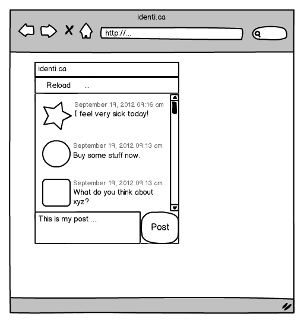

Tutorial Part 2: Finishing the UI
=================================

In the first part \<tutorial-part-1\> of the tutorial, we built a basic window for our target application, a tweets client. In the second part of the tutorial, we want to finish the UI of the application. So lets get started, we got a lot to do!

I hope you remember the layout of the application we are trying to build. If not, here is a little reminder.



The first thing we need to do is to set a layout for our window. You can see that the text area and the button are side by side while all the other elements are ordered vertically. But all elements are aligned in a grid so we should choose a grid layout for that. We can add the grid layout in our own window class. Just add these lines of code in `MainWindow.js`:

```javascript
// add the layout
var layout = new qx.ui.layout.Grid(0, 0);
this.setLayout(layout);
```

But a layout without any content is boring so we should add some content to see if it's working. Lets add the first two elements to the window, the toolbar and the list view.

Layout and Toolbar
------------------

First, we need to create the toolbar before we can add it. Creating the toolbar and adding it is straight forward.

```javascript
// toolbar
var toolbar = new qx.ui.toolbar.ToolBar();
this.add(toolbar, {row: 0, column: 0});
```

This will add the toolbar to the grid layout of our main window. The only thing you should take care of is the second parameter of `.add()`. It contains a map with layout properties. You can see the available layout properties in the [API of the layout](http://demo.qooxdoo.org/%{version}/apiviewer/#qx.ui.layout.Grid), in this case of the grid layout. Here, we use only the row and column property to tell the layout that this is the element in the first row and column (rows and columns start at index 0, you guessed it).

List and Layout, again
----------------------

Adding the list should look familiar now.

```javascript
// list
var list = new qx.ui.form.List();
this.add(list, {row: 1, column: 0});
```

Now its time to see our work in the browser. But again, we have added new class dependencies so we need to invoke the generator with `./generate.py`. After that, we can see the result in the browser. I guess it's not the way we like it to be. You cannot see any toolbar, the list has too much padding against the window border and doesn't fit the whole window. That's something we should take care of now.

First, get rid of that padding we don't need. The window object has a default content padding which we just to set to `0`.

```javascript
this.setContentPadding(0);
```
Put that line in your windows constructor and the padding is gone.

Next, we take care of the size of the list. The layout does not know which column(s) or row(s) it should stretch. So we need to tell the layout which one it should use:

```javascript
layout.setRowFlex(1, 1);
layout.setColumnFlex(0, 1);
```
The first line tells the layout to keep the second row (the row for the list) flexible. The second row does the same for the first column.

The last thing we need to fix was the invisible toolbar. If you know the reason why it's not visible, you sure know how to fix it. It contains not a single element so it won't be visible. Fixing it means adding an element, in our case we just add the reload button. We already know how to create and add widgets so just add the following lines of code.

```javascript
// reload button
var reloadButton = new qx.ui.toolbar.Button("Reload");
toolbar.add(reloadButton);
```

Now its time to see if all the fixes work. But be sure to run the generator before you reload the browser page because we added (again) another class (the button). Now everything should look the way we want it to be.

Text Area and Button
--------------------

After that success, we can got to the next task, adding the text area and "Post" button. This is also straight forward like we have seen in all the other adding scenarios.

```javascript
// textarea
var textarea = new qx.ui.form.TextArea();
this.add(textarea, {row: 2, column: 0});

// post button
var postButton = new qx.ui.form.Button("Post");
this.add(postButton, {row: 2, column: 1});
```

This time, we have to add the button in the second column to get the button and the text area aligned horizontally. Its time to test this... again generate and reload.

Like the last time, the result is not quite what we want it to be. The list and toolbar do not fill the whole window. But that's a home-made problem because we extended our grid to two columns by adding the post button. The list and the toolbar need to span both available columns to have the result we want. But that's easy too, add `colSpan: 2` to the layout properties used by adding the list and the toolbar. Your code should look like this:

```javascript
this.add(toolbar, {row: 0, column: 0, colSpan: 2});
// ...
this.add(list, {row: 1, column: 0, colSpan: 2});
```

This time, we did not add a new class dependency so we can just reload the index file and see the result.

Breathing Life into the UI
--------------------------

The UI now looks like the one we have seen in the mockup. But how does the UI communicate with the application logic? It's a good idea to decouple the UI from the logic and use events for notifying the behaviour. If you take a look we only have two actions where the UI needs to notify the rest of the application: reloading the tweets and posting a tweet.

These two events we add to our window. Adding events is a two step process. First, we need to declare what kind of event we want to fire. Therefore, we add an events section alongside to the constructor section of the window class definition:

```javascript
events : {
    "reload" : "qx.event.type.Event",
    "post"   : "qx.event.type.Data"
},
```

As you can see in the snippet here, it ends with a comma. It always depends on what position you copy the section if the comma is necessary. Just take care the class definition is a valid JavaScript object. But now back to the events. The reload event is a plain event which only notifies the receiver to reload. The post event is a data event which contains the data to post to identica. That's why there are two different types of events used.

Declaring the events is the first step of the process. The second part is firing the events! Let's take a look at the reload event. It needs to be fired when the reload button was triggered (or "was executed" in qooxdoo parlance). The button itself fires an event on execution so we could use this event to fire our own reload event.

```javascript
reloadButton.addListener("execute", function() {
    this.fireEvent("reload");
}, this);
```

Here we see two things: First, how to add an event listener and second, that firing an event is as easy as a method call. The only parameter to .fireEvent() is the name of the event we have declared in the class definition. Another interesting thing here is the third parameter of the `addListener` call, **this**. It sets the context of the callback function to our window instance, so the this in this.fireEvent() is resolved correctly.

The next case is a bit different but also easy.

```javascript
postButton.addListener("execute", function() {
    this.fireDataEvent("post", textarea.getValue());
}, this);
```

This time, we call the `fireDataEvent` method to get a data event fired. The second parameter is the data to embed in the event. We simply use the value of the text area. That's it for adding the events. To test both events we add a debug listener for each event in our application code, in the main() method of Application.js:

```javascript
main.addListener("reload", function() {
    this.debug("reload");
}, this);

main.addListener("post", function(e) {
    this.debug("post: " + e.getData());
}, this);
```

You can see in the event listener functions that we use the qooxdoo debugging function `debug`. Now it's time to test the whole UI. Open the index file in a browser you like and see the UI. If you want to see the debugging messages you have to open either a the debugging tool of your chosen browser or use the qooxdoo debugging console. Press F7 to get the qooxdoo console visible.

Finishing Touches
-----------------

As a last task, we can give the UI some finishing touches. Wouldn't it be nice if the text area had a placeholder text saying you should enter your message here and `ToolTips` showing some more info to the user? Easy task!

```javascript
reloadButton.setToolTipText("Reload the tweets.");
//..
textarea.setPlaceholder("Enter your message here...");
//..
postButton.setToolTipText("Post this message on identi.ca");
```

Another nice tweak could be a identica logo in the windows caption bar. Just download this [logo from identica](https://raw.github.com/qooxdoo/qooxdoo/%{release_tag}/component/tutorials/tweets/step2/source/resource/logo.png) and save it in the `source/resource/tweets` folder of your application. Adding the logo is easy because the window has also a property for an icon, which can be set in the constructor. Adding the reference to the icon in the base call should do the job.

```javascript
this.base(arguments, "tweets", "logo.png");
```

This time, we added a new reference to an image. Like with class dependencies, we need to run the generator once more. After that, the image should be in the windows caption bar.

Two more minor things are left to finish. First, the button does not look very good. Why don't we just give it a fixed width to fit its height.

```javascript
postButton.setWidth(60);
```

The last task is a bit more complicated than the other tweaks before. As you probably know, identica messages have a maximum length of 140 characters. So disabling the post button if the entered message has more the 140 characters could help us out in the communication layer. An identica message with no text at all is also useless and we can disable the post button in that case. To get that we need to know when the text was changed in the text area. Fortunately, the text area has a data event for text changes we can listen to:

```javascript
textarea.addListener("input", function(e) {
    var value = e.getData();
    postButton.setEnabled(value.length < 140 && value.length > 0);
}, this);
```

The event handler has only two rows. The first gets the changed text of the text area from the data event. The second row sets the enabled property of the post button if the length of the message is lower than 140 characters and not 0. Some of you might have a bad feeling about this code because the listener is called every time the user adds a character. But that's not a problem because the qooxdoo property system takes care of that. If the value passed into the setter is the same as the existing value, it is ignored and no event is fired.

The last thing we should consider is the startup of the application. The text area is empty but the button is enabled. Disabling the button on startup is the way to go here.

```javascript
postButton.setEnabled(false);
```

Now go back to the browser and test your new tweaks. It should look like this.


That's it for building the UI. Again, if you want to take a [look at the code](https://github.com/qooxdoo/qooxdoo/tree/%{release_tag}/component/tutorials/tweets/step2), fork the project on github. Next time we take care of getting the data. If you have feedback on this post, just let us know!
