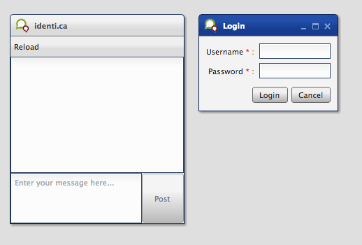

Tutorial Part 4: Handling Forms
================================

In the previous steps of this tutorial, we laid the groundwork for a tweets client application, gave it a neat UI and implemented a communication layer. One thing this application still lacks is a nice way for users to input their identica user name and password in order to post a status update. Fortunately, qooxdoo comes with a forms API that takes the pain out of creating form elements and handling user input.

Before we get started, make sure you're working on the version of the tweets tutorial application tagged with ["Step 3" in the GitHub repository](https://github.com/qooxdoo/qooxdoo/tree/%{release_tag}/component/tutorials/tweets/step3). This includes the posting part of the communication layer that we'll be using in this tutorial.

The plan
--------

We want to create a new window with user name and password fields that pops up when the tweets application starts. The values will be used to retrieve the user's list of Tweets. Seems simple enough, so let's get right down to business.

Creating the login window
-------------------------

We start by creating a new class called tweets.LoginWindow that inherits from [qx.ui.window.Window](http://demo.qooxdoo.org/%{version}/apiviewer/index.html#qx.ui.window.Window), similar to the MainWindow class from the first part of this tutorial:

```javascript
qx.Class.define("tweets.LoginWindow", {
  extend : qx.ui.window.Window,
  construct : function() {
    this.base(arguments, "Login", "tweets/logo.png");
  }
});
```

The Login window will only contain the form, which takes care of its own layout. So for the window itself, a Basic layout will suffice. We'll also make the window modal:

```javascript
var layout = new qx.ui.layout.Basic();
this.setLayout(layout);
this.setModal(true);
```

Adding the Form
---------------

Now it's time to add a form and populate it with a pair of fields:

```javascript
var form = new qx.ui.form.Form();

var username = new qx.ui.form.TextField();
username.setRequired(true);
form.add(username, "Username", null, "username");

var password = new qx.ui.form.PasswordField();
password.setRequired(true);
form.add(password, "Password", null, "password");
```

Note how the fields are marked as required. This is a simple kind of validation and in this case it's all we need, which is why the third argument for `form.add` is null instead of a validation function. Required fields will be displayed with an asterisk (\*) next to their label.

The next step is to add a dash of data binding awesomeness:

```javascript
var controller = new qx.data.controller.Form(null, form);
var model = controller.createModel();
```

Just like in the previous tutorial, we create a [controller](http://demo.qooxdoo.org/%{version}/apiviewer/index.html#qx.data.controller.Form) without a model. Then, we ask the controller to create a model from the form's elements. This model will be used to serialize the form data.

The form still needs a "submit" button, so we'll add one, plus a "cancel" button to close the window:

```javascript
var loginbutton = new qx.ui.form.Button("Login");
form.addButton(loginbutton);

var cancelbutton = new qx.ui.form.Button("Cancel");
form.addButton(cancelbutton);
cancelbutton.addListener("execute", function() {
  this.close();
}, this);
```

That's all the elements we need, let's get them displayed. We'll let one of qooxdoo's built-in [form renderer](http://demo.qooxdoo.org/%{version}/apiviewer/index.html#qx.ui.form.renderer) classes worry about the form's layout:

```javascript
var renderer = new qx.ui.form.renderer.Single(form);
this.add(renderer);
```

The renderer is a widget, so we can just add it to the window. In addition to the standard renderers, it's fairly simple to create a custom renderer by subclassing [qx.ui.form.renderer.AbstractRenderer](http://demo.qooxdoo.org/%{version}/apiviewer/index.html#qx.ui.form.renderer.AbstractRenderer), though that's outside the scope of this tutorial.

Accessing the form values
-------------------------

Similar to MainWindow, we'll use an event to notify the other parts of our application of changes to the form. As you'll remember, the "event" section is on the same level as the constructor in the class declaration:

```javascript
events : {
  "changeLoginData" : "qx.event.type.Data"
},
```

Then we add a listener to the submit button that retrieves the values from the model object and attaches them to a data event, making sure the form validates, i.e. both fields aren't empty.

```javascript
loginbutton.addListener("execute", function() {
  if (form.validate()) {
    var loginData = {
      username : controller.getModel().getUsername(),
      password : controller.getModel().getPassword()
    };
    this.fireDataEvent("changeLoginData", loginData);
    this.close();
  }
}, this);
```

Tying it all together
---------------------

Now to integrate the login window with the other parts of the application. As we are using a mocked API for the tutorials, it is not possible to login or fetch the users tweets. So we skip that step.

All that's left is to show the login window when the application is started and call `fetchTweets` with the information from the `changeLoginData` event. In the main application class, we'll create an instance of tweets.LoginWindow, position it next to the MainWindow and open it:

```javascript
this.__loginWindow = new tweets.LoginWindow();
this.__loginWindow.moveTo(320,30);
this.__loginWindow.open();
```

And finally, we'll attach a listener to `changeLoginData`:

```javascript
this.__loginWindow.addListener("changeLoginData", function(ev) {
  var loginData = ev.getData();
  service.fetchTweets(loginData.username, loginData.password);
});
```

Note how all the other calls to `service.fetchTweets` can remain unchanged: By making the login window modal, we've made sure the first call, which creates the store, contains the login data. Any subsequent calls (i.e. after reloading or posting an update) will use the same store so they won't need the login details.

OK, time to run `generate.py` and load the application in a browser to make sure everything works like it's supposed to.



Tweets client application with login window

And that's it for the form handling chapter. As usual, you'll find the tutorial [code on GitHub](https://github.com/qooxdoo/qooxdoo/tree/%{release_tag}/component/tutorials/tweets/step4.1). Watch out for the next chapter, which will focus on developing your own custom widgets.
