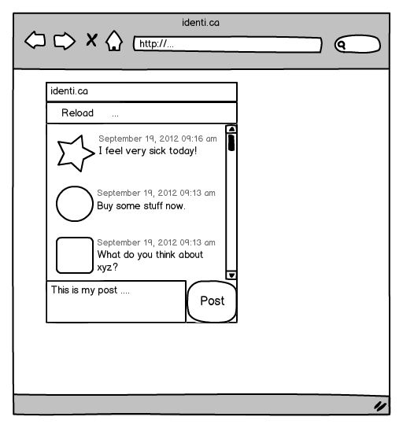

Tutorial Part 5: Custom Widgets
=================================

In this tutorial we will deal with how to create a custom widget for our tweets application. It is necessary that you finished the tutorials part 1 through part 3 to work with this tutorial, but previous knowledge from tutorial 4.1 is not needed.

Do you remember the mockup from tutorial part 1?



You can see that one tweet consists of a photo, a text and a creation date, but at the moment the tweets application doesn't show the creation date of a tweet. This is because we use the default [ListItem](http://demo.qooxdoo.org/%{version}/apiviewer/#qx.ui.form.ListItem) to show a tweet and a ListItem can only show an image and/or label. To achieve our goal, we have to create a custom widget which we can use instead of the ListItem.

> **note**
>
> The code in this tutorial should also work when you haven't completed the 4.1 tutorial because it doesn't depend on the code changes from tutorial 4.1. But if you have any problems to run the tutorial, you can also checkout the code from tutorial 4.1 on [github](https://github.com/qooxdoo/qooxdoo/tree/%{release_tag}/component/tutorials/tweets/step4.1).

The plan
--------

First of all we have to create a custom widget which fulfills our requirements from the mockup. We will achieve this by combining a widget with two labels and one image. Afterwards we have to configure the controller so that it uses our custom widget for the tweets.

Create the custom widget class
------------------------------

You should know how to create a class from the previous tutorials. So please create a class for `tweets.TweetView`, but in our case we need to extend from `qx.ui.core. Widget`.

```javascript
qx.Class.define("tweets.TweetView", {
  extend : qx.ui.core.Widget,
  include : [qx.ui.form.MModelProperty],

  construct : function() {
    this.base(arguments);
  }
});
```

The attentive reader noticed that we use the `include` key for the first time. `include` is used to include a mixin in a class. This is necessary in our case to support Data Binding. Our tweets application uses it and therefore it is expected that the new widget implements the [qx.ui.form.IModel](http://demo.qooxdoo.org/%{version}/apiviewer/#qx.ui.form.IModel) interface. Otherwise the widget can't be used with Data Binding. But fortunately the mixin `qx.ui.form.MModelProperty` already implements it, so we can reuse the implementation.

Define the needed properties
----------------------------

Our widget should show a Tweet as shown in the mockup. To achieve this, we need properties to save the data for a Tweet. Add this definition to the `TweetView` class:

```javascript
properties : {
  appearance : {
    refine : true,
    init : "listitem"
  },

  icon :  {
    check : "String",
    apply : "_applyIcon",
    nullable : true
  },

  time :  {
    check : "Date",
    apply : "_applyTime",
    nullable : true
  },

  post :  {
    check : "String",
    apply : "_applyPost",
    nullable : true
  }
},
```

The properties `icon`, `time` and `post` contain the data from a tweet. In this definition you'll also find a property `appearance`. This property is needed for the theming, it tells the appearance system that the `TweetView` should be styled like the `ListItem`. We could also use a new appearance id, but than we'd have to define an appearance for it and that's not part of this tutorial.

How to define properties was explained in tutorial part 3 \<tutorial-part-3\>, so we don't repeat it. But we use some unfamiliar keys for definition and I will explain them:

-   **check**: check ensures that the incoming value is of this type. But be careful, the check is only done in the source version.
-   **apply**: here you can define which method should be called when the value changes.
-   **refine**: this is needed when an already defined property should be overridden.
-   **init**: defines the initialized value of a property.

Using Child Control
-------------------

qooxdoo has a special system to realize combined widgets like in our case. This system is called child controls and you can find a detailed documentation in our manual \<desktop/ui\_develop\>.

Okay, back to our problem. To achieve the requirements we need an [Image](http://demo.qooxdoo.org/%{version}/apiviewer/#qx.ui.basic.Image) for the photo, a Label for the post and another [Label](http://demo.qooxdoo.org/%{version}/apiviewer/#qx.ui.basic.Label) for the creation time. So three widgets, also called sub widgets, are needed for our custom widget. And last but not least the familiar [Grid](http://demo.qooxdoo.org/%{version}/apiviewer/#qx.ui.layout.Grid) layout for layouting, but that's not created in the child control implementation. We just need to keep it in mind when adding the child control with `_add`.

```javascript
members : {
  // overridden
  _createChildControlImpl : function(id) {
    var control;
    switch(id) {
      case "icon":
        control = new qx.ui.basic.Image(this.getIcon());
        control.setAnonymous(true);
        this._add(control, {row: 0, column: 0, rowSpan: 2});
        break;

      case "time":
        control = new qx.ui.basic.Label(this.getTime());
        control.setAnonymous(true);
        this._add(control, {row: 0, column: 1});
        break;

      case "post":
        control = new qx.ui.basic.Label(this.getPost());
        control.setAnonymous(true);
        control.setRich(true);
        this._add(control, {row: 1, column: 1});
        break;
    }

    return control || this.base(arguments, id);
  }
},
```

The child control system has a special method to create sub widgets. The method is called `_createChildControlImpl` and we override it to create our sub widgets. This method is called from the child control system when it notices that a sub widget is needed but not already created.

In our case:

-   **icon**: for the photo
-   **time**: for the creation time
-   **post**: for the text from the tweet

Dependent on the passed id we create the correct sub widget, configure it and add it to the Grid layout at the right position. If an unknown id is passed, we delegate it to the superclass.

Finishing the constructor
-------------------------

Now it's time to finish the constructor.

```javascript
// create a date format like "June 18, 2010 9:31 AM"
this._dateFormat = new qx.util.format.DateFormat(
  qx.locale.Date.getDateFormat("long") + " " +
  qx.locale.Date.getTimeFormat("short")
);
```

The property for the date saves only a date object and our requirement from the mockup describes a spacial format and a simple `toString` usage is not enough. Therefore we need a special transformation which we can achieve by using [DateFormat](http://demo.qooxdoo.org/%{version}/apiviewer/#qx.util.format.DateFormat).

```javascript
// initialize the layout and allow wrap for "post"
var layout = new qx.ui.layout.Grid(4, 2);
layout.setColumnFlex(1, 1);
this._setLayout(layout);
```

Now we create a layout for our custom widget. This should be known from tutorial part 2 \<tutorial-part-2\>.

```javascript
// create the widgets
this._createChildControl("icon");
this._createChildControl("time");
this._createChildControl("post");
````

Time for our child control implementation. With these lines we trigger the subwidget creation which we implemented before.

Adding the apply methods
------------------------

We have already defined the properties, but we haven't implemented the needed apply methods for them. So, time to add the missing apply method for the properties to the `members` section.

```javascript
// property apply
_applyIcon : function(value, old) {
  var icon = this.getChildControl("icon");
  icon.setSource(value);
},

_applyPost : function(value, old) {
  var post = this.getChildControl("post");
  post.setValue(value);
},

// property apply
_applyTime : function(value, old) {
  var time = this.getChildControl("time");
  time.setValue(this._dateFormat.format(value));
}
```

The apply methods for `icon` and `post` are trivial, we have to ensure that we delegate the value change to the correct widget. To get the correct widget instance we can use the `getChildControl` method and afterwards we can set the value on the widget.

The date, however, needs some extra love. We have to use the DateFormat instance to format the date before we set the value.

Finishing the custom widget
---------------------------

At the end we have to add the attribute `_dateFormat` to the `members` section and a destructor to clean up the created DateFormat instance.

Just add this line at the beginning of the members section:

```javascript
_dateFormat : null,
```

And the destructor after the members section:

```javascript
destruct : function() {
  this._dateFormat.dispose();
  this._dateFormat = null;
}
```

Great, now we have finished the custom widget.

Configure the List Controller
-----------------------------

At the moment the controller doesn't know that it should use our `TweetView` class. Therefore we have to change the old controller configuration. Search for these lines of code in the `Application.js` file:

```javascript
// create the controller
var controller = new qx.data.controller.List(null, main.getList());
controller.setLabelPath("text");
controller.setIconPath("user.profile_image_url");
controller.setDelegate({
  configureItem : function(item) {
    item.getChildControl("icon").setWidth(48);
    item.getChildControl("icon").setHeight(48);
    item.getChildControl("icon").setScale(true);
    item.setRich(true);
  }
});
```
First of all, remove these two lines:

```javascript
controller.setLabelPath("text");
controller.setIconPath("user.profile_image_url");
```

Now to the delegate, just replace the current delegate with this one:

```
controller.setDelegate({
  createItem : function() {
    return new tweets.TweetView();
  },

  bindItem : function(controller, item, id) {
    controller.bindProperty("text", "post", null, item, id);
    controller.bindProperty("user.profile_image_url", "icon", null, item, id);
    controller.bindProperty("created_at", "time", {
      converter: function(data) {
        return new Date(data);
      }
    }, item, id);
  },

  configureItem : function(item) {
    item.getChildControl("icon").setWidth(48);
    item.getChildControl("icon").setHeight(48);
    item.getChildControl("icon").setScale(true);
    item.setMinHeight(52);
  }
});
```

The concept of a delegate should be known from tutorial part 3, I will only explain the modifications.

You can see that we added a `createItem` method: With this method we can configure the controller to use our `TweetView` for item creation. The method `bindItem` is used to configure the controller to keep the properties of the model and the widget synchronized. In our case it is important to keep the photo, post and creation date synchronous.

```javascript
controller.bindProperty("text", "post", null, item, id);
```

Let us have a look at the above example. The [bindProperty](http://demo.qooxdoo.org/%{version}/apiviewer/#qx.data.controller.List~bindProperty) method is responsible for the binding between model and widget. The first parameter is the path from the model, the second is the name of the property in the widget, the third parameter is an [options map](http://demo.qooxdoo.org/%{version}/apiviewer/#qx.data.SingleValueBinding~bind) to do e. g. a conversion, the fourth parameter is the widget and the last is the index.

In our case the photo and the post need no conversion because the source data and target data are of the same type. But the creation time needs a conversion because the model contains a String with the UTC time while the widget expects a date object. So we have to convert the data:

```javascript
converter: function(data) {
  return new Date(data);
}
```

The converter method creates a date object from the given number (time in milliseconds). The `configureItem` method should be known from tutorial part 3 \<tutorial-part-3\>, there are only some improvements to keep the same behavior as before.

Great, now we've got it! Run `generate.py` to create the application.


Again, if you want to take a [look at the code](https://github.com/qooxdoo/qooxdoo/tree/%{release_tag}/component/tutorials/tweets/step4.2), fork the project on github.
