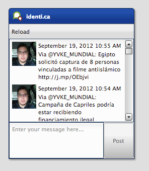
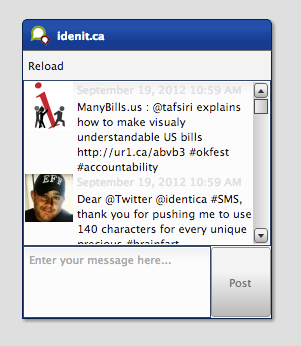
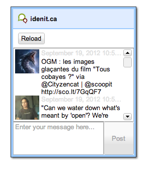
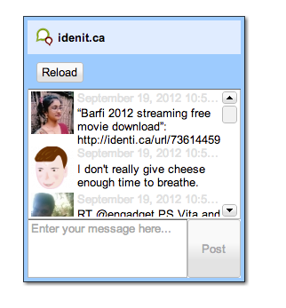

Tutorial Part 6: Theming
==================================

This time, we continue with a very exciting topic for the tutorials: Theming. As you might already know, the theming system in qooxdoo is not based on CSS which means you, as an application developer, don't have to bother with cross browser CSS. The qooxdoo framework takes care of all that for you. As a base for theming an app, we use the already known tweets client we built in the former tutorials. On the left is a picture how it should look to get you started. The the code of the tutorial [on GitHub](https://github.com/qooxdoo/qooxdoo/tree/%{release_tag}/component/tutorials/tweets/step4.2.1).



The plan
--------

Giving the whole application a new look is too much detail and work for such a short tutorial. We concentrate on some basic key aspects which are important to get you an idea how to use the theming system and get you started. So I picked three basic tasks we could do to make the app look different.

> -   Style the widget we created for showing tweets.
> -   Change the default theme.
> -   Change the look of a built-in widget

Lets get started with the first one:

Style the widget we created for showing tweets
----------------------------------------------

In Tutorial 5, we created a custom widget for showing the tweets icons, content and date. As you can see on the screenshot above, the time and the content have the same text color which might be irritating. That's why we want to change the time's color to a lighter gray. So how should we do that?

First, we need to get some knowledge about the theming system itself. Every widget has a so called appearance, which is used to identify the styling of a widget. In our case, we used the `listitem` appearance in the former tutorial, which is defined in qooxdoo's default theme, the Modern theme. But now we want to change that so we need to edit the `TweetView` class and change the appearance property's init value from `listitem` to a custom name we choose, lets say `tweet-view`. The new code should look like this:

```javascript
appearance : {
  refine : true,
  init : "tweet-view"
},
```

Now, we have defined a custom appearance key for our own widget but the appearance definition is still missing. But where should we put that definition?

The tweets application is based on a default GUI skeleton which has already a predefined custom theme. This can be found in the `theme` namespace of the applications source code (`source/class/tweets/theme/`). Taking a look at the namespace shows you five files in total:

> -   `Appearance.js` holds all appearance definitions
> -   `Color.js` holds all color definitions
> -   `Decoration.js` holds all decorator definitions
> -   `Font.js` holds all font definitions
> -   `Theme.js` meta theme which combines all others

Except the meta file, all other files are only a skeleton for adding custom theme definitions. So I guess you have already seen the file we should modify now: `Appearance.js`. The basic outline of such an appearance definition can be compared to a class definition. You can find a name, an extend key and something where the content should go called `appearances`. That's where we put our new appearance definition. First, we define a appearance definition for the `tweet-view` key we defined. That definition can be empty because we only want to style the label showing the date and time for the tweet. The code looks like this:

```javascript
qx.Theme.define("tweets.theme.Appearance", {
  extend : qx.theme.modern.Appearance,

  appearances : {
    "tweet-view" : {}
  }
});
```

The last missing piece of our first task is to style the label. But how do we access it in the appearance theme if we haven't assigned a separate appearance key for it?

Luckily, we defined the label as child control \<desktop/ui\_develop\> named `time` (take a look at the custom widget tutorial \<tutorial-part-4-2\> for more details). That way, we can assign a separate appearance key using that hierarchy:

```javascript
"tweet-view/time" : {
  style : function() {
    return {
      textColor: "#E0E0E0"
    }
  }
}
```


You can see a complete definition for the time label in the code above. The important part is the map, which is returned by the style function. It contains a set of themeable properties for the widget which will be assigned. In our case, we are styling a simple label, which has the property `textColor`. You can find all themeable properties in the [API viewer](http://demo.qooxdoo.org/current/apiviewer/#qx.ui.core.Widget~textColor) (Hint: themeable properties are marked with a little icon). Now we are done and can give the application a try, which should result into something like this:

Now we have everything the way we want it to be but one little thing is still missing. We defined the color's value inline which is considered bad style because in case you want to use the same color somewhere else, you have to write the value again which results in hard-to-maintain code. That's where the color theme could help. We have already seen a file called `Color.js` which is responsible for holding color definitions. As in the appearance file, we have one main section but this time its called `colors`. Here we add a color definition for the color we want to use:

```javascript
colors : {
  "tweet-time" : "#E0E0E0"
}
```

Now, we have defined a color alias for our color which can be used in the whole application, no matter if it's in a theme or in some application class. As a final step, we change the explicit color definition from `"#E0E0E0"` to `"tweet-time"` in the custom appearance file.



Change the default theme
------------------------

As a next step, we want to change the default theme, which is the Modern theme \<desktop/ui\_theming\>, to the Simple theme \<desktop/ui\_theming\>. For that, we have to take another look at the files in the `theme` folder. You might have already realized that all these files do have an "extend" key which extends from the Modern theme's files. That's what we are going to change now. Just open all the files in the theme folder and change the extend key from `qx.theme.modern.xyz` to `qx.theme.simple.xyz` with *xyz* as a placeholder for the name of the file you are editing. There is only one file you don't have to change which is the meta theme named `Theme.js`. It does not refer to the framework theme so there is nothing to change. With that change, we included new dependencies to classes and resources which means, we have to rebuild our application. Run `./generate.py` in the root folder of your application to rebuild the development version of the tweets application. After the process is done, we can reload the application and see a dramatically changed application using the Simple theme.



Change the look of a built in widget
------------------------------------

As a last and final step, I like to show you how to change the styling of a built in qooxdoo widget. As you can see on the screenshot of the last step, the toolbar has the same background color as the windows caption bar. It might be nice if the toolbar had the same color as the window's inner border. So what we need to do is to override the appearance of the toolbar. For that, we need to find out how the appearance key for the toolbar is named. You can find that in the [API viewer](http://demo.qooxdoo.org/current/apiviewer/#qx.ui.toolbar.ToolBar~appearance) in the `appearance` property of toolbar. The init value is used for the styling, in this case, its `toolbar`. If we now use that key in our custom appearance file, we can set our own keys for styling the toolbar.

```javascript
"toolbar" : {
  style : function() {
    return {
      backgroundColor : "window-border-inner"
    }
  }
}
```

Like in the former appearance we added, we define one property. In this case, we use the `backgroundColor` property to set the background color of the toolbar. But what color is `"window-border-inner"`? This is a named color which comes from the frameworks Simple theme. You can find all the colors of the theme in the framework in the namespace `qx.theme` or `qx.theme.simple` for the Simple theme. A little hint: Before overriding an appearance, check out the original appearance definition in the theme you are using. There might be some edge cases considered you want to consider writing your own appearance. The final result should look like this:



Job done
--------

With the last step, we have finally managed to change the three basic things we wanted to change. If you are interested in more details about the theming possibilities in qooxdoo, check out the manual for more information. As always, the code of the tutorial is [on GitHub](https://github.com/qooxdoo/qooxdoo/tree/%{release_tag}/component/tutorials/tweets/step4.2.1).
