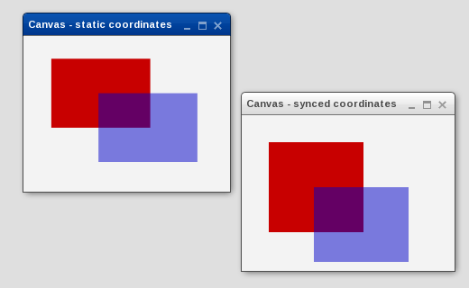

Canvas
======

This widget embed the [HTML canvas element](http://www.whatwg.org/specs/web-apps/current-work/multipage/the-canvas-element.html#the-canvas-element).

> **note**
>
> It does not work with Internet Explorer

Preview Image
-------------

Features
--------

Since this widget is embedding the HTML canvas element the core features of this widget are limited by the canvas element itself respective by the implementation of the different browsers. However, the widget offers these features on top:

-   fires a `redraw` event whenever the dimensions of the canvas element has changed or the canvas element needs an update
-   update method for the canvas element
-   width and height of the canvas element as properties
-   support for synchronized width and height coordinates

Description
-----------

Taken from the WHATWG website: "The canvas element represents a resolution-dependent bitmap canvas, which can be used for rendering graphs, game graphics, or other visual images on the fly."

Demos
-----

Here are some links that demonstrate the usage of the widget:

-   [Canvas demo](http://demo.qooxdoo.org/%{version}/demobrowser/index.html#widget-Canvas.html)

API
---

Here is a link to the API of the Widget:
[Canvas API](http://demo.qooxdoo.org/%{version}/apiviewer/index.html#qx.ui.embed.Canvas)
