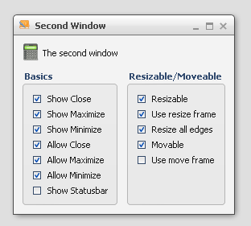

CheckBox
========

A CheckBox widget for Boolean values.

Preview Image
-------------

Features
--------

-   Pointer and keyboard control.
-   Ellipsis: If the label does not fit into the widget bounds an ellipsis (”...”) is rendered at the end of the label.

Description
-----------

The CheckBox is a common widget found in many GUI applications. A CheckBox can be checked or not checked, either by pointer or keyboard. When the tri-state mode is enabled, there is an additional third state. The third state means that the CheckBox was neither checked nor unchecked, i.e. the state of the CheckBox is undetermined.

The CheckBox supports an optional plain text.

Also it is possible to combine a CheckBox with a TreeItem to construct a complex widget.

Demos
-----

Here are some links that demonstrate the usage of the widget:

-   [CheckBoxes used in a GroupBox](http://www.qooxdoo.org/devel/demobrowser/#widget~GroupBox.html)
-   [CheckBoxes used in a GroupBox to control a window](http://www.qooxdoo.org/devel/demobrowser/#widget~Window.html)
-   [A small dialog Demo](http://www.qooxdoo.org/devel/demobrowser/#showcase~Dialog.html)
-   [ComboBox combined with a TreeItem](http://www.qooxdoo.org/devel/demobrowser/#widget~Tree_Columns.html)

API
---

Here is a link to the API of the Widget:
[qx.ui.form.CheckBox](http://www.qooxdoo.org/devel/api/#qx.ui.form.CheckBox)
