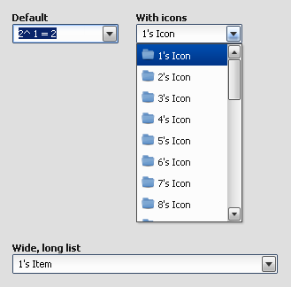

ComboBox
========

A ComboBox widget is used to select items from a list or allow customer input. The items in a ComboBox supports plain text and/or icons.

Preview Image
-------------

Features
--------

-   Pointer and keyboard support.
-   Items with plain text and/or icons
-   Ellipsis: If the label does not fit into the widget bounds an ellipsis (”...”) is rendered at the end of the label.

Description
-----------

A ComboBox is like a textfield with a drop down of predefined values. The main difference to the selectbox is that the user can enter individual values or choose from the predefined ones. The items in the predefined list supports plain text and/or icons. The items which can be added to the list are `qx.ui.form.ListItem` items.

Please note that the ComboBox supports no auto- completion.

Demos
-----

Here are some links that demonstrate the usage of the widget:

-   [ComboBox demo](http://demo.qooxdoo.org/%{version}/demobrowser/#widget~ComboBox.html)
-   [Form demo](http://demo.qooxdoo.org/%{version}/demobrowser/#showcase~Form.html)

API
---

Here is a link to the API of the Widget:
[qx.ui.form.ComboBox](http://demo.qooxdoo.org/%{version}/apiviewer/#qx.ui.form.ComboBox)
