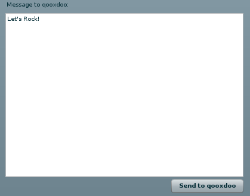

Flash
=====

Container widget for Flash.

Preview Image
-------------

Description
-----------

A flash movie can be controlled to a certain extent directly from JavaScript with a number of commands.

These commands do not cover all Flash commands, so if you need more functionality you have to fuse an ActionScript with the Flash movie and start using the ExternalInterface to communicate.

To be able to use the JavaScript commands, three conditions must be full-filled:

1.  the flash object must have been loaded to the DOM tree
2.  the flash object must have received an id
3.  the flash movie or document must have been enough loaded

To implement this functionality in qooxdoo we have added three events: "loading", "loaded" and "timeout". When the event "loading" is fired the three conditions have not been full-filled, and therefore the commands can't be used. If you wanna make sure the flash object is fully loaded and ready to be used listen to the "loaded" event. When the "loaded" event is fired you can start communicating directly with the Flash object. A "timeout" event is fired when the flash objects fails to load. You can also use the method isLoaded() in code to make sure that the Flash object is actually loaded.

Here's an example that shows how you can control changing to previous frame of a flash movie.

    var flashWidget = new qx.ui.embed.Flash("/flash.swf");

    flashWidget.addListener("loaded", function() {
      var flashFE = flashWidget.getFlashElement();

      var currentFrame = flashFE.CurrentFrame();
      var totalFrames = flashFE.TotalFrames();

      var newFrame = parseInt(currentFrame) - 1;

      if(totalFrames > 0 && newFrame >= 0)
      {
        flashFE.GotoFrame(newFrame);
      }
    });

Demos
-----

Here are some links that demonstrate the usage of the widget:

-   [Embeded Flash in qooxdoo](http://demo.qooxdoo.org/%{version}/demobrowser/#widget~Flash.html)

API
---

Here is a link to the API of the Widget:
[qx.ui.embed.Flash](http://demo.qooxdoo.org/%{version}/apiviewer/#qx.ui.embed.Flash)
