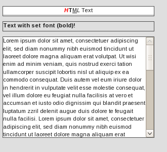

HTML Embed
==========

The Html widget embeds plain HTML code into the application.

Preview Image
-------------

Features
--------

-   displays any valid HTML code
-   CSS class support
-   control whether the content is focusable
-   control whether the content is selectable
-   overflow support
-   data event `changeHtml` is dispatched whenever content changes

Description
-----------

The HTML embed can display any valid HTML code and implements some useful features like focus- and selection-control on top of it.

If you want to display a large amount of HTML code you can additionally use the overflow control to prevent the widget from eating up too much space within your application. This makes the seamless integration as easy as possible.

If you want to manipulate the styling of the displayed HTML code you can easily set a CSS class name to have the full control of the HTML.

Demos
-----

Here are some links that demonstrate the usage of the widget:

-   [HTML embed demo](http://demo.qooxdoo.org/%{version}/demobrowser/index.html#widget-HtmlEmbed.html)

API
---

Here is a link to the API of the Widget:
[HTML Embed API](http://demo.qooxdoo.org/%{version}/apiviewer/index.html#qx.ui.embed.Html)
