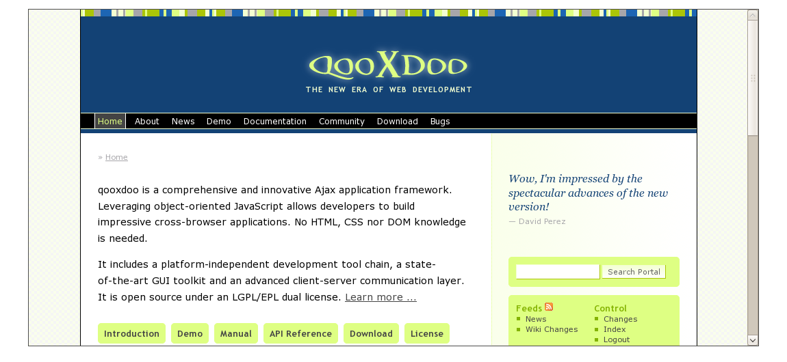

Iframe
======

Container widget for internal frames (iframes). An iframe can display any HTML page inside the widget.

Preview Image
-------------

Features
--------

-   can display any HTML page
-   fires a `load` event when the page fully loaded
-   integrates a blocker element to prevents the iframe to handle key or pointer events

Description
-----------

The iframe is a container widget for displaying any HTML page. It integrates seamlessly in your application though it can be styled like any other qooxdoo widget and offers an `load` event to control the page that's loaded within the widget. And the built-in blocker element prevents the native iframe element to handle any key or pointer event to ensure that e.g. the user navigates away by tapping a hyperlink.

Demos
-----

Here are some links that demonstrate the usage of the widget:

-   [Iframe demo](http://demo.qooxdoo.org/%{version}/demobrowser/index.html#widget-Iframe.html)

API
---

Here is a link to the API of the Widget:
[API for Iframe](http://demo.qooxdoo.org/%{version}/apiviewer/index.html#qx.ui.embed.Iframe)
