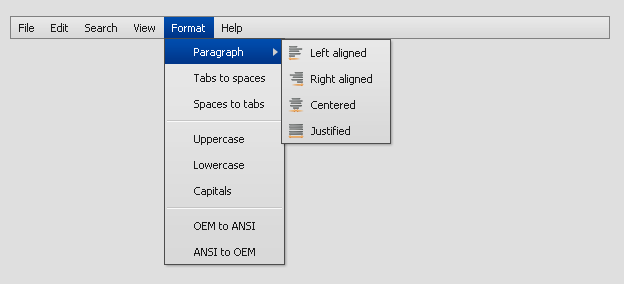

MenuBar
=======

The MenuBar is a Widget to create a classic menu bar for an application.

Preview Image
-------------

Features
--------

-   Buttons as menu items with label and/or icon.

Description
-----------

The MenuBar contains items `qx.ui.menubar.Button` to open a submenu `qx.ui.menu.Menu` that can handle user interactions. For more information about menus see menu.

Demos
-----

Here are some links that demonstrate the usage of the widget:

-   [MenuBar with all features](http://demo.qooxdoo.org/%{version}/demobrowser/#widget~MenuBar.html)

API
---

Here is a link to the API of the Widget:
[qx.ui.menubar.MenuBar](http://demo.qooxdoo.org/%{version}/apiviewer/#qx.ui.menubar.MenuBar)
