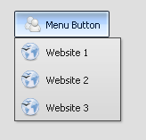

MenuButton
==========

The MenuButton looks like a normal button, but it opens a menu when tapping on it.

Preview Image
-------------

Features
--------

-   Contain text and/or icon.
-   Pointer support.
-   Ellipsis: If the label does not fit into the widget bounds an ellipsis (”...”) is rendered at the end of the label.
-   Menu support.

Description
-----------

The MenuButton looks like a normal button, but it opens a menu when tapping on it.

For using a menu see: menu

Demos
-----

Here are some links that demonstrate the usage of the widget:

-   [Menu demo that contains a MenuButton](http://www.qooxdoo.org/devel/demobrowser/#widget~Menu.html)
-   [Form demo](http://www.qooxdoo.org/devel/demobrowser/#showcase~Form.html)

API
---

Here is a link to the API of the Widget:
[qx.ui.form.MenuButton](http://www.qooxdoo.org/devel/api/#qx.ui.form.MenuButton)
