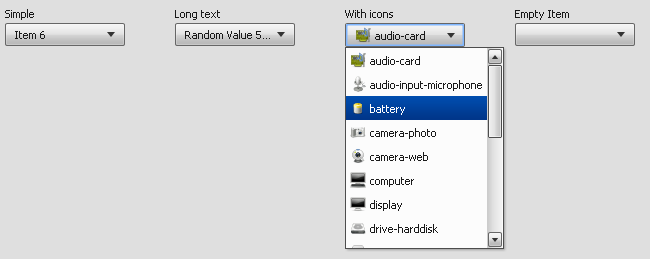

SelectBox
=========

The SelectBox has the same act like the ComboBox, but the SelectBox doesn't allow user input only selection is allowed.

Preview Image
-------------

Features
--------

-   Pointer and keyboard support.
-   Items with plane text and/or icons
-   Ellipsis: If the label does not fit into the widget bounds an ellipsis ("...") is rendered at the end of the label.

Description
-----------

The SelectBox has the same act like the ComboBox, but the SelectBox doesn't allow user input only selection is allowed.

For more details about ComboBox see: combobox

Demos
-----

Here are some links that demonstrate the usage of the widget:

-   [SelectBox demo](http://demo.qooxdoo.org/%{version}/demobrowser/#widget~SelectBox.html)
-   [Other SelectBox demo](http://demo.qooxdoo.org/%{version}/demobrowser/#ui~SelectBox_EdgeCases.html)
-   [Form demo](http://demo.qooxdoo.org/%{version}/demobrowser/#showcase~Form.html)

API
---

Here is a link to the API of the Widget:
[qx.ui.form.SelectBox](http://demo.qooxdoo.org/%{version}/apiviewer/#qx.ui.form.SelectBox)
