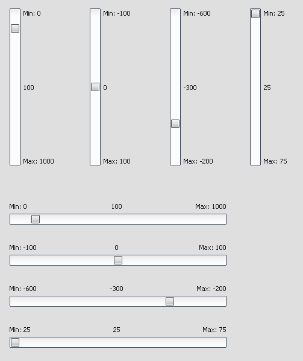

Slider
======

The Slider widget is the classic widget for controlling a bounded value.

Preview Image
-------------

Features
--------

-   Pointer support.
-   Horizontal and vertical orientation.
-   Configurable steps.

Description
-----------

The Slider widget is the classic widget for controlling a bounded value. It lets the user move a slider handle along a horizontal or vertical groove and translates the handle's position into an integer value within the defined range.

Demos
-----

Here are some links that demonstrate the usage of the widget:

-   [Slider demo](http://www.qooxdoo.org/devel/demobrowser/#widget~Slider.html)
-   [Form demo](http://www.qooxdoo.org/devel/demobrowser/#showcase~Form.html)

API
---

Here is a link to the API of the Widget:
[qx.ui.form.Slider](http://www.qooxdoo.org/devel/api/#qx.ui.form.Slider)
