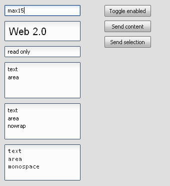

TextField
=========

The TextField widget is a classic GUI widget to edit text in a TextField.

Preview Image
-------------

Features
--------

-   Pointer and keyboard control.
-   Configurable fonts and text alignment.
-   Set maximum input length.
-   Read only support.

Description
-----------

The TextField widget has properties to set an alignment for the orientation and a Font for styling. Also is it possible to set the TextField read only and the maximum input length could be set.

Demos
-----

Here are some links that demonstrate the usage of the widget:

-   [Shows different TextField demos](http://www.qooxdoo.org/devel/demobrowser/#widget~TextField.html)
-   [Shows a dialog demo with some TextFields](http://www.qooxdoo.org/devel/demobrowser/#showcase~Dialog.html)
-   [Show a form demo](http://www.qooxdoo.org/devel/demobrowser/#showcase~Form.html)
-   [Shows a browser demo](http://www.qooxdoo.org/devel/demobrowser/#showcase~Browser.html)

API
---

Here is a link to the API of the Widget:
[qx.ui.form.TextField](http://www.qooxdoo.org/devel/api/#qx.ui.form.TextField)
