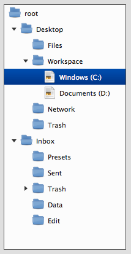
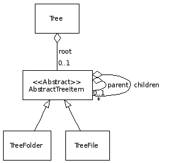
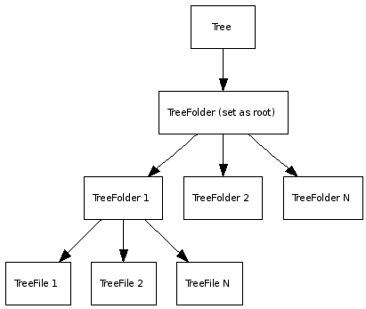

Tree
====

The tree package contains classes that allow you to build up visual trees, like the ones you are familiar with e.g. for browsing your file system. Expanding and collapsing tree nodes is handled automatically by showing or hiding the contained subtree structure.

Preview Image
-------------

Features
--------

-   Different open and selection modes
-   Toggle-able tree root

Description
-----------

A `Tree` contains items in an hierarchically structure. The first item inside a `Tree` is called the root. A tree always contains one single `TreeFolder` as the root widget which itself can contain several other items. A `TreeFolder` (which is also called *node*) can contain `TreeFolder` widgets or `TreeFile` widgets. The `TreeFile` widget (also called *leaf*) consists of an icon and a label.

UML Diagram
-----------

Dependencies
------------

Demos
-----

Here are some links that demonstrate the usage of the widget:

-   [Complex demo which shows many features of the tree](http://demo.qooxdoo.org/%{version}/demobrowser/#widget~Tree.html)
-   [A multi column tree](http://demo.qooxdoo.org/%{version}/demobrowser/#widget~Tree_Columns.html)

API
---

Here is a link to the API of the Widget:
[qx.ui.tree](http://demo.qooxdoo.org/%{version}/apiviewer/#qx.ui.tree)
