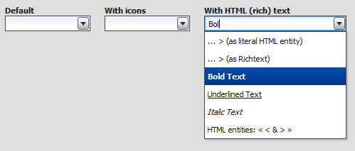

Virtual ComboBox
================

The virtual ComboBox acts like the regular combobox, but is based on the framework's virtual infrastructure.

Preview Image
-------------

Features
--------

-   Pointer and keyboard support.
-   Items with plain text and/or icons
-   Ellipsis: If the label does not fit into the widget's bounds an ellipsis (”...”) is rendered at the end of the label.
-   Supports filtering, sorting, grouping, data binding and custom rendering like the virtuallist.

**Pointer and keyboard behavior:**

<table>
<col width="15%" />
<col width="9%" />
<col width="30%" />
<col width="45%" />
<tbody>
<tr class="odd">
<td align="left"></td>
<td align="left">keyboard</td>
<td align="left"><strong>open drop-down</strong></td>
<td align="left">key down; key up;</td>
</tr>
<tr class="even">
<td align="left"></td>
<td align="left"></td>
<td align="left"><strong>close drop-down</strong></td>
<td align="left">esc; enter</td>
</tr>
<tr class="odd">
<td align="left"></td>
<td align="left">pointer</td>
<td align="left"><strong>open drop-down</strong></td>
<td align="left">tap on arrow button</td>
</tr>
<tr class="even">
<td align="left"></td>
<td align="left"></td>
<td align="left"><strong>close drop-down</strong></td>
<td align="left">tap on item; click outside drop-down</td>
</tr>
<tr class="odd">
<td align="left">drop-down closed</td>
<td align="left">keyboard</td>
<td align="left"><strong>select next</strong></td>
<td align="left">not possible</td>
</tr>
<tr class="even">
<td align="left"></td>
<td align="left"></td>
<td align="left"><strong>select previous</strong></td>
<td align="left">not possible</td>
</tr>
<tr class="odd">
<td align="left"></td>
<td align="left"></td>
<td align="left"><strong>select first</strong></td>
<td align="left">not possible</td>
</tr>
<tr class="even">
<td align="left"></td>
<td align="left"></td>
<td align="left"><strong>select last</strong></td>
<td align="left">not possible</td>
</tr>
<tr class="odd">
<td align="left"></td>
<td align="left">pointer</td>
<td align="left"><strong>select next</strong></td>
<td align="left">not possible</td>
</tr>
<tr class="even">
<td align="left"></td>
<td align="left"></td>
<td align="left"><strong>select previous</strong></td>
<td align="left">not possible</td>
</tr>
<tr class="odd">
<td align="left">drop-down open</td>
<td align="left">keyboard</td>
<td align="left"><strong>select next</strong></td>
<td align="left">key down then enter</td>
</tr>
<tr class="even">
<td align="left"></td>
<td align="left"></td>
<td align="left"><strong>select previous</strong></td>
<td align="left">key up then enter</td>
</tr>
<tr class="odd">
<td align="left"></td>
<td align="left"></td>
<td align="left"><strong>select first</strong></td>
<td align="left">page up then enter</td>
</tr>
<tr class="even">
<td align="left"></td>
<td align="left"></td>
<td align="left"><strong>select last</strong></td>
<td align="left">page down then enter</td>
</tr>
<tr class="odd">
<td align="left"></td>
<td align="left">pointer</td>
<td align="left"><strong>select next</strong></td>
<td align="left">tap on item</td>
</tr>
<tr class="even">
<td align="left"></td>
<td align="left"></td>
<td align="left"><strong>select previous</strong></td>
<td align="left">tap on item</td>
</tr>
<tr class="odd">
<td align="left"></td>
<td align="left"></td>
<td align="left"><strong>wrap in list</strong></td>
<td align="left">no</td>
</tr>
<tr class="even">
<td align="left"></td>
<td align="left"></td>
<td align="left"><strong>preselect</strong></td>
<td align="left">pointer over; key up; key down</td>
</tr>
<tr class="odd">
<td align="left"></td>
<td align="left"></td>
<td align="left"><strong>select drop-down item on open</strong></td>
<td align="left">yes, first item in the list which begins with value</td>
</tr>
</tbody>
</table>

Description
-----------

The `qx.ui.form.VirtualComboBox` is based on the virtual infrastructure. The virtual SelectBox has both a textfield and a virtuallist drop-down. The drop-down can be used to predefine values which the user can select.

Using the virtual infrastructure has considerable advantages when there is a huge amount of model items to render: Widgets are created only for visible items and reused. This saves both creation time and memory.

The virtual ComboBox uses the same [qx.ui.list.core.IListDelegate](http://demo.qooxdoo.org/%{version}/apiviewer/#qx.ui.list.core.IListDelegate) interface as the virtuallist to configure the ComboBox's behavior (item and group renderer configuration, filtering, sorting, grouping, etc.).

> **note**

> Only widget based rendering for list and group items is supported.

Code Example
------------

Here's an example. We create a simple ComboBox example with 2500 items, sorting the items (ascending) and log each value change.

    //create the model data
    var rawData = [];
    for (var i = 0; i < 2500; i++) {
      rawData[i] = "Item No " + i;
    }
    var model = qx.data.marshal.Json.createModel(rawData);

    //create the SelectBox
    var comboBox = new qx.ui.form.VirtualComboBox(model);

    //configure the ComboBox's behavior
    var delegate = {
      sorter : function(a, b) {
        return a > b ? 1 : a < b ? -1 : 0;
      }
    };
    comboBox.setDelegate(delegate);

    //log value changes
    comboBox.addListener("changeValue", function(e) {
      this.debug("Value: " + e.getData());
    }, this);

Demos
-----

Here are some links that demonstrate the usage of the widget:

-   [ComboBox demo](http://demo.qooxdoo.org/%{version}/demobrowser/#virtual~ComboBox.html)

API
---

Here is a link to the API of the widget:
[qx.ui.form.VirtualComboBox](http://demo.qooxdoo.org/%{version}/apiviewer/#qx.ui.form.VirtualComboBox)
