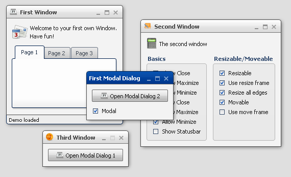

Window
======

The window widget is similar to Windows' MDI child windows.

Preview Image
-------------

Features
--------

-   Title support text and/or icon
-   Support modal window
-   Status bar support
-   Minimize and maximize a window
-   Open and close a window
-   Resize a window

Description
-----------

The window widget can be used to show dialogs or to realize a MDI (Multiple Document Interface) Application.

The widgets implements all known metaphors from a window:

-   minimize
-   maximize
-   open
-   close
-   and so on

The package `qx.ui.window` contains two other classes that can be used to create a MDI Application:

-   The [Desktop](http://demo.qooxdoo.org/%{version}/apiviewer/#qx.ui.window.Desktop) can act as container for windows. It can be used to define a clipping region for internal windows.
-   The [Manager](http://demo.qooxdoo.org/%{version}/apiviewer/#qx.ui.window.Manager) handle the z-order and modality blocking of windows managed the connected desktop.

Demos
-----

Here are some links that demonstrate the usage of the widget:

-   [Demonstrate different window types](http://demo.qooxdoo.org/%{version}/demobrowser/#widget~Window.html)
-   [Windows with using a Desktop](http://demo.qooxdoo.org/%{version}/demobrowser/#widget~Desktop.html)
-   [A window containing a table demo](http://demo.qooxdoo.org/%{version}/demobrowser/#table~Table.html)
-   [A calculator demo](http://demo.qooxdoo.org/%{version}/demobrowser/#showcase~Calculator.html)

API
---

Here is a link to the API of the Widget:
[qx.ui.window.Window](http://demo.qooxdoo.org/%{version}/apiviewer/#qx.ui.window.Window)
