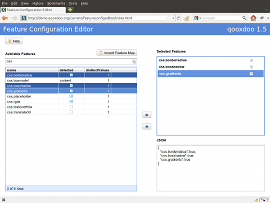
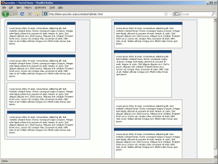
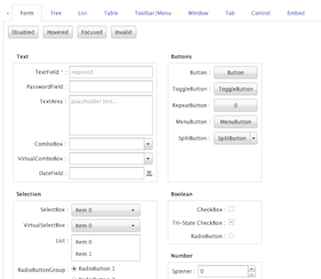

.. ################################################################################
   #
   #  qooxdoo - the new era of web development
   #
   #  http://qooxdoo.org
   #
   #  Copyright:
   #    2006-2011 1&1 Internet AG, Germany, http://www.1und1.de
   #
   #  License:
   #    LGPL: http://www.gnu.org/licenses/lgpl.html
   #    EPL: http://www.eclipse.org/org/documents/epl-v10.php
   #    See the LICENSE file in the project's top-level directory for details.
   #
   #  Authors:
   #    * qooxdoo developers
   #
   ################################################################################

Manual |version|
****************

.. toctree::
   :maxdepth: 1
   :hidden:

   toc

.. |apiviewer| image:: _static/apiviewer.png

.. |feedreadermobile_ios| image:: _static/feedreadermobile_ios.png

.. |g_book| image:: _static/utilities-notes.png
.. |o_star| image:: _static/development.png
.. .. |g_write| image:: _static/internet-blog.png
.. |g_write| image:: _static/office-contact.png
.. |o_folder| image:: _static/utilities-dictionary.png
.. |o_save| image:: _static/document-open.png
.. |g_faq| image:: _static/engineering.png
.. |tutorial| image:: _static/internet-blog1.png

Welcome to the qooxdo manual. Here are some highlights of what you can find here. For a full overview proceed to the :doc:`table of contents <toc>`.

  +----------+-------------------------------------------------------------------------------------+
  | |o_star| | **Getting Started**                                                                 |
  |          |   * :ref:`Prerequisites <pages/getting_started/helloworld#requirements>`            |
  |          |   * :ref:`Download <pages/getting_started/helloworld#download>`                     |
  |          |   * :ref:`Installation <pages/getting_started/helloworld#installation>`             |
  |          |   * :ref:`"Hello World" <pages/getting_started/helloworld#create_your_application>` |
  +----------+-------------------------------------------------------------------------------------+

  +----------+-------------------------------------------------------------------------------------+
  ||tutorial|| **Tutorials**                                                                       |
  |          |   * :doc:`Rich Internet Applications  <pages/tutorials/tutorial-part-1>`            |
  |          |   * :doc:`Mobile Apps <pages/mobile/tutorial>`                                      |
  |          |   * :doc:`Tooling      <pages/tool/tutorial_basics>`                                |
  +----------+-------------------------------------------------------------------------------------+

  +----------+-------------------------------------------------------------------------------------+
  ||g_book|  | **Core Concepts**                                                                   |
  |          |   * :doc:`Classes       <pages/core/oo_introduction>`                               |
  |          |   * :doc:`Properties <pages/core/understanding_properties>`                         |
  |          |   * :doc:`Data Binding <pages/data_binding/data_binding>`                           |
  |          |   * :doc:`Environment   <pages/core/environment>`                                   |
  +----------+-------------------------------------------------------------------------------------+

  +----------+-------------------------------------------------------------------------------------+
  ||g_write| | **APIs**                                                                            |
  |          |   * :doc:`Widgets       <pages/gui_toolkit/ui_widgets>`                             |
  |          |   * :doc:`Low-level  <pages/low_level/low_level_apis>`                              |
  |          |   * :doc:`Mobile       <pages/mobile/mobile_overview>`                              |
  +----------+-------------------------------------------------------------------------------------+

  +----------+-------------------------------------------------------------------------------------+
  ||o_folder|| **Reference**                                                                       |
  |          |   * :doc:`Table of Contents <toc>`                                                  |
  |          |   * :doc:`Collection of technical references <pages/references>`                    |
  |          |   * :doc:`Glossary                <pages/glossary>`                                 |
  |          |   * :ref:`Index                              <genindex>`                            |
  +----------+-------------------------------------------------------------------------------------+

  +----------+-------------------------------------------------------------------------------------+
  ||g_faq|   | **Migration**                                                                       |
  |          |   * :doc:`Migration Guide <pages/migration/migration_guide>`                        |
  +----------+-------------------------------------------------------------------------------------+

  +----------+-------------------------------------------------------------------------------------+
  | |o_save| | **Offline Manual**                                                                  |
  |          |   * `Get the PDF <qooxdoo.pdf>`__                                                   |
  +----------+-------------------------------------------------------------------------------------+

