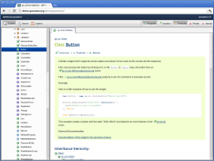

API Viewer
**********

The API Viewer displays class API reference for one or more libraries. The tree view pane offers the typical class hierarchy, organized by name spaces. Each package (intermediate name space) has an overview description and links to the sub-packages or classes it contains. Descriptions usually contain cross links to relevant packages or classes. The entire reference is searchable through the search tab.

The actual API descriptions are generated from :doc:`JSDoc-style comments </pages/development/write_api_documentation>` in the class code, and can be generated for custom applications as well, so you can browse the API of your own classes.

Advanced Search
---------------

Search results can be filtered by type (Methods, Properties, etc.) and restricted to given namespaces. **Regular Expressions** are supported for both the item name and the namespace. Note that if a search term contains one or more capital letters, the search will be **case-sensitive**.

Class Item Toggles
------------------

The visibility of various class items can be toggled using the buttons on the right hand side of the tool bar:

* **Properties**: Toggles :ref:`generated property methods <pages/understanding_properties#available_methods>`
* **Includes**: Members inherited from super classes and included from :doc:`Mixins </pages/core/mixins>` can be toggled separately
* **Protected/Private/Internal**: Separate toggles for each type of :ref:`non-public member <pages/classes#access>`

Linking Source Files
--------------------

The API Viewer can show links to the source code, typically provided by the web interface of a source code management system, for classes, methods and static functions.
To add these links for your own libraries, define the key ``info/sourceViewUri`` in ``Manifest.json``, e.g.:

::

  "info" : 
  {
    "name" : "Custom Application",
    "version" : "trunk",
    "qooxdoo-versions": ["trunk"],
    //[...]
    "sourceViewUri" : "https://github.com/someuser/custom/blob/master/source/class/%{classFilePath}#L%{lineNumber}"
  },

The following placeholders are supported:

* ``%{classFilePath}`` will be replaced with the fully qualified name of the class converted to a file path, e.g. ``custom.model.OrderData`` would become ``custom/model/OrderData.js``
* ``%{lineNumber}`` will be replaced by the line number where an item (member or static method) is defined in the original source file.

API Doc Verification
--------------------

The Generator checks API documentation for completeness while building the API Viewer. Errors, such as members with missing doc comments or undocumented parameters will be displayed in the GUI: Affected name spaces and classes will have an exclamation mark on their icon in the tree view, while the detail view will display an error message for the affected class item.
  