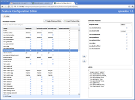

.. _pages/application/featureconfigeditor#featureconfigeditor:

Feature Configuration Editor
****************************

A tool designed to help developers create configurations for browser-specific builds. Detected feature sets from multiple clients can be imported and compared to find common values. The selected features are displayed in JSON format and can be pasted straight into the application's ``config.json``.

Browser-specific builds
-----------------------

By predefining environment keys that correspond to certain browser-specific features, builds can be tailored towards certain clients. For example, legacy Internet Explorer versions (6,7 and 8) have very similar sets of features that are highly unlikely to change. Due to their comparatively poor JavaScript performance, they also particularly benefit from cutting down the size of the code that needs to be evaluated and the number of runtime feature checks, making them prime candidates for a custom build.

Generator configuration
^^^^^^^^^^^^^^^^^^^^^^^

Regardless of the usage scenario, developers need to make sure to carefully choose the environment settings to be hard-wired so as not to accidentally remove code needed by one of the target clients. The Feature Configration Editor was designed to facilitate this process by allowing developers to compare the feature sets of multiple browsers and create an environment configuration for common features.

The following job config example shows how to create an application variant customized for IE 6, 7 and 8:

::

    "build-script-legacyie" :
    {
      "extend" : ["build-script"],
    
      "environment" :
      {
        "browser.name":"ie",
        "css.borderradius":false,
        "css.boxmodel":"content",
        "css.boxshadow":false,
        "css.gradients":false,
        "css.placeholder":false,
        "css.rgba":false,
        "css.textoverflow":true,
        "css.translate3d":false,
        "ecmascript.objectcount":false,
        "engine.name":"mshtml",
        "event.pointer":false,
        "event.touch":false,
        "html.audio":false,
        "html.canvas":false,
        "html.classlist":false,
        "html.filereader":false,
        "html.geolocation":false,
        "html.svg":false,
        "html.video":false,
        "html.vml":true,
        "html.webworker":false,
        "html.xpath":false,
        "html.xul":false
      },
      
      "compile-options" : 
      {
        "paths": 
        {
          "file" : "build/script/${APPLICATION}_ie.js"
        }
      }
    }

By also running the default ``build-script`` job, an additional generic version of the application that makes no assumptions about client features can be generated whenever ``build`` is run:

::

    "build" :
    {
      "run" : 
      [
        "build-resources",
        "build-script",
        "build-script-legacyie",
        "build-files"
      ]
    } 

Loading a specific variant
^^^^^^^^^^^^^^^^^^^^^^^^^^

Finally, the application's ``index.html`` file must make sure the correct application variant is loaded based on the browser, e.g. by performing a simple user agent check:

.. code-block:: html

    <!DOCTYPE html>
    <html xmlns="http://www.w3.org/1999/xhtml" xml:lang="en">
    <head>
      <meta http-equiv="Content-Type" content="text/html; charset=utf-8" />
      <title>customapp</title>
      
    </head>
    <body></body>
    </html>
