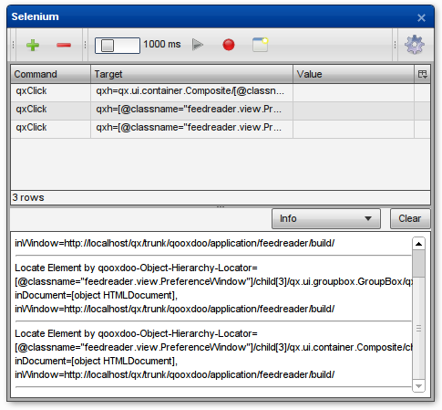
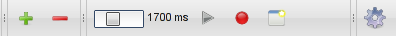
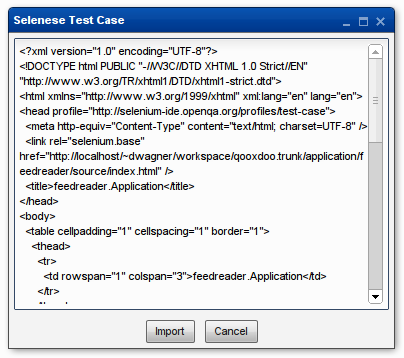

.. _pages/application/inspector_selenium#using_the_qooxdoo_inspector_to_write_selenium_tests:

Using the Inspector to write Selenium tests
***************************************************
qooxdoo's Inspector is not only a very useful tool for application developers, it can also help you write Selenium tests.

.. _pages/application/inspector_selenium#the_selenium_window:

The Selenium window
===================
The Inspector's Selenium window duplicates some of the functionality of the Selenium IDE Firefox extension, with a qooxdoo twist. It can generate locator strings for any qooxdoo widget and run Selenium commands against the inspected application. The result is a simple Selenium test case that can be exported in the "Selenese" HTML format.

.. _pages/application/inspector_selenium#configuration:

Configuration
-------------
The Selenium window must load **Selenium Core** (the JavaScript part of Selenium RC) from an external source. This location can be configured in the options window, which is opened by clicking the rightmost button in the Selenium window.

If the Inspector is loaded over HTTP, the required scripts can be loaded directly from their online repository on Google Code. Just click the "Use default URI" button.

If you can't access the Selenium repository or you're loading the Inspector from the local file system, you can manually download and extract Selenium Core:

* Download the `1.0.2 release of Selenium RC <https://code.google.com/p/selenium/downloads/detail?name=selenium-remote-control-1.0.2.zip>`_
* Open the downloaded archive and extract the file ``/selenium-remote-control-1.0.2/selenium-server-1.0.2/selenium-server-standalone-1.0.2.jar``
* From the .jar file, extract the ``core`` directory.
* In the Options window, enter the path to the **parent directory** of ``core``. Use a file system URI (``file:///...``) if you're loading the Inspector from the file system. If you're loading the Inspector from a web server, use an HTTP URI. In this case, Same Origin Policy restrictions do **not** apply, so the script directory needn't be on the same server as the Inspector itself. If it is, a relative path can be used.

Click "OK" after configuring the paths. The rest of the Selenium window's GUI will be activated once the external scripts are loaded. The configured URI is saved in a cookie so this step is only necessary once per browser.

.. _pages/application/inspector_selenium#controls:

Controls
--------

.. _pages/application/inspector_selenium#toolbar:

Toolbar
^^^^^^^

Pressing the **plus button** will add a new line to the test case. This consists of a default command (``qxClick``) and a ``qxh`` locator pointing to the widget currently selected in the Inspector.

The **minus button** removes the currently selected lines from the test case.

The **slider** controls the delay between individual commands when playing back a test case. In some cases, e.g. clicking a button that opens a new window, it will be necessary to set this to a higher value to make sure the application finishes rendering before the next command executes.

The **play button** executes selected test commands. If no commands are selected, the will all be run.

While the **record button** is active, a new line will be added whenever a new widget is selected in the Inspector.

The **import/export button** opens a new window containing the current test case in Selenese format. To import a Selenese test case, paste it into the text field and click ``Import``.

The **options button** opens a dialog where external script paths can be configured.

.. _pages/application/inspector_selenium#test_commands:

Test Commands
^^^^^^^^^^^^^
.. foo bar baz

.. |command_table| image:: inspector_selenium_command_table.png

|command_table|

The table underneath the toolbar lists the commands in the current test case. Select one or more rows to execute their commands using the play button. Commands, locators and parameters can be edited by double clicking. Editing commands will display a combo box listing all commands supported by Selenium Core.

.. _pages/application/inspector_selenium#log:

Log
^^^
The log area displays any messages generated by Selenium Core while running commands.

.. _pages/application/inspector_selenium#tutorial:

Selenese window
^^^^^^^^^^^^^^^

Opened by clicking the Import/Export button in the toolbar, the Selenese window displays the current test case in Selenese format. This can be copied and pasted into a file, e.g. to be run by Selenium RC.
Selenese import is also supported by pasting the contents of a Selenese file in the text area and clicking ``Import``. This will replace any commands in the current test case with those from the pasted Selenese.

Tutorial
--------
To demonstrate the Selenium window, let's write a small test case for the qooxdoo Feed Reader: We'll automate the procedure of adding a new user-defined feed.

For this we'll need both the Feed Reader itself and the Inspector, of course: Generate both by running ``generate.py source,inspector`` in the ``application/feedreader`` directory of  your qooxdoo SDK or SVN checkout, then open ``application/feedreader/inspector/index.html`` in your favorite browser.

Now configure the external scripts as described above.

Time to start automating: Click the **Inspect Widget** button in the Inspector's toolbar, then click the Feed Reader's **Add Feed** button. ``qx.ui.toolbar.Button[xy]`` should now be listed as the inspected widget. If you clicked the button's icon or label, that's fine too.

Click the **plus button** and a new line is added to the test case. Select that line and press **play** and the Add Feed window should open. You might need to move some Inspector windows around to see it.

Now click the **record** button, select **Inspect widget** again and click the upper text field in the Add Feed window. The new command will be added immediately. Select **Inspect Widget** again and click the second text field, then repeat the process for the **Add** button. We're done adding commands, so you can deactivate the **record** button and then close the Add Feed window.

Of course we want to type in the text fields instead of clicking them, so we need to change the commands: Double click the first column of the second row that currently says ``qxClick``. Open the dropdown menu that appears and select ``qxType``.
Now double click this command's ``value`` cell and enter a title for the new feed to be added, e.g. "Selenium Blogs".

Repeat this step for the next row to define the new feed's URL, e.g. "http://feeds.feedburner.com/Selenium".

That's all the steps we need, so let's watch Selenium work. Set the slider to something around 1.5 seconds, select all four commands in the table and press the **play** button. If all went according to plan, we can click the **export** button to get a Selenese version of our test case to save.

